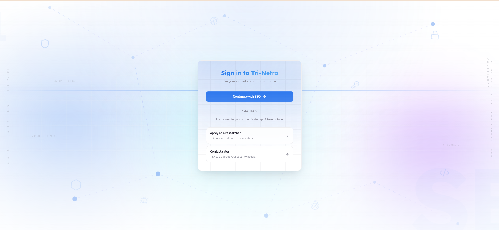
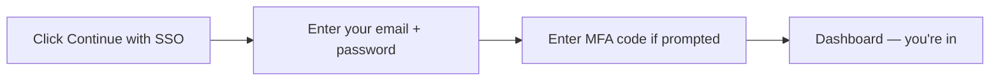

## Signing In

### 1. How you get access

Access to Tri-Netra is **invite-only**. You don't create an account yourself — your
organisation's admin or SecurityBoat sends you an invitation.

| If you are... | What happens |
|---------------|--------------|
| **New to your organisation** | Your Client Admin or SecurityBoat CSM sends you an invitation email. |
| **Your organisation is new to SecurityBoat** | Click **Contact sales** on the sign-in screen to submit an onboarding request. |

Once invited, check your inbox for the invitation email and follow its link to set
up your account.

---

### 2. The sign-in screen

Open your Tri-Netra URL. You'll see the sign-in screen with:

- **Continue with SSO** — the main sign-in button. Click this every time you sign in.
- **Apply as a researcher / Contact sales** — for prospective researchers and new customers.

---

### 3. Signing in — what you actually do

1. **Click "Continue with SSO".** Your browser opens the sign-in page.
2. **Enter your email and password.** These are the credentials you set up when you accepted your invitation.
3. **Enter your MFA code** if prompted (from your authenticator app).
4. **You land on your Dashboard.** Everything you see is scoped to your organisation and role.

---

### 4. First-time setup (from an invitation)

1. Open the **invitation email** and click the link inside.
2. Set your **password** — pick something strong and unique.
3. Set up **MFA** if prompted — scan the QR code with your authenticator app.
4. After setup, sign in anytime by clicking **Continue with SSO** on the sign-in screen.

---

### 5. Managing MFA

- **Set up or change MFA:** go to **Settings → MFA Setup** once signed in.
- **Lost your authenticator?** Contact your Organization Administrator or SecurityBoat CSM to reset your MFA.

---

### 6. Signing out

Click your avatar (top-right) → **Sign out**. Always sign out on shared or public devices.

---

### Best practices

- **Set up MFA** — it's your strongest protection against account takeover.
- **Never share your login** — accounts are per-person and all activity is audited.
- **Sign out on shared devices** — sessions persist until you sign out or they expire.

### Troubleshooting

| Symptom | What to do |
|---------|------------|
| **"You're not invited" or access denied** | Your account hasn't been invited yet. Ask your organisation's admin or CSM. |
| **Can't sign in with your password** | Use the password reset option on the sign-in page, or contact your admin. |
| **Lost MFA device** | Contact your Organization Administrator or SecurityBoat CSM to reset your MFA. |
| **Signed out unexpectedly** | Sessions expire after inactivity for security. Sign in again — it takes 30 seconds. |

---

← Previous: [Introduction](01-introduction.md) | Next: [Dashboard →](03-dashboard.md)
