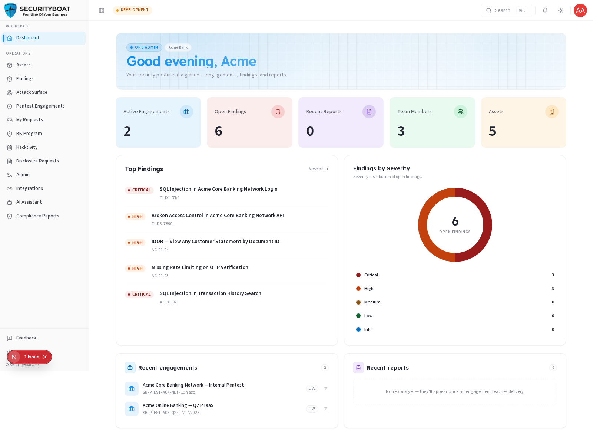

## Dashboard

### 1. What the Dashboard is for

The **Dashboard** is the first screen you see after signing in. It's your
organisation's **security posture at a glance** — a single, always-current
summary that answers three questions without you having to open any module:

- **Where do I stand right now?** (open findings, active engagements, assets)
- **What needs my attention most?** (top findings and findings by severity)
- **What's happened recently?** (Recent engagements and reports)

Everything on it is **scoped to your organisation** and **filtered to your role** —
you never see another company's data, and the tiles reflect only what you're
permitted to access. The Dashboard is **read-only**: it's a launchpad, not a place
to edit. Every card links through to the module where you can act.

### 2. How to reach it

- It loads automatically after login.
- From anywhere, click **Dashboard** (top of the left sidebar) or the SecurityBoat logo.

### 3. The Dashboard, top to bottom

The client dashboard is assembled from these sections, in order:

#### a. Greeting banner (HeroGreeting)

A personalised header showing your **first name**, your **role**, and your
**organisation name**. It orients you and confirms which org's data you're viewing.

#### b. Key Metrics (Overview Cards)

A row of overview cards showing your current key metrics. Each card displays a live count and can be clicked to jump to the respective module:

| Card / Metric | Meaning | Links to |
|------|---------|----------|
| **Active Engagements** | Penetration tests currently in progress for your org. | Engagements |
| **Open Findings** | Vulnerabilities not yet resolved (across all sources). | Findings |
| **Recent Reports** | Newly available deliverables/compliance reports. | Reports / Compliance |
| **Team Members** | People in your organisation with Tri-Netra access. | Admin → Users |
| **Assets** | Items in your testable inventory. | Assets |

> The exact metrics shown vary slightly by client role. **Client Admin** sees the team/user count because they manage users; **Client TPM** and **Client Viewer** see a security-focused subset. All numbers reflect your organisation's real-time totals.

#### c. Top Findings

A ranked list of your **most severe open findings**. Each row shows a colour-coded
**severity chip** (Critical → High → Medium → Low → Informational), the finding
**title**, and its **source** (PTaaS or Bug Bounty). This is your prioritised work
queue — start at the top. Click any row to open the full finding.

#### d. Severity Posture Ring (donut)

A **donut chart** breaking your open findings down by severity. The centre shows the
total; each coloured segment is one severity band. Use it to gauge overall risk
concentration at a glance, a ring dominated by red/orange signals urgent exposure.

#### e. Recent Engagements

The latest penetration tests for your org, each with its **title**, **status**, and
timing. Click through to the engagement's detail (scope, team, timeline, findings).

#### f. Recent Reports

The most recently produced deliverables and compliance reports, so you can jump
straight to the newest documents.

#### g. Attack Surface & Recent Programs *(only if subscribed)*

If your organisation is onboarded for **ASM**, an **Attack Surface** card summarises
monitored targets, discovered assets, and exposures. If you're onboarded for
**Bug Bounty**, a **Recent Programs** card lists your active programs. These cards
**do not appear** if your org isn't subscribed to those platforms.

### 4. Role differences on the Dashboard

The dashboard component is chosen by your role:

- **Client Admin** → the full client dashboard above, including the team/users metric.
- **Client TPM** → a security-delivery view (engagements, findings, posture) without
  the user-management metric.
- **Client Viewer** → the same read-only posture view; all links lead to read-only pages.

In every case the data is identical in scope (your org) — only the emphasis and the
actions you can take downstream differ.

### 5. How to use it day to day

1. **Scan the key metrics** for any sudden changes (such as a spike in open findings or a new active engagement).
2. **Work the Top Findings list** from the top down — highest severity first.
3. **Check the posture ring** to confirm your risk is trending down over time.
4. **Open Recent Reports** when you're notified a deliverable is ready.

### Best practices

- Treat **Top Findings** as your daily triage queue.
- Watch the **posture ring** week over week — the goal is fewer red/orange segments.
- Use the overview cards as shortcuts to quickly access specific modules instead of using the sidebar.

### Troubleshooting

| Symptom | Cause / Fix |
|---------|-------------|
| **A tile shows 0** | You genuinely have none of that item yet (e.g. no active engagement), or your org isn't onboarded for that platform. |
| **No ASM / Bug Bounty card** | Your organisation isn't subscribed to that module — ask your CSM. |
| **Numbers look stale** | The dashboard refreshes on load; reload the page to force-refresh. |

---

← Previous: [Login](02-login.md) | Next: [Assets →](assets/overview.md)
