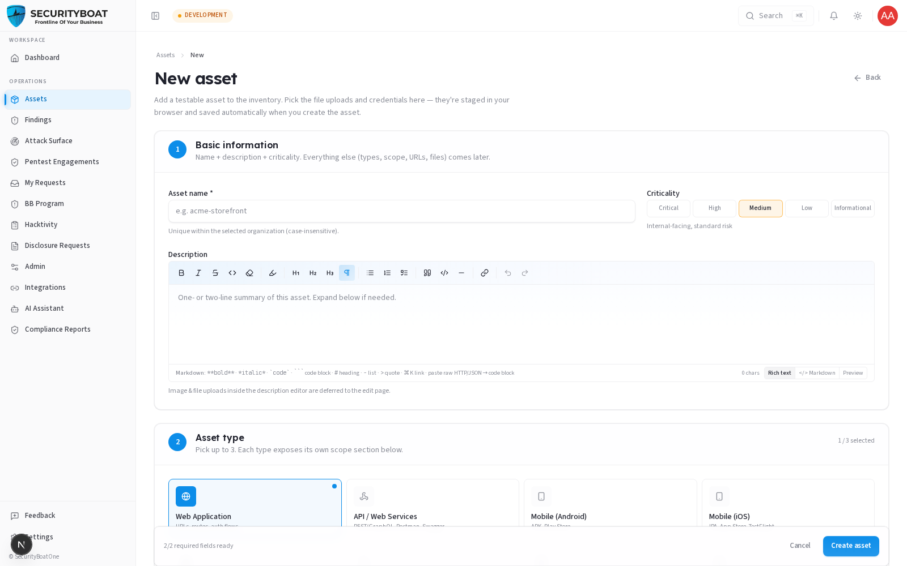
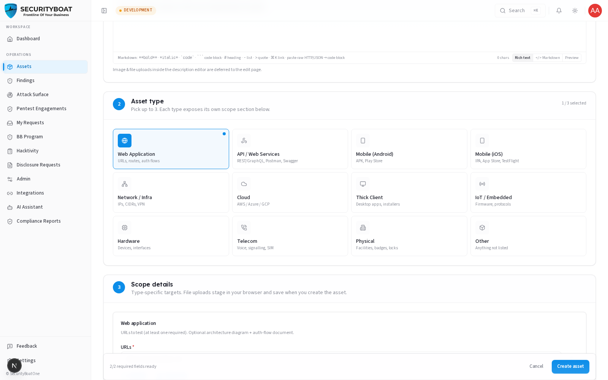
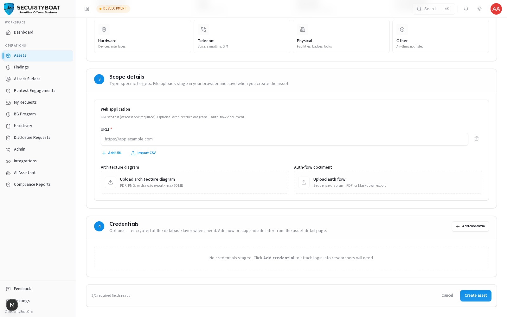
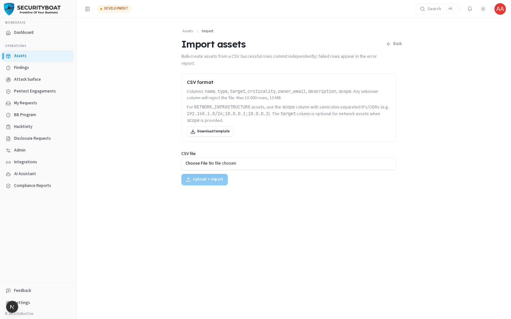
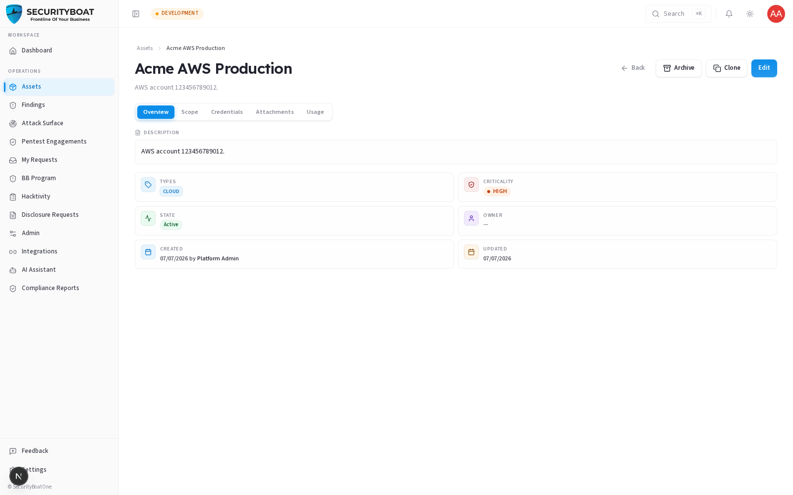

## 4. Assets

### 4.0 What an "asset" is and why it matters

In Tri-Netra an **asset** is a single testable target that belongs to your
organisation — a web application, an API, a mobile app, a network range, a cloud
environment, and so on. It is the **root record** that every security activity
hangs off:

- A **PTaaS engagement** (a scheduled penetration test) is always scoped to one
  or more assets.
- A **Bug Bounty program** advertises an asset (or set of assets) for
  researchers to test.
- An **ASM scan** (attack-surface monitoring) discovers and watches an asset's
  exposed surface.

Because everything references assets, the quality of your asset inventory
directly determines the quality of your testing. If an asset's **scope** (the
exact URLs, IP ranges, or binaries in play) is vague, testers waste time
clarifying it or — worse — test the wrong thing. If its **criticality** is wrong,
findings get triaged at the wrong priority. This module is therefore where you
invest up front so every downstream activity runs smoothly.

**Mental model:** think of an asset as a "product record" for security. It has
identity (name, type), risk classification (criticality), a precise definition of
what's in bounds (scope contract), optional secrets testers need (credentials),
and a lifecycle (active → archived).

### 4.1 What each client role can do (and why)

Asset permissions are enforced centrally by the platform's authorization service. That means the rules below hold no matter how you reach a page.

| Action | Client Admin | Client TPM | Client Viewer | Why |
|--------|:---:|:---:|:---:|-----|
| View / search list | ✅ | ✅ | ✅ | Everyone in your org needs situational awareness. |
| Open detail (metadata) | ✅ | ✅ | ✅ | Reviewing scope/criticality is read-only. |
| Export list to CSV | ✅ | ✅ | ✅ | Export is a client-side dump of what you can already see. |
| Create / Edit / Import | ✅ | ✅ | ❌ | These change the inventory — a write surface. |
| Clone | ✅ | ✅ | ❌ | Clone creates a new record (same surface as create). |
| Archive / Restore | ✅ | ✅ | ❌ | Lifecycle changes are writes. |
| View asset **credentials** | ❌ | ❌ | ❌ | Secrets are gated by a *separate* policy; clients don't read them back. |

**Key point:** everything is scoped to **your organisation only**. The service
layer filters every query by your **Organization ID**, so you can never see or
modify another tenant's assets, regardless of role. **Client Viewer** is read-only
everywhere in this module — if you're a viewer, the create/import/edit controls
simply won't appear.

### Navigation

Click **Assets** in the left sidebar menu.

---

### 4.2 The Assets list — every control explained

The list is your inventory dashboard: what exists, how risky it is, and whether
it's actively being tested.

#### Toolbar (top-right)

| Control | Type | What it does | Expected result |
|---------|------|--------------|-----------------|
| **Density toggle** | Toggle | Switches row height between comfortable and compact. | Table redraws denser/looser; purely visual, nothing is saved. |
| **Export CSV** | Button | Serialises the **currently loaded rows** to a file. | Browser downloads `assets-export-<YYYY-MM-DD>.csv` with columns for name, target type, target URL, criticality, owner email, and description. Disabled when the list is empty. |
| **Import CSV** | Button → page | Opens the bulk-import workflow. | Opens the bulk import page. *(Client Admin / Client TPM only.)* |
| **New asset** | Button → page | Opens the create form. | Opens the create asset form. *(Client Admin / Client TPM only.)* |

> **Why Export is available to everyone but Import isn't:** exporting only reveals
> data you already have permission to see, so it's safe for **Client Viewer**.
> Importing *writes* new records, so it's restricted to admins/TPMs.

#### Filter bar

All filters combine (AND logic) and narrow the table in place:

| Filter | Type | Values | Use case |
|--------|------|--------|----------|
| **Search** | Text | Matches asset **name** | Jump to a known asset quickly. |
| **Type** | Dropdown | Web App, API, Mobile (Android/iOS), Network, Cloud, Hardware, Thick Client, IoT/Embedded, Telecom, Physical, Other | "Show me only our APIs." |
| **Criticality** | Dropdown | Critical / High / Medium / Low / Informational | "Which crown-jewel assets do we have?" |
| **State** | Dropdown | Active / Inactive / Archived | Find retired assets, or hide them. |
| **Clear** | Button | — | Appears once any filter is set; resets all filters at once. |

> Filters are held **in memory** and reset when you navigate away — they are not
> written to the URL. This is intentional so a shared link never leaks your
> filtering intent.

#### Table columns

| Column | Meaning |
|--------|---------|
| **Name** | The asset's unique name in your org. Click to open its detail page. |
| **Type** | One or more coloured badges. An asset can carry **up to 3 types** (e.g. a product that is both a Web App and an API). |
| **Criticality** | Colour-coded pill from Critical (red) → Informational (blue). Drives triage priority. |
| **State** | Active / Inactive / Archived. |
| **Owner** | The person accountable for the asset, or `—` if unassigned. |
| **Engagements** | How many engagements (active or historical) reference this asset — a quick signal of how heavily tested it is. |
| **Created** | When the asset record was created. |

The table paginates at **10 rows per page**. Click any row to open that asset.

**Empty state:** with no assets (or none matching your filters) you'll see a
prompt with **Add asset** and **Import CSV** buttons instead of a table.

---

### 4.3 Create a new asset — the full flow (Client Admin / Client TPM)

Click **New asset**. The form is broken into **numbered sections** so you build
the record in a logical order: identity → classification → what it is → what's in
scope → how to log in. A sticky footer shows `N/total required fields ready` and
holds **Cancel** and **Create asset** (the submit button stays disabled until all
required fields are satisfied).

> As a client user the form is auto-scoped to **your** organisation.

#### Section 1 — Basic information

| Field | Type | Required | Validation / limits | Meaning & use case |
|-------|------|:---:|---------------------|--------------------|
| **Asset name** | Text | ✅ | ≤ 255 chars; **unique within your org**, case-insensitive | The human label used everywhere else (engagement scope, reports). Use a stable, recognisable slug like `acme-storefront` or `payments-api-prod`. |
| **Criticality** | Single-select | ✅ (defaults to Medium) | One of 5 fixed levels | Business risk classification. See the guide below. |
| **Description** | Rich text | — | — | Context for testers: what the app does, who uses it, any caveats. Images pasted here are saved when you later edit the asset. |

**Choosing criticality — what each level means:**

| Level | Choose it when… |
|-------|-----------------|
| **Critical** | The asset is business-critical; a finding should block a release. |
| **High** | Customer-facing or handles sensitive data. |
| **Medium** | Internal-facing, standard risk (the default). |
| **Low** | Low exposure or limited data. |
| **Informational** | No sensitive data or access. |

> **Why it matters:** criticality feeds finding triage and report prioritisation.
> An identical vulnerability on a Critical asset is escalated faster than on an
> Informational one. Set it honestly — over-inflating everything to Critical
> defeats the purpose.

#### Section 2 — Asset type

Pick **up to 3** types. Each type you select reveals its own **scope section**
below (Section 3). The header shows `N / 3 selected`.

| Type | What it covers | Scope you'll provide |
|------|----------------|----------------------|
| **Web Application** | Sites, routes, auth flows | One or more **URLs** (≥1 required) + optional architecture diagram & auth-flow doc |
| **API & Web Services** | REST/GraphQL endpoints | One or more **base URLs** + optional Postman collection & OpenAPI/Swagger spec |
| **Mobile (Android)** | APK / Play Store app | Store URL, uploaded APK, and/or notes (at least one) |
| **Mobile (iOS)** | IPA / App Store / TestFlight | Store URL, uploaded IPA, and/or notes (at least one) |
| **Network & Infrastructure** | IPs, CIDRs, VPN | A table of **IP/CIDR targets** (up to 5,000) + VPN notes + optional network diagram |
| **Cloud** | AWS / Azure / GCP | Free-text notes + optional supporting document |
| **Thick Client** | Desktop apps, installers | Notes + optional document |
| **IoT / Embedded** | Firmware, protocols | Notes + optional document |
| **Hardware** | Devices, interfaces | Notes + optional document |
| **Telecom** | Voice, signalling, SIM | Notes + optional document |
| **Physical** | Facilities, badges, locks | Notes + optional document |
| **Other** | Anything not listed | Notes + optional document |

> **Why up to 3 types?** Real products are often several things at once — a web
> app *and* its API *and* an Android client. Grouping them under one asset keeps
> scope, findings, and reports cohesive instead of fragmented across records.

#### Section 3 — Scope details (the "scope contract")

This is the single most important part of the record. The **scope contract** is a
structured, type-specific definition of exactly what is in bounds. Testers rely on
it literally — anything not listed here is generally out of scope.

Depending on the types you picked, you'll see:

- **Web Application → URLs (required):** add each URL (`https://app.example.com`).
  You can add rows one at a time or **Import CSV/TXT** to bulk-paste a list.
  Optional uploads: architecture diagram, auth-flow document (max 50 MB each).
- **API → Base URLs (required):** e.g. `https://api.example.com/v1`. Optionally
  attach a **Postman collection** (JSON) and/or **OpenAPI/Swagger** spec (JSON/YAML)
  so testers can hit endpoints immediately.
- **Mobile → store URL / binary / notes:** provide at least one. Upload the APK
  or IPA if it isn't publicly downloadable.
- **Network → target table:** each row is an **IP** or **CIDR** with an optional
  note. Add rows manually or import a CSV (`kind,value,note` or one value per
  line — the form auto-detects IP vs CIDR by the presence of `/`). Up to **5,000**
  targets. Add VPN/access notes and an optional network diagram.
- **Cloud / Hardware / Thick Client / IoT / Telecom / Physical / Other → notes
  (≤ 2,000 chars) + one supporting document** (any format, max 50 MB).

> **Input → output:** everything you enter here is stored as one JSON scope contract
> object on the asset (capped at 2 MB total). Files you attach are **staged in
> your browser** and uploaded automatically the moment you click **Create asset**;
> if an upload fails, the asset is still created and you're told which file to
> retry from the edit page.

#### Section 4 — Credentials (optional)

Click **Add credential** to attach login details testers will need. Each row:

| Field | Type | Required | Notes |
|-------|------|:---:|-------|
| **Label** | Text | ✅ | e.g. `Admin Login`, `Read-only User`. |
| **Username** | Text | — | The account identifier. |
| **Secret** | Password | ✅ | Password/token/key. |
| **Notes** | Text | — | e.g. "MFA disabled for this test account". |

> **How secrets are protected:** the **Secret** value is **encrypted at rest** the instant the asset is saved — it is never stored in plain text.
> This is why, as a client, you can *add* credentials but the UI does not read
> secrets back to you afterwards (that surface is gated by a separate,
> stricter policy). You can add credentials now or later from the detail page.

#### Submitting

Click **Create asset** (enabled only when every required field is ready). On
success you're taken to the new asset's detail page. Behind the scenes the
platform creates the record, uploads any staged files, and encrypts any
credentials — all in one flow. Partial failures never lose your asset; you'll get
a warning naming anything that needs a retry.

---

### 4.4 Import assets from CSV — bulk creation (Client Admin / Client TPM)

When you're onboarding many assets at once, use **Import CSV** instead of the form.

**The file format:**

| Column | Meaning |
|--------|---------|
| `name` | Asset name (unique per org). |
| `type` | One of the asset-type codes, e.g. Web Application, API & Web Services, Network & Infrastructure. |
| `target` | Primary URL/host (optional for network assets that use `scope`). |
| `criticality` | Critical / High / Medium / Low / Informational. |
| **Owner Email** | Optional owner email. |
| `description` | Optional free text. |
| `scope` | For Network & Infrastructure: semicolon-separated IPs/CIDRs, e.g. `192.168.1.0/24;10.0.0.1`. |

- **Any unknown column rejects the whole file** — this is a guard against
  malformed spreadsheets silently importing bad data. Start from **Download
  template** to guarantee the right headers.
- **Limits:** 10,000 rows, 10 MB.

**The flow, step by step:**

1. (Client roles skip the "which client?" selector — it's auto-scoped to your org.)
2. Choose your CSV and click **Upload + import**.
3. The file is **virus-scanned** before anything is processed. On a cold start this can take up to ~15 minutes; you'll see a "still scanning" hint.
4. Once clean, the import is queued as a background job.
5. The **status panel** shows **Imported** and **Failed** counts as the job runs.
6. Any failed rows appear in an **error report** table — `row`, `code`, `field`,
   `detail` — so you can fix just those rows and re-import. **Successful rows
   commit independently of failures**, so a few bad rows never block the good ones.

---

### 4.5 Asset detail page — reviewing and managing one asset

Click any asset (from the list) to open its detail page.

**Header actions** *(shown for Client Admin / Client TPM; hidden or disabled for Client Viewer):*

| Action | What it does | Why / when to use it |
|--------|--------------|----------------------|
| **Edit** | Opens the edit form (identical fields to create). | Update scope, criticality, add credentials/files. |
| **Archive** | Hides the asset from default lists (state → Archived). Confirmation dialog. **Blocked while any bound engagement is still active.** | Retire an asset you no longer test — without destroying its history. |
| **Restore** | Appears instead of Archive when archived; returns it to Active. | Bring a retired asset back into rotation. |
| **Clone** | Creates a **new** asset copying metadata + scope contract. **Credentials, attachments, and engagement links are *not* copied.** You supply a new name. | Stand up a near-identical asset (e.g. `-staging` vs `-prod`) then tweak scope. |
| **Back** | Returns to the Assets list. | — |

> **Why archive instead of delete?** Findings, reports, and engagement history all
> reference the asset. Hard-deleting would orphan that history and break audit
> trails. Archiving preserves everything while removing the asset from day-to-day
> views. That's also why archive is **blocked while an engagement is active** — you
> can't retire something that's currently being tested.

The body is a **tabbed** view (overview, scope, credentials, engagements, files,
etc., depending on the asset's types). **Client Viewer** can read metadata tabs but
never the credential secrets.

---

### 4.6 Export to CSV — getting data out

The **Export CSV** button on the list produces a point-in-time snapshot of the rows currently loaded (respecting your active filters), exporting asset name, target type, target URL, criticality, owner email, and description fields. Use it for offline reviews, sharing an inventory with auditors, or re-importing after edits. It's a client-side export, so it's instant and available to every client role.

---

### Best practices

- **Get scope right first.** A precise scope contract is the difference between a
  focused test and a slow one. List every in-bounds URL/IP; note anything fragile.
- **Set criticality honestly** so downstream triage stays meaningful.
- **Register/import assets before requesting an engagement** so scope is ready.
- **Clone** for near-duplicates (staging vs prod), then adjust scope and add each
  environment's own credentials.
- **Archive** retired assets rather than losing their history.

### Troubleshooting

| Symptom | Cause / Fix |
|---------|-------------|
| **New asset / Import buttons missing** | You're **Client Viewer** (read-only). Ask a **Client Admin** in your org. |
| **"Name must be unique" on create** | An asset with that name already exists in your org (case-insensitive). Pick another. |
| **Create button stays disabled** | A required field is unmet — usually a name, a type, or (for web/API) at least one URL. The footer shows how many required fields remain. |
| **Archive is blocked** | An engagement bound to the asset is still active. Close/complete it first. |
| **CSV import rejected immediately** | The file has an unknown column, or exceeds 10,000 rows / 10 MB. Start from the downloaded template. |
| **Import "stuck" on upload** | The virus scan is running (can take minutes on a cold start). Wait for the status to change; re-upload only if it errors. |

---

← Previous: [Dashboard](03-dashboard.md) | Next: [Findings →](05-findings.md)
