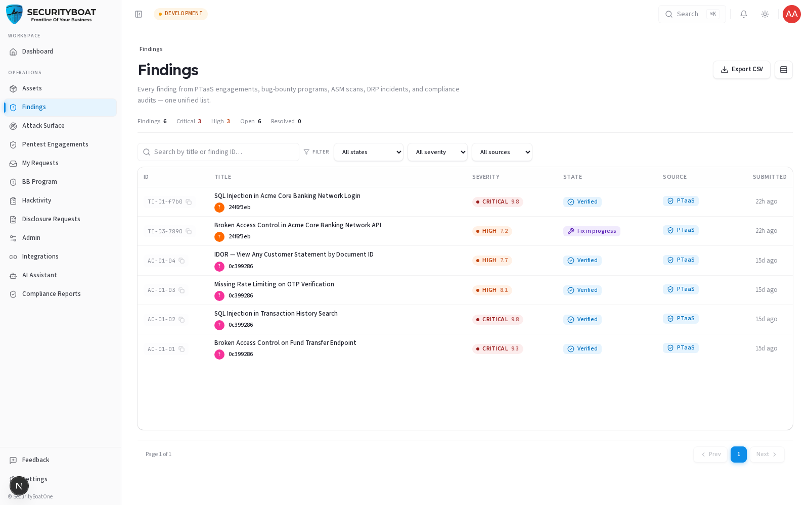
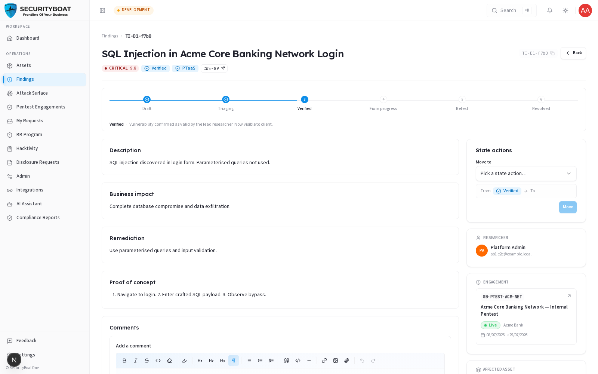
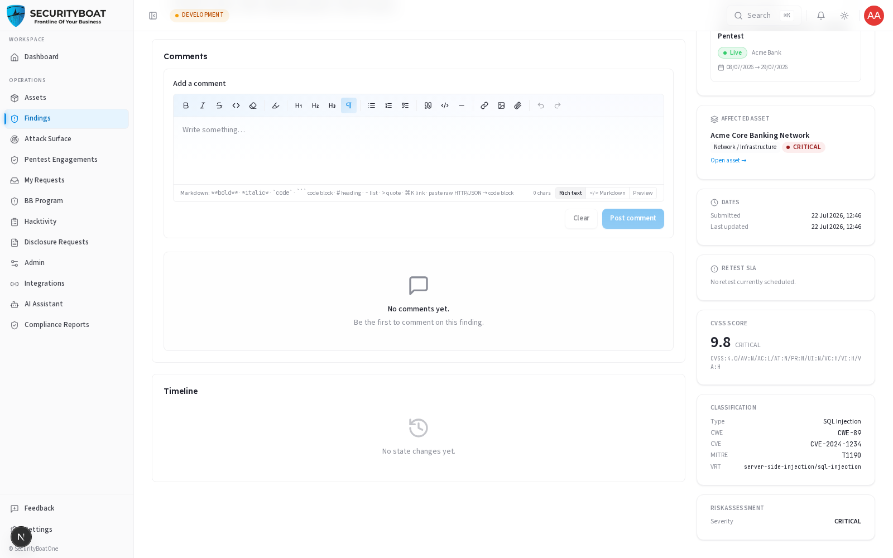

## 5. Findings

### 5.0 What a "finding" is and why the module works the way it does

A **finding** is a single, documented security issue discovered on one of your
assets — a SQL injection, a broken access control, an exposed secret, and so on.
Tri-Netra keeps **one unified findings list** regardless of where the issue
came from:

| Source | Where it originates |
|--------|---------------------|
| **PTaaS** | A scheduled penetration-test engagement. |
| **Bug Bounty** | A researcher submission against a bug-bounty program. |
| **ASM** | Attack-surface monitoring scans. |
| **DRP** | Digital-risk / incident detections. |
| **Compliance** | Issues raised during a compliance audit. |

Unifying them means you triage and remediate in one place instead of chasing five
different tools.

**The single most important rule for clients — visibility:**

> You only see a finding **after it has been verified** by SecurityBoat's testing
> team. A finding that is still a `DRAFT` or `NEW` (submitted but not yet
> quality-checked) is **invisible** to every client role. This is deliberate:
> raw, unverified submissions can contain false positives or mis-scored severity.
> Showing them to you before a TPM validates them would create noise and false
> alarms. The states you can see are: **Verified, Fix in progress, Ready for
> retest, Accepted risk, Resolved.**

This is why your list may show fewer findings than testers are actively working
on — the pre-verification ones simply aren't surfaced yet.

### 5.1 What each client role can do

| Action | Client Admin | Client TPM | Client Viewer |
|--------|:---:|:---:|:---:|
| View / search verified findings | ✅ | ✅ | ✅ |
| Open a finding's detail | ✅ | ✅ | ✅ |
| Export findings to CSV | ✅ | ✅ | ✅ |
| Add comments | ✅ | ✅ | ❌ |
| Mark **Fix in progress** / **Ready for retest** | ✅ | ✅ | ❌ |
| **Accept risk** (formally accept without fixing) | ✅ | ❌ | ❌ |
| Create a finding | ❌ | ❌ | ❌ |

> **Why clients can't create findings:** a finding must be tied to a real source
> (an engagement, a program, a scan) so its provenance can't be forged. Creation
> is therefore anchored to that source resource and performed by the testing team,
> not from a free-form form. There is intentionally **no "New finding" button** on
> this page.

### Navigation

Click **Findings** in the main sidebar menu.

---

### 5.2 The Findings list — every control explained



#### KPI tally row (top)

A flat count strip that respects your active filters:

| Tally | Meaning |
|-------|---------|
| **Findings** | Total findings visible to you. |
| **Critical** | Count at Critical severity (red when > 0). |
| **High** | Count at High severity. |
| **Open** | Everything not yet Resolved. |
| **Resolved** | Fixed and closed. |

#### Toolbar

| Control | Type | Behaviour |
|---------|------|-----------|
| **Export CSV** | Button | Downloads `findings-export-<date>.csv` containing finding records (Finding ID, Title, Severity Rating, Status, Category, CVSS Score, CWE/CVE Reference, Affected Endpoint, Description, Impact, Remediation, Submitter Name, Created Date). Disabled when empty. |
| **Density toggle** | Toggle | Compact vs comfortable rows. |

#### Filters (saved in the URL)

Unlike the Assets filters, these are written to the URL, so a filtered view is
shareable/bookmarkable.

| Filter | Type | Values / use case |
|--------|------|-------------------|
| **Search** | Text | Matches **title** or **finding ID** (e.g. paste an ID from an email). |
| **State** | Dropdown | Verified, Fix in progress, Ready for retest, Accepted risk, Resolved. |
| **Severity** | Dropdown | Critical / High / Medium / Low / Informational. |
| **Source** | Dropdown | PTaaS / Bug Bounty / ASM / DRP / Compliance. |
| **Clear** | Button | Resets all filters. |

#### Columns

| Column | Meaning |
|--------|---------|
| **ID** | The human finding ID (click the pill to copy it). |
| **Title** | Short name of the issue + the submitter (researcher/tester). |
| **Severity** | Colour-coded pill with the **CVSS score** shown alongside. |
| **State** | Main state badge, plus a "side-state" pill (e.g. duplicate) when relevant. |
| **Source** | Which module the finding came from. |
| **Submitted** | Relative time (e.g. "3d ago"). |

Paginated at **10 per page**. Click a row to open the finding.

---

### 5.3 Understanding severity and CVSS

Every finding carries a **severity** and a **CVSS v4.0** score/vector. Severity is
the at-a-glance priority; the CVSS vector is the precise, standardised breakdown
of *why* it scored that way (attack vector, complexity, impact on
confidentiality/integrity/availability, etc.).

| Severity | Typical meaning |
|----------|-----------------|
| **Critical** | Immediate, severe risk — remediate now. |
| **High** | Serious; schedule promptly. |
| **Medium** | Meaningful but bounded. |
| **Low** | Minor. |
| **Informational** | No direct risk; awareness only. |

> The platform standardises on **CVSS v4.0** (not the older v3.1). If severity ever
> looks off, the detail page shows the full vector so you can see the reasoning —
> and you can discuss it via comments before accepting or remediating.

---

### 5.4 The finding detail page — fields and the remediation workflow

Click any finding to open it.





#### What each field means

| Field | Type | Meaning / how to use it |
|-------|------|-------------------------|
| **Title** | Text | Short label for the issue. |
| **Severity + CVSS** | Enum + score/vector | Priority and its standardised justification. |
| **Vulnerability type** | Text | The class of issue (e.g. "SQL Injection"). |
| **CWE / CVE** | IDs | Links to the industry taxonomy / known-vuln database, where applicable. |
| **Endpoint / URL** | Text | Exactly where the issue was found. |
| **Description** | Rich text | What the issue is. |
| **Impact** | Rich text | What an attacker could achieve — the business risk. |
| **Remediation** | Rich text | How to fix it. This is your action plan. |
| **Evidence** | Attachments | Screenshots, request/response captures, PoC steps. |
| **Submitter** | User | The tester/researcher who reported it. |
| **State history** | Timeline | Every state change, who made it, and the note they left. |

#### The state lifecycle you drive

Once a finding is **Verified** (visible to you), remediation is a shared workflow.
Use the **State actions** panel on the detail page:

```
VERIFIED ──▶ FIX IN PROGRESS ──▶ READY FOR RETEST ──▶ (tester retests) ──▶ RESOLVED
   │
   └──▶ ACCEPTED RISK   (Client Admin only)
```

| Transition | Who | When to use it | Input required |
|------------|-----|----------------|----------------|
| **Verified → Fix in progress** | Client Admin / Client TPM | You've started remediating. | Optional/required note (the dialog tells you the minimum length). |
| **Fix in progress → Ready for retest** | Client Admin / Client TPM | Your fix is deployed; ask the tester to re-verify. | Note (often required). |
| **→ Accepted risk** | Client Admin **only** | You've decided to formally accept the risk instead of fixing (business decision). | A justification note. |
| **Ready for retest → Resolved** | Tester (not you) | The tester confirms the fix works. | — |

To move a finding: pick the target in the **"Move to"** dropdown, review the
From → To preview, click **Move**, and enter the note when prompted. The note is
saved on both the state-history timeline and the comments thread, so there's an
auditable record of every decision.

> **Why the required comments?** Each transition is a contractual event. Requiring
> a reason keeps a defensible audit trail — essential for compliance and for the
> retest tester to know exactly what changed.

#### Comments

Use the comments thread to ask the tester questions ("is this exploitable behind
our WAF?"), attach remediation notes, or dispute severity. **Client Viewer** can read
but not post.

---

### 5.5 Export to CSV

**Export CSV** produces a full snapshot of the currently filtered findings — ideal
for sharing a remediation backlog with your engineering team or handing evidence
to auditors. Available to all client roles.

---

### Best practices

- **Work Critical/High first** — the KPI tallies make the backlog obvious.
- **Move findings through the states honestly.** Marking "Ready for retest" before
  the fix is deployed just wastes a retest cycle.
- **Use comments, don't email.** Keeping the discussion on the finding preserves
  context for the retest and the final report.
- **Accept risk deliberately.** Only a Client Admin can, and it should carry a
  clear business justification in the note.

### Troubleshooting

| Symptom | Cause / Fix |
|---------|-------------|
| **A finding I was told about isn't in my list** | It hasn't been **Verified** yet — pre-verification findings are hidden from clients by design. It'll appear once the TPM verifies it. |
| **No State-actions available** | You're **Client Viewer** (read-only), or the finding is in a state you can't transition from (e.g. already Resolved). |
| **Can't "Accept risk"** | Only **Client Admin** can accept risk; **Client TPM** cannot. |
| **"Move" button disabled** | You haven't picked a target state yet, or a required note is too short — the dialog shows the minimum length. |

---

← Previous: [Assets](04-assets.md) | Next: [Engagements →](06-engagements.md)
