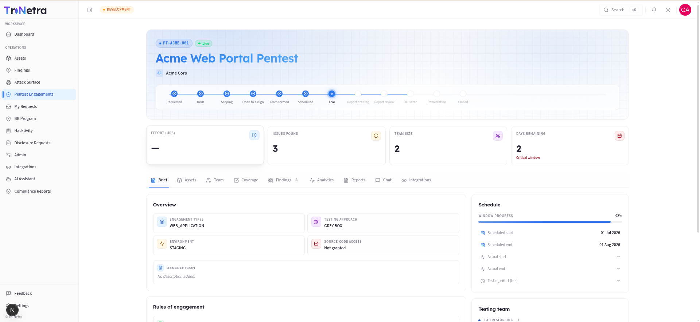
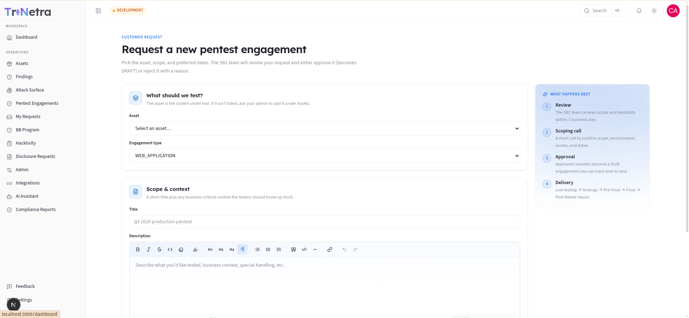
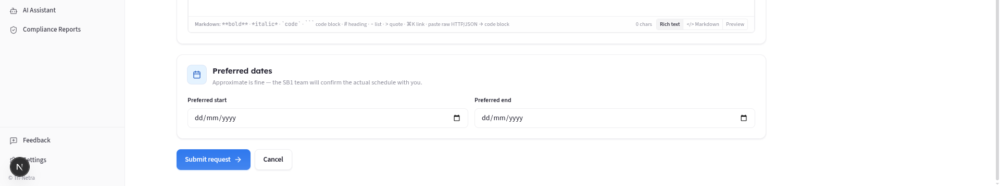
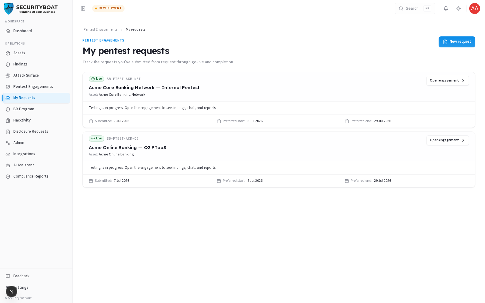

## 6. Engagements (PTaaS)

### 6.0 What an engagement is and how the PTaaS model works

An **engagement** is a scheduled penetration test of one of your assets, run by
SecurityBoat's testing team. "PTaaS" (Penetration Testing as a Service) means the
whole lifecycle — requesting, scoping, testing, reporting, and retesting — happens
on this platform instead of over email and PDFs.

The lifecycle runs through a series of **states**. You don't see all of them (many
are internal), but understanding the arc helps you know where your test stands:

```
REQUESTED → DRAFT → SCOPING → OPEN_FOR_BIDS → TEAM_FORMED → SCHEDULED
        → LIVE → REPORT_DRAFTING → REPORT_REVIEW → DELIVERED → REMEDIATION → CLOSED
```

| State | What's happening | Visible to you? |
|-------|------------------|:---:|
| **Requested** | You submitted a request; awaiting Tri-Netra review. | ✅ |
| **Draft** | Approved; you can still refine scoping details. | ✅ |
| **Scoping / Open for bids / Team formed / Scheduled** | Internal prep: scope lock, tester selection, scheduling. | ❌ (staff-only) |
| **Live** | Testing is in progress. | ✅ |
| **Report drafting / Report review** | Testers are writing and reviewing the report. | ✅ |
| **Delivered** | Final report issued. | ✅ |
| **Remediation** | You're fixing; retest may follow. | ✅ |
| **Closed** | Engagement complete. | ✅ |

> **Why some states are hidden:** the pre-LIVE steps (choosing testers, agreeing internal scope) are SecurityBoat's operational workflow. Exposing them would be noise for you and could leak tester or financial details. The platform strips internal fields from anything a client sees. To track a request *before* it goes live, use **My requests** (§6.4), which shows a simplified status without the internal machinery.

### 6.1 What each client role can do

| Action | Client Admin | Client TPM | Client Viewer |
|--------|:---:|:---:|:---:|
| View own-org engagements (visible states) | ✅ | ✅ | ✅ |
| Open engagement detail (Brief, Findings, Reports…) | ✅ | ✅ | ✅ |
| Submit a new pentest **request** | ✅ | ✅ | ❌ |
| Edit scoping details while in **Draft** | ✅ | ✅ | ❌ |
| Drive findings remediation (see Findings guide) | ✅ | ✅ | ❌ |

> **Why you request instead of "create":** a client can't directly spin up a live
> engagement — scope, testers, and scheduling need Tri-Netra review. So clients file a
> **request** (a `Requested` engagement); once Tri-Netra approves it, it becomes a
> `Draft` engagement you can track end to end.

### Navigation

Click **Pentest Engagements** in the main sidebar menu.

---

### 6.2 The Engagements list


**KPI strip:** Total engagements · Active · Completed — computed from your visible
set.

**Filter pills (state buckets):** the 11 internal states are grouped into
friendly buckets so you can filter quickly:

| Bucket | Includes |
|--------|----------|
| **All** | Everything visible to you. |
| **Active** | Draft/Scoping/…/Live/Report stages (in-flight work). |
| **Live** | Live + report drafting/review. |
| **Delivered** | Delivered + Remediation. |
| **Closed** | Closed. |
| **Requested** | Your pending engagement requests. |

Each pill shows a live count. There's also a **search** box (matches Project ID or
title). *(A per-client dropdown appears only for users who span multiple orgs; as a
single-org client you won't see it.)*

**Columns:** Engagement (title + Project ID + sub-type/testing approach) ·
Client · State · TPM (your SecurityBoat project manager) · Findings (count) ·
Scheduled (start → end). Click a row — or the **⋮** menu (Open · View bids · Open
checklist) — to open it. Paginated at 10/page.

---

### 6.3 The engagement detail page


Opening an engagement shows a header (title, state, findings count, days
remaining) and a set of **tabs**. What you can act on depends on the state and
your role, but you can generally **read** all of these on your own engagements:

| Tab | What it shows / does |
|-----|----------------------|
| **Brief** | Overview: scope, testing approach, schedule, state history. |
| **Assets** | The asset(s) under test and their scope. |
| **Team** | The SecurityBoat testers/TPM assigned. |
| **Coverage** | The testing checklist/methodology coverage — what was tested. |
| **Findings** | All findings for this engagement (subject to the verified-only visibility rule — see the Findings guide). |
| **Analytics** | Charts: severity breakdown, progress over time. |
| **Reports** | Inline preview of the engagement report. **Download PDF** is enabled once the report is marked **final** (Approved / Post-retest final). |
| **Chat** | Message the engagement team directly. |
| **Integrations** | Push findings to connected tools (e.g. Jira). |

> **Reports tab nuance:** you can preview the report as it progresses, but the
> **Download PDF** button only activates when the report reaches a final state.
> This prevents circulating a draft report as if it were the deliverable.

---

### 6.4 Requesting a pentest (Client Admin / Client TPM)

From **Pentest Engagements** (or **My requests**) click **New request** to open the request form.





**Fields:**

| Field | Type | Required | Validation | Meaning / use case |
|-------|------|:---:|-----------|--------------------|
| **Asset** | Dropdown | ✅ | Scoped to your org's assets | The system to be tested. If it's missing, add it under **Assets** first. |
| **Engagement type** | Dropdown | ✅ (defaults to Web Application) | One asset-type | The kind of test (Web App, API, Mobile, Network, …). |
| **Title** | Text | ✅ | 3–255 chars | A recognisable label, e.g. "Q3 2026 production pentest". |
| **Description** | Rich text | — | — | Business context, special handling, anything testers should know up front. |
| **Preferred start** | Date | — | — | Approximate is fine — Tri-Netra confirms the real schedule. |
| **Preferred end** | Date | — | — | Your target window close. |

**What happens after you submit:**

1. **Review** — Tri-Netra reviews scope and feasibility (typically within 1 business day).
2. **Scoping call** — a short call to confirm scope, environment, access, and dates.
3. **Approval** — an approved request becomes a **Draft** engagement you can track.
   (A rejected request comes back with a reason.)
4. **Delivery** — Live testing → findings → pre-final → final → post-retest report.

> While the engagement is in **Draft**, you (Client Admin / Client TPM) can still edit
> scoping details before Tri-Netra moves it into Scoping.

---

### 6.5 My requests — tracking pre-live work



Because pre-LIVE engagement states are hidden from the main list, **My requests**
is your window into requests that haven't gone live yet.
Each card shows a **simplified status**:

| Status | Meaning |
|--------|---------|
| **Submitted** | Received; awaiting review. |
| **Approved — preparing** | Approved; scope/testers being arranged; live soon. |
| **Live** | Testing in progress — open the engagement for findings, chat, reports. |
| **Completed** | Closed; findings and reports remain available. |
| **Closed** | Closed before testing started; contact your account team. |

Cards show the project ID, title, asset, and your submitted/preferred dates. When a
request goes live, an **Open engagement** button links straight to the full detail.

---

### Best practices

- **Give rich context in the request description** — the more testers know up front,
  the less back-and-forth during scoping.
- **Keep the asset scope current** before requesting so there's nothing to clarify.
- **Use the engagement Chat** for questions during Live testing instead of email.
- **Wait for "final" before circulating the report** — the Download PDF button
  tells you when it's official.

### Troubleshooting

| Symptom | Cause / Fix |
|---------|-------------|
| **My engagement disappeared from the list** | It moved into an internal pre-LIVE state (Scoping/Team forming). Track it under **My requests** until it goes Live. |
| **No "New request" button** | You're **Client Viewer** (read-only). Ask a Client Admin / Client TPM. |
| **Download PDF is greyed out** | The report isn't final yet (still drafting/review). It enables at Approved / Post-retest final. |
| **Can't pick my asset in the request form** | The asset isn't registered in your org yet — add it under **Assets** first. |

---

← Previous: [Findings](05-findings.md) | Next: [My Requests →](07-my-requests.md)
