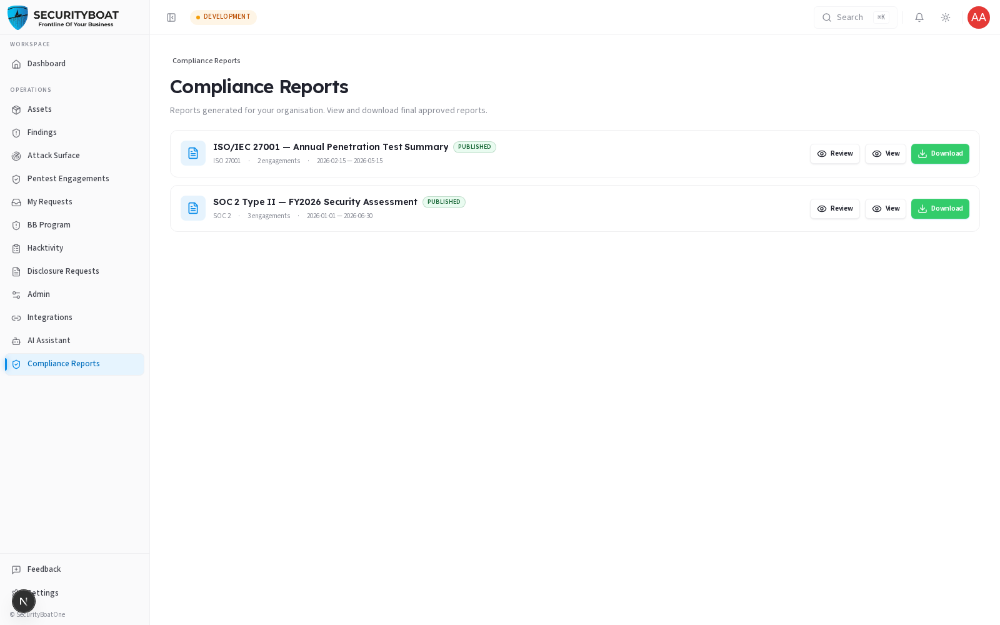

## Compliance Reports

### 1. What this module is for

**Compliance Reports** are the formal, framework-aligned reports SecurityBoat
produces for your organisation — the documents you hand to auditors, regulators,
customers, or your board to prove your security testing meets a standard.

Each report is tied to a **compliance framework**:

| Framework | Typical use |
|-----------|-------------|
| **SOC 2** | Service-org trust criteria (common for SaaS vendors). |
| **ISO/IEC 27001** | Information-security management certification. |
| **RBI / SEBI / IRDAI** | Indian regulators (banking / securities / insurance). |
| **None** | An ungoverned summary report not mapped to a framework. |

A report aggregates the results of one or more engagements over an **audit period**
into a single deliverable.

### 2. The visibility rule (why your list may be short)

> You only see compliance reports that are **Approved** and belong to **your
> organisation**. Reports still being drafted, reviewed, or QA'd by SecurityBoat
> are hidden until they're approved — you should never receive a half-finished
> compliance document. The platform enforces this on the server, not just the
> screen: a request for a non-approved or another org's report simply returns
> "not found".

### 3. What each client role can do

| Action | Client Admin | Client TPM | Client Viewer |
|--------|:---:|:---:|:---:|
| See approved reports for my org | ✅ | ✅ | ✅ |
| **View** (open the rendered report) | ✅ | ✅ | ✅ |
| **Download** (when published) | ✅ | ✅ | ✅ |
| **Review** — add management response fields | ✅ | ❌ | ❌ |
| Author / edit report content | ❌ | ❌ | ❌ |

> Clients never author compliance reports — that's SecurityBoat's job. The one
> client-editable surface is the **management review** (see §8.4), and only a
> **Client Admin** may use it.

### Navigation

Click **Compliance Reports** in the main sidebar menu.

---

### 4. Reading the list

Each report is a card showing:

| Element | Meaning |
|---------|---------|
| **Report name** | The report title (e.g. "SOC 2 Type II — FY2026 Security Assessment"). |
| **Status badge** | **Published** (green) = final, downloadable. **Pending Review** (amber) = approved but not yet published for download. |
| **Framework** | The standard it maps to. |
| **Engagement count** | How many engagements were rolled into it. |
| **Audit period** | The start — end dates the report covers. |

**Per-card actions:**

| Button | Who | What it does |
|--------|-----|--------------|
| **Review** | Client Admin | Opens the review screen to add your management response (see §8.4). |
| **View** | all client roles | Opens the fully rendered report in the viewer. |
| **Download** | all client roles | Downloads the report PDF — **only shown once the report is Published**. |

> **Published vs approved:** a report can be *approved* (visible, viewable) but not
> yet *published* (downloadable). The **Download** button appears only when the
> report is published, so you never circulate a report before it's cleared for
> distribution.

---

### 5. Management review (Client Admin only)

Click **Review** to record your organisation's formal response to a report. A
Client Admin can edit a small, fixed set of **client-review fields** on an approved
report:

| Field | Type | Meaning |
|-------|------|---------|
| **EPSS score** | Number | The Exploit Prediction Scoring System value you want recorded for risk context. |
| **Management comment** | Text | Your organisation's official response/remediation stance. |
| **Closure date** | Date | When you consider the matter closed. |

> These are the **only** fields a client can change on a compliance report — the
> body, findings, and framework mapping are locked (authored by SecurityBoat).
> **Client TPM** and **Client Viewer** cannot open the review screen.

---

### Best practices

- **Download only Published reports** for external sharing — those are the
  distribution-ready versions.
- **Use the management comment** to capture your remediation position on record; it
  becomes part of the compliance narrative.
- Keep the **audit period** in mind when handing reports to auditors — match the
  report window to the audit scope they're asking about.

### Troubleshooting

| Symptom | Cause / Fix |
|---------|-------------|
| **"No compliance reports available"** | No report for your org has been **Approved** yet. Drafts/in-review reports are hidden. Ask your CSM about status. |
| **No Download button** | The report is approved but not **Published** yet. View it online; download unlocks on publish. |
| **No Review button** | Only **Client Admin** can open management review. |

---

← Previous: [My Requests](07-my-requests.md) | Next: [Admin →](09-admin.md)
