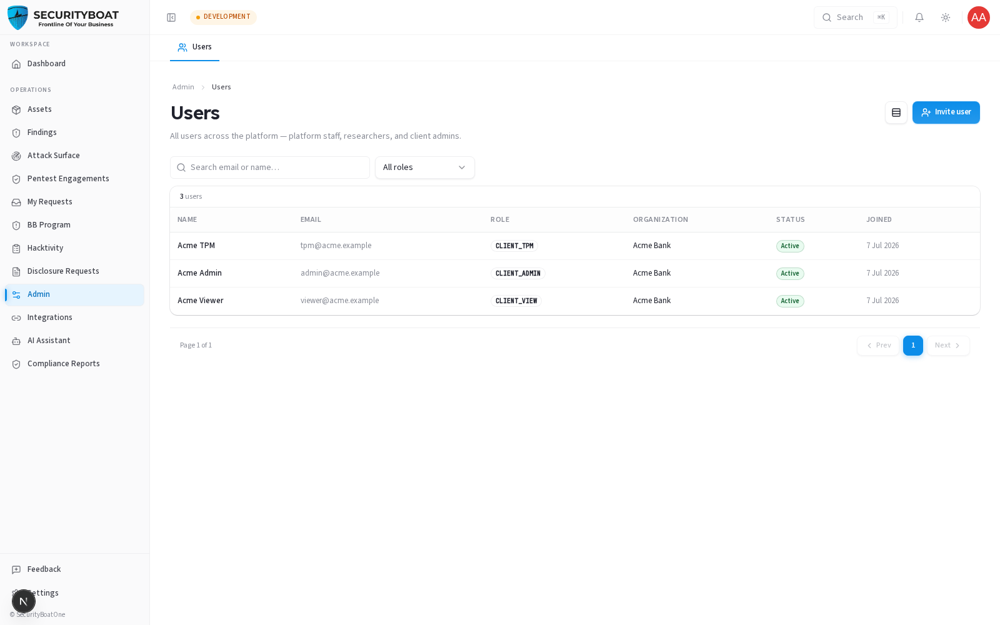
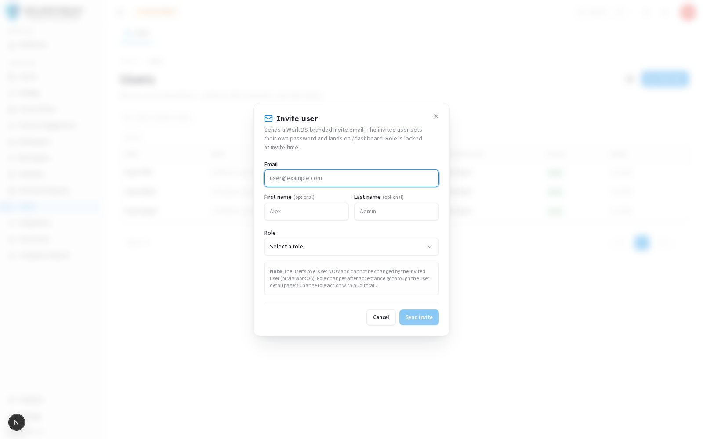

## Admin (User Management)

### 1. What this section is and who can reach it

The **Admin** area is where a client organisation manages its own people on the
platform — inviting teammates and controlling their access. For client
organisations it is deliberately narrow: it's about **your users**, nothing else.

> **Access is Client Admin-only.** Among client roles, only a **Client Admin** can
> access the user management console. **Client TPM** and **Client Viewer** do not have
> access to user administration — this is enforced on the server, not just hidden in the UI.
> Even for a Client Admin, the only tab shown is **Users**; all platform-wide
> operational tabs are SecurityBoat staff-only.

Everything a Client Admin sees here is **scoped to their own organisation** — you
manage your org's users and no one else's.

### Navigation

Click **Admin** in the left sidebar menu (visible only to Client Admins), then **Users**.

---

### 2. The Users list

**Toolbar:** a **Density toggle** and the **Invite** button (see §9.2).

**Filters:**

| Filter | Type | Use case |
|--------|------|----------|
| **Search** | Text | Find a person by email or name. |
| **Role** | Dropdown | Narrow to Client Admin / Client TPM / Client Viewer. |
| **Clear** | Button | Reset filters. |

**Columns:**

| Column | Meaning |
|--------|---------|
| **Name** | Full name, with a small **verification dot** indicating background-verification status. |
| **Email** | The user's login email. |
| **Role** | Their platform role (badge). |
| **Organization** | Your org (all rows, since you're scoped to your own tenant). |
| **Status** | **Active** or **Inactive**. |
| **Joined** | Account creation date. |

Paginated at 10/page. Click a row to open that user's **detail page**, where you
can review their profile and open **Edit** to update profile fields (name, phone,
LinkedIn/GitHub/website, etc.).

---

### 3. Inviting a user

Click **Invite** to open the invite dialog.

**Fields:**

| Field | Type | Required | Notes |
|-------|------|:---:|-------|
| **Email** | Email | ✅ | Where the invitation is sent. |
| **First name** | Text | — | |
| **Last name** | Text | — | |
| **Role** | Dropdown | ✅ | **Limited to client roles** — Client Admin, Client TPM, Client Viewer. |
| **Organization** | — | (auto) | **Forced to your own org.** You cannot invite into another tenant — the field is hidden and the server rejects any attempt. |

**What each role you can grant means:**

| Role | Gives them |
|------|-----------|
| **Client Admin** | Full client access + user management + integrations. |
| **Client TPM** | Everything an admin does *except* user management and integrations (they can request pentests, drive finding remediation, etc.). |
| **Client Viewer** | Read-only across assets, verified findings, and compliance reports. |

On submit, an invitation email goes out and the person appears in your Users list.
They complete sign-up (via WorkOS) to activate the account.

> **Why you can only grant client roles:** a client admin can't mint SecurityBoat
> staff or researcher accounts — that would cross the tenant/staff boundary. The
> invite dialog only offers client roles, and the authorization service enforces
> the same rule server-side.

---

### 4. Managing existing users

Open a user from the list to:

- **View** their profile and verification status.
- **Edit** their profile details (**Edit** button → name, phone, social links).
- See their **status** (Active/Inactive).

> Role and organisation are governed centrally; profile edits are the day-to-day
> task. If you need to change someone's role or deactivate them and don't see the
> option, contact your CSM.

---

### Best practices

- **Grant least privilege.** Default new teammates to **Client Viewer** unless they
  need to act; reserve **Client Admin** for the few who manage users/integrations.
- **Review your user list periodically** and deactivate people who've left.
- **Keep at least two Client Admins** so you're never locked out of user
  management.

### Troubleshooting

| Symptom | Cause / Fix |
|---------|-------------|
| **"Unauthorized" when opening Admin** | You're **Client TPM**/**Client Viewer**. Only Client Admins can manage users. |
| **Only the Users tab shows** | Correct — client admins see only Users; other admin tabs are SecurityBoat-staff only. |
| **Can't pick a platform/researcher role when inviting** | By design — client admins can only invite client roles into their own org. |
| **Invited user doesn't appear active** | They haven't completed sign-up yet; the account activates once they finish onboarding. |

---

← Previous: [Compliance Reports](08-compliance-reports.md) | Next: [Integrations →](10-integrations.md)
