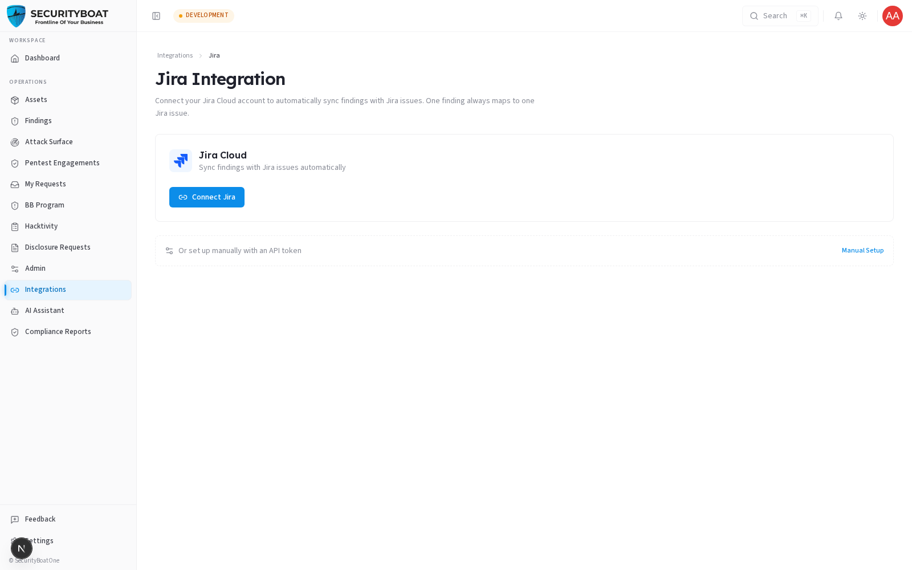
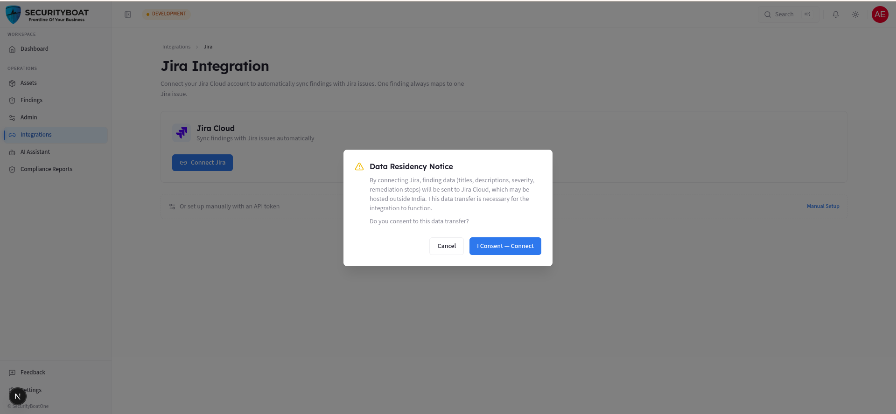
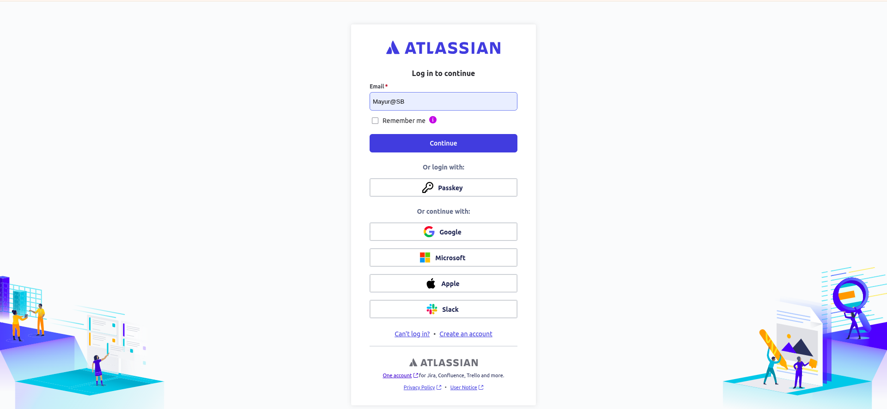

## 10. Integrations (Jira)

### 10.0 What it does and why you'd use it

The **Jira integration** connects your organisation's Jira Cloud to
SecurityBoat so security findings flow into your engineering workflow
automatically. Instead of copy-pasting vulnerabilities into tickets, a finding
becomes (and stays in sync with) a Jira issue.

**The core rule:** *one finding always maps to one Jira issue.* When a finding's
state changes on SecurityBoat, the linked Jira issue can transition too (and vice
versa, via the transition mappings you configure). This keeps your remediation
board and your security findings in lockstep.

### 10.1 Who can do what

| Action | Client Admin | Client TPM | Client Viewer |
|--------|:---:|:---:|:---:|
| View connection status & sync logs | ✅ | ✅ | ✅ |
| Connect / disconnect Jira | ✅ | ❌ | ❌ |
| Configure project & transition mappings | ✅ | ❌ | ❌ |
| Trigger a manual sync | ✅ | ❌ | ❌ |

> Configuring an integration touches credentials and changes how data leaves your
> tenant, so it's restricted to **Client Admin**. TPM and Viewer can see that it's
> connected and inspect sync activity, but not change it.

### Navigation

Click **Integrations → Jira** in the main sidebar menu.

---

### 10.2 The page, section by section

**1. Connection card.** Shows whether Jira is **Connected** or not. A Client Admin
connects via the OAuth flow (authorise SecurityBoat against your Jira Cloud site).

**2. Manual setup** *(shown when not connected).* An alternative to OAuth — supply
Jira connection details/API token manually if your org can't use the OAuth app.

Once connected, three more sections appear:

**3. Project mappings.** Decide which SecurityBoat context (e.g. an engagement or
your whole org) pushes findings into which **Jira project**. This is what tells the
sync "create issues for these findings in *that* project".

| Concept | Meaning |
|---------|---------|
| **Map project** | Link a source → a Jira project (issues get created there). |
| **Unmap project** | Remove a link (stops new issue creation for that source). |

**4. Transition mappings.** Map SecurityBoat finding states → Jira workflow
transitions, so moving a finding (e.g. to **Fix in progress**) moves the Jira issue
to the matching column, and Jira status changes flow back. Because every Jira
project can have a different workflow, you define these per mapping.

**5. Sync activity (logs).** A running log of every sync event — what was pushed or
pulled, when, and whether it succeeded. This is your audit trail and your first
stop when something looks out of sync.

---

### 10.3 Typical setup flow (Client Admin)

1. **Connect** your Jira Cloud (OAuth) — or use **Manual setup**.
2. **Map** the relevant source(s) to your Jira project(s).
3. **Configure transition mappings** so state changes line up with your Jira
   workflow columns.
4. Let it run — findings sync automatically. Use **manual sync** if you need to
   force a refresh, and watch **Sync activity** to confirm.

---

### Best practices

- **Map transitions carefully.** A mismatched transition mapping can leave issues
  stuck in the wrong column. Verify against a couple of test findings first.
- **Use one project per engagement (or per app)** to keep boards focused.
- **Check Sync activity after the first few findings** to confirm the mapping does
  what you expect before relying on it.

### Troubleshooting

| Symptom | Cause / Fix |
|---------|-------------|
| **No Connect/Configure controls** | You're **Client TPM**/**Client Viewer** — read-only. A Client Admin must set it up. |
| **Findings aren't appearing in Jira** | No project mapping for that source, or the connection dropped. Check the connection card and mappings. |
| **Jira status changes aren't reflected** | Transition mappings are missing/mismatched for that project's workflow. |
| **A sync failed** | Open **Sync activity** for the error detail; re-run a manual sync after fixing the cause. |

---

---

## 10.4 Slack (engagement chat mirrored to Slack)

Alongside Jira, SecurityBoat can mirror your **pentest engagement chat** into your
**Slack** workspace, so your team can follow and reply to engagement conversations
without leaving Slack.

**What it does.** Once your Slack workspace is connected, each new pentest
engagement that uses **Slack as its communication channel** gets a **dedicated
Slack channel** created automatically. Your engagement team members are auto-invited
to it, and messages relay **both ways** — platform ↔ Slack. Internal notes are never relayed to Slack.

**Who sets it up.** Unlike Jira, the Slack
**workspace connection is configured by your SecurityBoat team** (CSM / account admin)
on your organisation's behalf — it isn't a self-service control in your client Integrations area. If you'd like Slack mirroring for your engagements, ask your CSM to connect your workspace and to select **Slack** as the communication channel when creating the engagement.

**What you'll see.** When it's active, an engagement's conversation appears in a
Slack channel named for that engagement; anyone on your team who is a member of the
connected Slack workspace is added automatically (people not in the workspace are
simply skipped). You continue to use the in-platform engagement chat as normal — Slack
is a mirror, not a replacement.

---

← Previous: [Admin](09-admin.md) | Next: [ASM →](11-asm.md)
