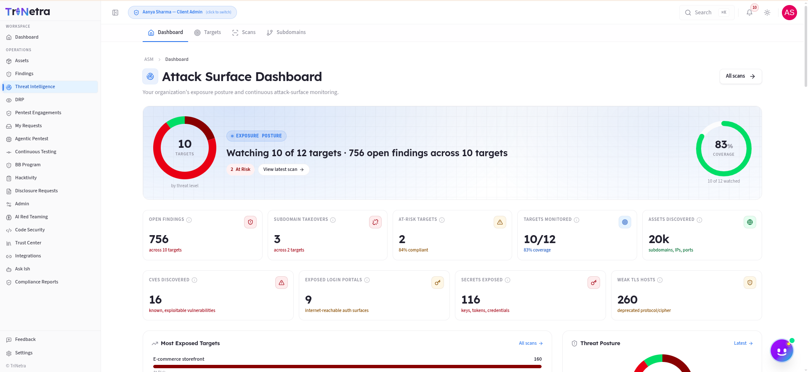
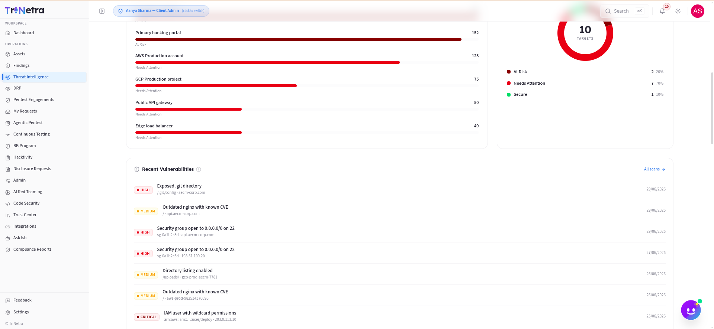
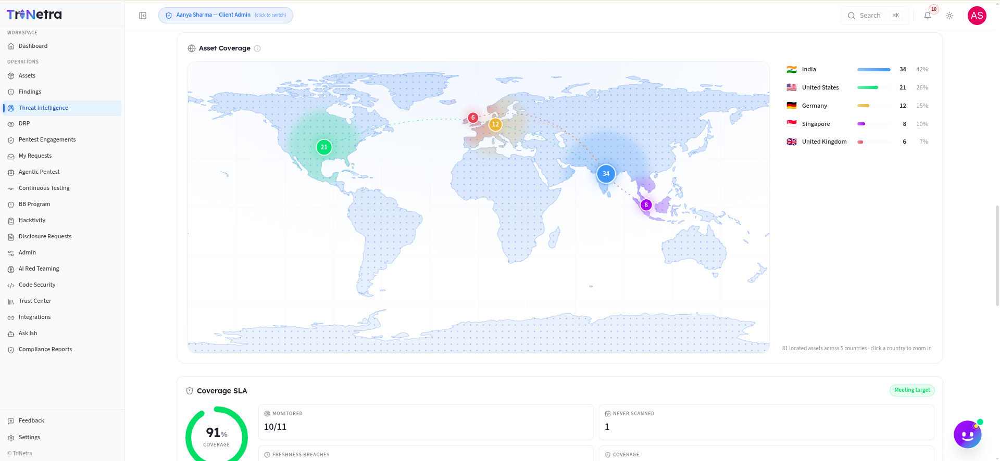
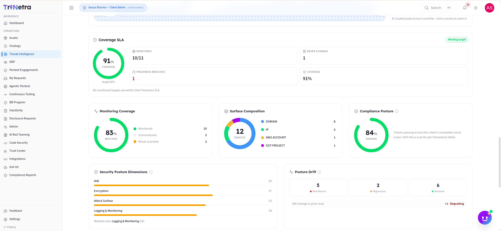
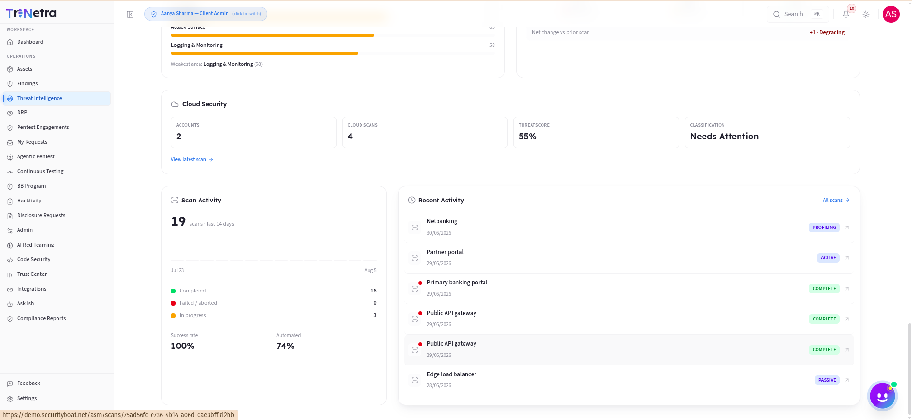
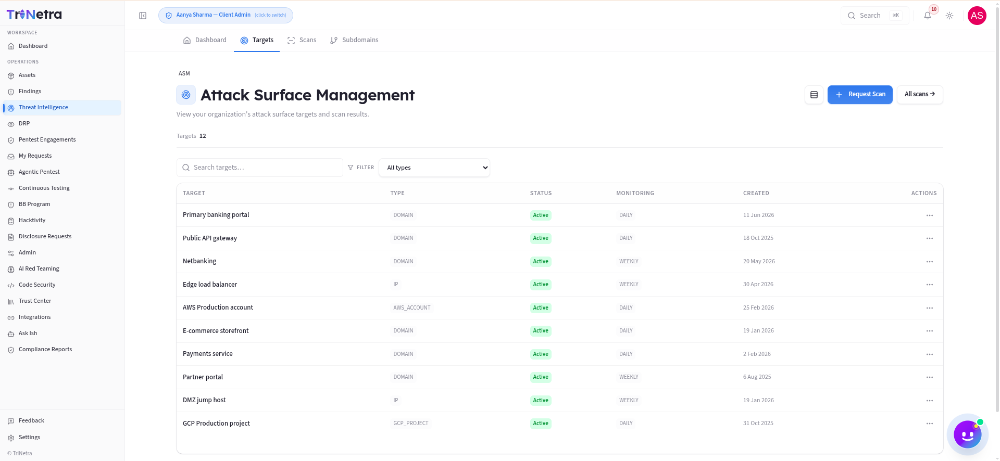
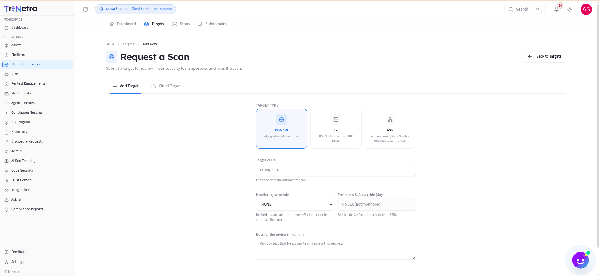

## Attack Surface (ASM)

> **Availability:** ASM is a **platform-gated** module. You'll only see **Attack
> Surface** in the sidebar if your organisation is onboarded for ASM. If it's not
> there, your org isn't subscribed to ASM — talk to your CSM.

### 1. What ASM is and why it matters

**Attack Surface Management (ASM)** continuously discovers and monitors everything
your organisation exposes to the internet — domains, subdomains, IPs, open ports,
technologies, cloud resources — and flags weaknesses before an attacker finds
them. Where a **pentest engagement** is a point-in-time deep test, **ASM is
always-on breadth**: it watches your perimeter between engagements.

For a client, ASM is a **read-only exposure console** scoped to your own
organisation. SecurityBoat runs the scanners; you consume the results.

### 2. What each client role can do

| Action | Client Admin | Client TPM | Client Viewer |
|--------|:---:|:---:|:---:|
| View the ASM dashboard, targets, scans, subdomains | ✅ | ✅ | ✅ |
| **Request** a new target to be scanned | ✅ | ❌ | ❌ |
| Set a target's **monitoring cadence / SLA** | ✅ | ❌ | ❌ |
| Create/delete targets, trigger scans directly | ❌ | ❌ | ❌ |

> **Why clients don't run scans directly:** scanning is an active operation with
> real-world impact, so SecurityBoat staff own the "arm the scanner" step. A
> **Client Admin** can **request** a target (it's created in a `Requested` state,
> auto-scoped to your org); staff review and approve before any scan runs.

### Navigation

Click **Attack Surface** in the main sidebar menu. It has tabs: **Dashboard**,
**Targets**, **Scans**, **Subdomains**.

---

### 3. The Dashboard (Exposure Posture Console)

**Metrics summary — what each number means:**

| Card / Metric | Meaning | Why it matters |
|-----|---------|----------------|
| **Open Findings** | Total open exposures + cloud findings, from the newest completed scan per target. | Your outstanding perimeter risk. |
| **Subdomain Takeovers** | Dangling DNS records pointing to deprovisioned services. | High-severity — an attacker could claim the subdomain. |
| **At-Risk Targets** | Targets whose latest scan scores "At Risk" (threat score > 60). | Where to focus first. |
| **Targets Monitored** | Targets on a recurring schedule vs total. | Coverage — unmonitored targets are scanned on demand only. |
| **Assets Discovered** | Subdomains, IPs, ports, technologies found. | The true size of your exposed surface. |

**Panels below the metrics:**

- **Posture band / Threat posture donut** — targets classified At Risk / Needs
  Attention / Secure / Unrated.
- **Most Exposed Targets** — ranked by finding count; click through to the scan.
- **Recent Vulnerabilities** — newest Critical/High/Medium findings, highest
  severity first.
- **Asset Coverage map** — geographic spread of discovered IP assets.
- **Coverage SLA** — how fresh your monitoring is against the target freshness SLA.
- **Monitoring Coverage / Surface Composition** — watched vs unwatched, and a
  breakdown by target type.
- **Compliance Posture** (cloud scans) or **Exposure Highlights** (takeovers,
  exposed secrets, weak TLS, hotspots) when there's no cloud scan.
- **Security Posture Dimensions & Drift** (cloud) — IAM, encryption, attack
  surface, logging scores, and how they changed since the last scan.
- **Scan Activity** — a 14-day scan histogram.

> The AI Assistant is "aware" of this dashboard — you can ask it things like
> "what is Coverage SLA?" or "why is my threat score high?" and it will explain
> using your live numbers.

---

### 4. Targets

A **target** is a domain, IP, or ASN registered for scanning. The list shows each
target's type, monitoring cadence, last scan, and status. Click a target to see
its scan history and details.

#### How to Request a New Target
Only a **Client Admin** can submit new targets for scanning. To add a target, navigate to **Attack Surface → Targets** and click the **Add New** button. The platform supports two target onboarding flows:

1. **Network & Infrastructure Targets** (Domain, IP, or ASN):
   - **Target Type**: Choose from `Domain` (e.g., apex domain names), `IP` (specific IP addresses or ranges), or `ASN` (Autonomous System Numbers).
   - **Target Value**: Enter the corresponding domain name, IP address, CIDR block, or ASN.
   - **Monitoring Schedule**: Select a recurring scan cadence: `Daily`, `Weekly`, `Monthly`, or `Manual` (on-demand).
   - **Freshness SLA Override (days)**: Define the maximum age of the scan results before they are flagged as stale on your dashboard.
   - **Note for the Reviewer**: An optional field to provide context or special instructions to the SecurityBoat operations team.

2. **Cloud Integration Targets**:
   - **Provider Selection**: Select your cloud service provider (e.g., AWS, Azure, GCP).
   - **Account Details**: Choose the target organization and enter your account identifier.
   - **Credentials Configuration**: Select a credential setup method (e.g., AWS AssumeRole role ARN, access keys, or credential files) and input the security parameters.
   - **Credential Validation**: Click **Validate** to run an automated check confirming the credentials work correctly before final submission.
   - **Review**: Set a descriptive **Scan Name** (defaults to "Provider - Organization Name") and add optional notes for the reviewer.

> [!IMPORTANT]
> **Staff Approval Requirement:** All newly requested targets enter a `Requested` state. Scans will not run, and configured schedules will remain dormant, until a SecurityBoat staff member (CSM or TPM) reviews and **approves** the request.

- **Client Admin** can request new targets and adjust existing targets' **monitoring cadence** and freshness **SLA**.
- **Client TPM / Client Viewer** view targets read-only.

---

### 5. Scans

The **Scans** tab displays a chronological registry of all automated and manual scans executed against your targets.

#### Scans List Columns
- **Target**: The domain name, IP, ASN, or cloud integration target being scanned.
- **State**: The real-time status of the scan execution (`Queued`, `Running`, `Complete`, or `Failed`).
- **Trigger**: Indicates whether the scan was initiated by a recurring `Scheduled` job or triggered `Manual`ly by a platform operator.
- **Started**: The timestamp of when the scanning pipeline commenced.
- **Scan ID**: The unique system identifier for auditing and referencing the scan.

#### Detailed Scan Results View
Clicking on any scan opens a comprehensive dashboard dedicated to that specific run:
- **Overview (Home)**: Displays key metrics (threat score, open findings count, assets discovered) alongside scan timeline metadata.
- **Compliance**: For cloud targets, lists the passed/failed security controls mapped to standard frameworks.
- **Vulnerabilities (Exposures)**: Lists verified vulnerabilities and exposures (e.g., open ports, TLS certificate issues, exposed keys) sorted by severity (Critical, High, Medium, Low, Info) with full request/response templates and Jira sync buttons.
  - **Subdomain Takeovers**: High-severity dangling DNS records pointing to deprovisioned or abandoned third-party services.
- **Discovered Assets**: Lists all discovered entities grouped by category (e.g., subdomains, technologies, open ports).
  - **Scanning Selected Subdomains**: In the subdomains sub-view, users can check boxes next to discovered subdomains and click **Scan Selected** to trigger a targeted rescan focused strictly on those hosts.

---

### 6. Subdomain Inventory

The **Subdomains** tab lists a deduplicated, organization-wide inventory of every subdomain discovered across all active targets. This module allows you to track and selectively audit your web perimeter.

#### Subdomains Inventory Details
- **Liveness Status**: Shows whether a subdomain is resolving and active (`Live` along with the HTTP response code, e.g., `Live · 200`) or offline (`Not Live`).
- **Classification**: Color-coded categorization indicating the function or nature of the host (e.g., `web`, `api`, `admin`, `dev`, `infra`, `cloud`).
- **Source**: Identifies how the subdomain was discovered (e.g., passive DNS, certificate transparency logs, active brute force).
- **Scan Status**: Shows real-time in-flight status (`queued` with a pulsating indicator, `running` with a loading spinner) or the terminal status of the last scan (`complete`, `no live hosts`, `failed`, `aborted`).
- **Risk Score**: The calculated numeric threat indicator based on discovered exposures.
- **Monitoring Toggle**: Click the bell icon to toggle whether that specific subdomain is on a recurring monitoring cadence.
- **Inline Tags**: Add custom labels (e.g., "production", "testing") directly to subdomains to categorize and filter them.

#### Initiating Subdomain Scans
To actively probe subdomains outside of the global target schedule:
- **Scan Selected (Bulk Scan)**: Check the boxes next to one or more subdomains in the inventory table and click **Scan Selected**. This triggers a scan scoped strictly to the chosen hosts under their parent targets.
- **Scan Ad-hoc**: Click **Scan Ad-hoc**, choose a registered target domain from the dropdown, and paste subdomains (separated by commas or lines). The system automatically validates that all pasted domains are children of the selected apex domain before executing.

### 7. How ASM connects to the rest of the platform

ASM findings flow into the unified **Findings** module (source = `ASM`), so a
perimeter exposure is triaged the same way as a pentest finding. If an ASM finding
warrants a deeper look, it can inform a new **pentest engagement request**.

---

### Best practices

- **Aim for high monitoring coverage** — unmonitored targets only get scanned on
  demand, so gaps hide there. (Client Admin: raise cadence on important targets.)
- **Treat subdomain takeovers as urgent** — they're cheap for attackers to exploit.
- **Watch the drift panel** after changes — new failures/regressions tell you if a
  deploy widened your surface.

### Troubleshooting

| Symptom | Cause / Fix |
|---------|-------------|
| **No "Attack Surface" in the sidebar** | Your org isn't onboarded for ASM. Contact your CSM. |
| **Can't request a target / change monitoring** | You're **Client TPM**/**Client Viewer** (read-only). Ask a Client Admin. |
| **My requested target isn't being scanned** | It's awaiting SecurityBoat approval — scans run only after a staff member approves the target. |
| **Dashboard looks empty** | No completed scans yet for your targets — results populate after the first scan finishes. |

---

← Previous: [Integrations](10-integrations.md) | Next: [Bug Bounty →](bug-bounty/overview.md)
