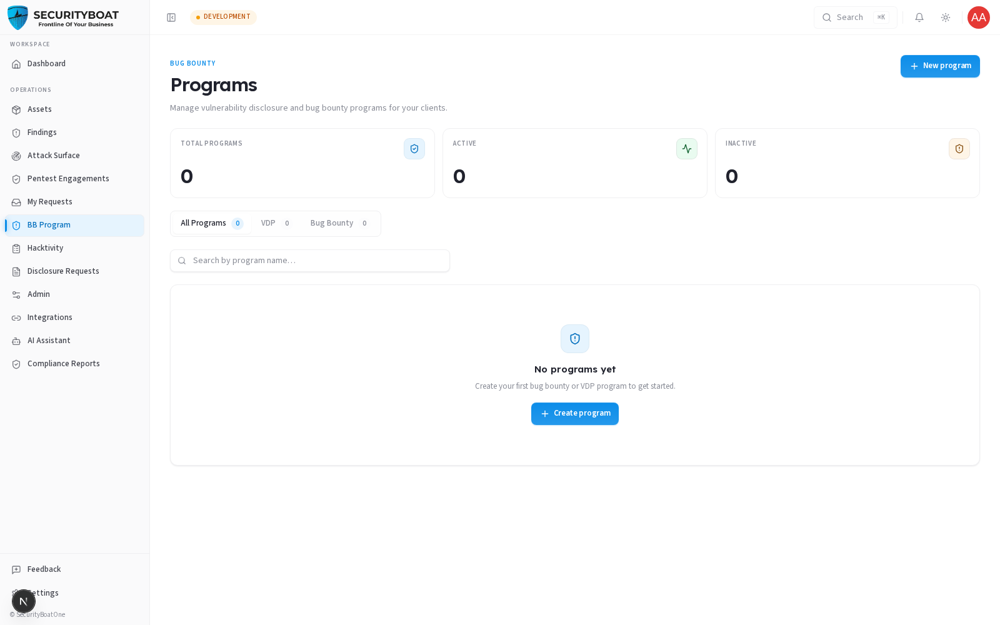
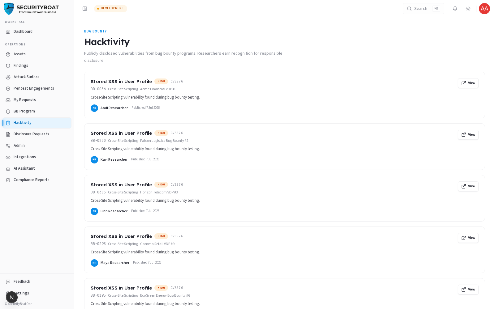
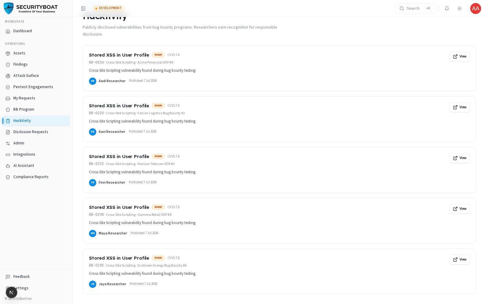
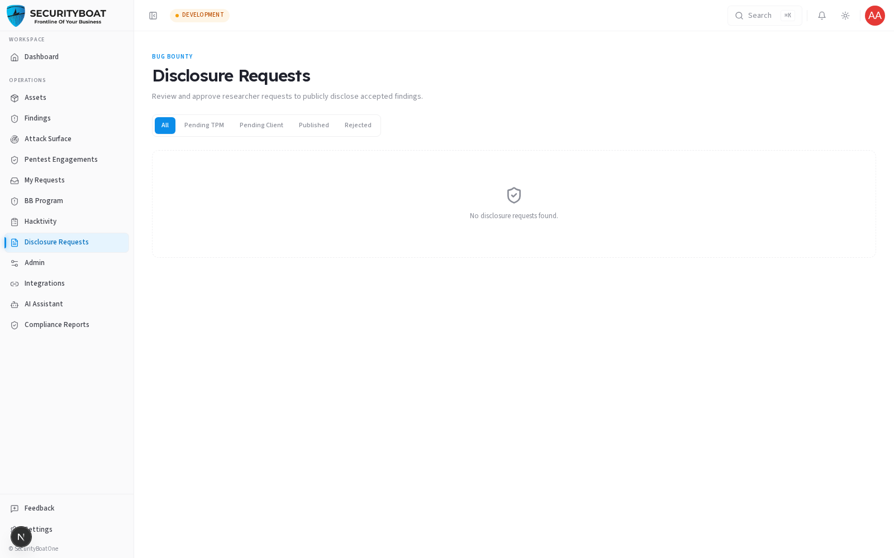

## Bug Bounty

> **Availability:** Bug Bounty is **platform-gated**. You'll only see the **BB
> Program**, **Hacktivity**, and **Disclosure Requests** entries in the sidebar
> if your organisation is onboarded for Bug Bounty. If they're missing, your org
> isn't subscribed — talk to your CSM.

### 1. What Bug Bounty is and how it differs from a pentest

A **Bug Bounty** program invites SecurityBoat's vetted researcher community to
continuously test your assets and submit vulnerabilities, typically for a reward.
Where a **PTaaS engagement** is a fixed-scope, fixed-window test by an assigned
team, Bug Bounty is **open-ended and crowd-sourced** — many researchers, ongoing,
paid per valid finding.

SecurityBoat supports two program types:

| Type | What it is | Rewards |
|------|-----------|---------|
| **VDP** (Vulnerability Disclosure Program) | A "see something, say something" channel — researchers can report issues responsibly. | Usually no monetary reward. |
| **Bug Bounty** | A rewarded program with defined scope and payout ranges. | Researchers are paid per valid finding. |

Programs also have a **visibility**: **Public** (any researcher can participate) or
**Private** (invite-only).

### 2. What each client role can do

| Action | Client Admin | Client TPM | Client Viewer |
|--------|:---:|:---:|:---:|
| View programs, hacktivity, disclosures | ✅ | ✅ | ✅ |
| **Create / configure** a program | ✅ | ❌ | ❌ |

> Bug Bounty findings still land in your unified **Findings** list (source =
> `Bug Bounty`) and follow the same verified-only client visibility rule.

### Navigation

The sidebar shows **BB Program**, **Hacktivity**, and **Disclosure Requests**.
(The **Leaderboard** is a SecurityBoat-staff view and is not shown to clients.)

---

### 3. Programs



**Metrics cards:** Total programs · Active · Inactive.

**Type tabs:** All Programs / VDP / Bug Bounty (each with a live count).

**Search:** by program name.

**Table columns:**

| Column | Meaning |
|--------|---------|
| **Program** | Program name (click to open its detail/policy page). |
| **Client** | The owning organisation (your org). |
| **Type** | VDP or Bug Bounty. |
| **Visibility** | Public or Private. |
| **Status** | Active / Inactive / Closed. |
| **Findings** | How many findings the program has produced. |

**Creating a program (Client Admin):** the **New program** button opens the
program builder where you define name, type (VDP/Bug Bounty), visibility, scope,
and (for Bug Bounty) reward tiers. **Client TPM**/**Client Viewer** don't see this button.

---

### 4. Hacktivity





**Hacktivity** is the activity feed of bug-bounty results that have been made
public — resolved and disclosed reports across programs. It's useful for seeing
the kinds of issues researchers are finding and for transparency. Sensitive detail
stays private until a disclosure is approved (see below).

> For a full walkthrough of the Hacktivity feed and how disclosures get there,
> see the dedicated **[Hacktivity guide](17-hacktivity.md)**.

---

### 5. Disclosure Requests



When a finding is fixed, a researcher may **request public disclosure** — permission
to publish a sanitised write-up. This page lists those requests and their status.
Disclosure is a deliberate, reviewed step: it balances researcher recognition and
community learning against your organisation's confidentiality. Nothing is
published without going through this review.

> For a detailed walkthrough of the approval workflow — including how to review,
> approve, and reject requests — see the dedicated **[Disclosure Requests guide](18-disclosure-requests.md)**.

---

### 6. How it fits together

```
Program (VDP / Bug Bounty)  →  Researchers test  →  Submit findings
      →  Findings module (source = Bug Bounty, verified before you see them)
      →  Fix  →  (optional) Disclosure request  →  Hacktivity (if approved)
```

### Best practices

- **Start with a VDP** if you're new to crowd-sourced testing — it opens a
  responsible-disclosure channel without payout commitments.
- **Use Private visibility** for sensitive assets so only invited researchers test.
- **Keep scope precise** in the program so researchers focus on what matters and
  out-of-scope noise is minimised.
- **Review disclosure requests promptly** — timely, sanitised disclosures build
  goodwill with the researcher community.

### Troubleshooting

| Symptom | Cause / Fix |
|---------|-------------|
| **No Bug Bounty entries in the sidebar** | Your org isn't onboarded for Bug Bounty. Contact your CSM. |
| **No "New program" button** | You're **Client TPM**/**Client Viewer**. Only Client Admins can create programs. |
| **A bug-bounty finding I heard about isn't in my Findings** | It hasn't been **verified** yet — the same verified-only visibility rule applies. |

---

← Previous: [ASM](11-asm.md) | Next: [Hacktivity →](17-hacktivity.md)
