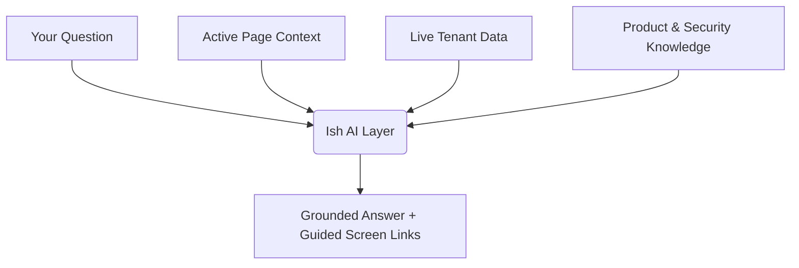
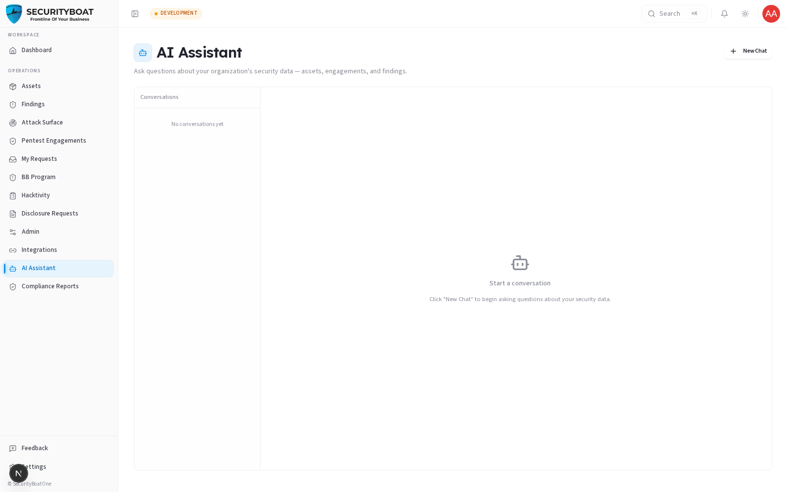

# AI Assistant (Ish)

> **Client Organisation Guide** · Client Admin · Client TPM · Client Viewer

The **AI Assistant** (powered by **Ish**, TriNetra's agentic AI assistant layer) is a data-aware, conversational reasoning assistant built directly into the platform. Unlike generic chatbots, Ish "sees" only the live TriNetra security data **your role and organisation are permitted to access**, answering high-level questions grounded in your live posture.

---

## 1. What is Ish?

In modern security operations, answering questions like *"Are we more exposed than we were last month?"* or *"Which critical findings are blocking our SOC 2 audit?"* traditionally requires exporting spreadsheets across multiple dashboards.

Ish unifies this by reading across your organization's active modules — Attack Surface Management (ASM), Digital Risk Protection (DRP), Bug Bounty, PTaaS engagements, Continuous Testing, AI Red Teaming, and Compliance.

### Core Architecture & Guarantees

* **Three-Layer Grounding Engine:** Ish grounds every response in:
  1. **Your Tenant Data:** Live verified findings, assets, scan telemetry, and engagement reports.
  2. **Product Knowledge:** Security standards (CVSS v4.0, OWASP Top 10, MITRE ATLAS, NIST AI RMF) and platform workflows.
  3. **Page Context:** Awareness of the active screen and filters you are currently viewing.
* **Strict Tenant & Role Scoping:** Ish strictly enforces role-based access controls (RBAC). It only accesses data permitted to your role (Client Admin, Client TPM, or Client Viewer) and never reveals cross-tenant data or unverified drafts.
* **Non-Actionable by Design:** To prevent unintended or unauthorized changes, Ish never runs destructive commands, modifies code, or closes tickets directly. It explains remediation steps and directs you to the exact screen where your team can review and approve changes.
* **Model Transparency:** Answers display a **Model Badge** and **Token Count** directly in the interface, providing an auditable record of the model that resolved your query.
* **Privacy & Isolation:** Your organization's queries and security telemetry are never used to train public LLM models.

---

## 2. Access & Interaction Modes

Ish is accessible in two ways across the platform:

1. **Dedicated AI Assistant Portal:** Click **AI Assistant** in the main sidebar menu to access the full-screen conversational interface with complete history and multi-turn deep dives.
2. **Floating Dashboard Widget:** Click the persistent **Ask Ish** widget in the lower corner of any product screen. The widget automatically inherits the context of the page you are on.

### Role Availability

Available to all client roles:
* **Client Admin** — Full query access across all subscribed modules, user admin context, and integrations.
* **Client TPM** — Full query access across assets, findings, engagements, ASM, DRP, and compliance data.
* **Client Viewer** — Read-only query access scoped to published reports and verified findings.

---

## 3. Example Queries by Module

Ish can synthesize cross-module information and answer domain-specific questions in plain language:

### Findings & Remediation
* *"How many critical and high severity findings are currently open across our assets?"*
* *"Summarise the remediation guidance for the SQL injection finding on our payment gateway."*
* *"Which of our verified findings are past their remediation SLA?"*

### Attack Surface (ASM) & Digital Risk Protection (DRP)
* *"What is our current Coverage SLA on the ASM dashboard?"*
* *"Are there any active phishing clones or typosquatted domains targeting our brand right now?"*
* *"Which external IP addresses have newly opened ports since the last scan?"*

### Engagements & Pentests (PTaaS)
* *"Summarise the key findings from our most recent mobile app penetration test."*
* *"What is the testing status of the Q3 Cloud Security engagement?"*

### Continuous Testing & AI Red Teaming
* *"How many exploit-confirmed findings were identified in this week's CI/CD pipeline runs?"*
* *"What is our current MITRE ATLAS tactic coverage across our LLM applications?"*

### Compliance & Trust Center
* *"Which compliance reports are approved and ready for regulator download?"*
* *"How many external access requests are currently pending review in the Trust Center?"*

---

## 4. Best Practices

- **Be specific:** Include asset names, engagement titles, severity levels, or timeframes for more precise answers.
- **Use page-level context:** Open the floating widget while viewing a finding or target to ask *"What does this drift score indicate?"*
- **Click through to take action:** Use Ish's responses as an initial triage step, then follow the provided screen links to transition findings or approve requests.
- **Maintain confidentiality:** Do not paste production API keys, master passwords, or sensitive client personal data into the chat.

---

## 5. Troubleshooting

| Symptom | Probable Cause | Recommended Fix |
|---|---|---|
| **"I cannot find that data"** | The item may be outside your role's permission scope (e.g. an unverified finding) or not present in your tenant. | Confirm your role permissions or check if the finding has completed TPM triage. |
| **Response seems outdated** | Data was updated in another tab after the conversation started. | Ask Ish to refresh its query context, or navigate directly to the respective module list. |
| **Module data missing** | Your organization may not be subscribed to that platform-gated module. | Check your subscription with your Customer Success Manager (CSM). |

---

← Previous: [Disclosure Requests](18-disclosure-requests.md) | Next: [Feedback →](16-feedback.md)
