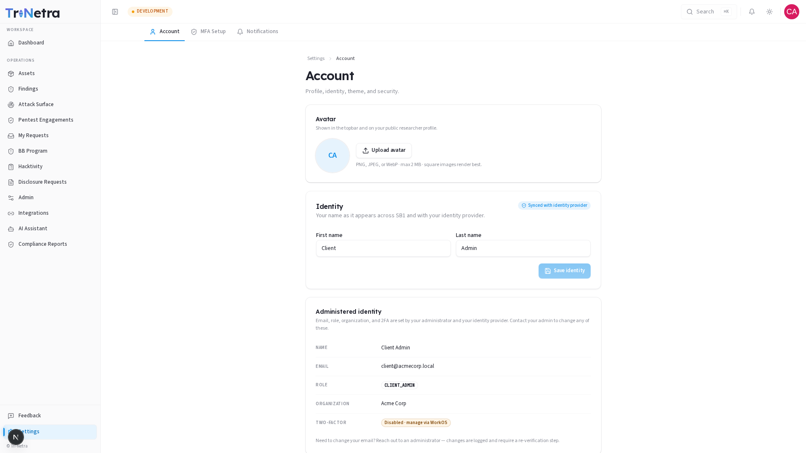
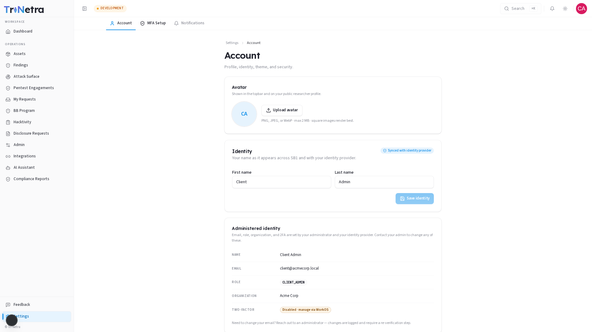
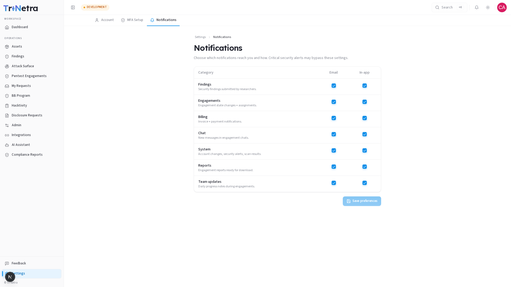

## Settings

### 1. Overview

**Settings** is your personal, per-user area — it controls *your* account, not your
organisation's. Every role has it. It has these tabs: **Account**, **MFA Setup**,
and **Notifications**. (The **Payouts** tab is researcher-only and won't appear for
client users.)

### Navigation

Click **Settings** at the bottom of the sidebar. It opens on the **Account** tab.

---

### 2. Account

| Section | What you can do |
|---------|-----------------|
| **Avatar** | Upload a profile picture shown in the top bar. |
| **Identity (name)** | Edit your first/last name. |
| **Administered identity** | **Read-only.** Your **email**, **role**, **organization**, and **two-factor** status are provisioned by your administrator and identity provider. To change your email or role, contact your admin — such changes are logged and require re-verification. |
| **Theme** | Switch **Light / Dark / System**. Saved per browser. |

> **Why email/role/org are locked:** these are security-critical identity
> attributes. Letting users self-edit them would undermine tenant isolation and
> access control, so they're admin/IdP-managed and audited.

### 3. MFA Setup

The **MFA Setup** tab is where you manage multi-factor
authentication. Enabling MFA is strongly recommended — it's your
best defence against account takeover. Your current 2FA status also shows on the
Account tab.

### 4. Notifications

Choose **which** notifications reach you and **how** (the delivery channels). Toggle
categories on/off to tune the noise to your role.

> **Critical security alerts may bypass these settings** — some safety-critical
> notifications are always delivered regardless of your preferences.

### Best practices

- **Enable MFA** immediately if it isn't already.
- **Tune notifications** so the alerts that matter to your role aren't lost in
  noise — but leave security-critical categories on.
- **Keep your name/avatar current** so teammates recognise you in comments and chat.

### Troubleshooting

| Symptom | Cause / Fix |
|---------|-------------|
| **Can't edit email/role/organization** | These are admin/IdP-managed by design. Contact your administrator. |
| **No Payouts tab** | Correct — Payouts is for researchers only. |
| **Theme keeps resetting** | Theme is saved **per browser**; a different browser/device starts at System. |

---

← Previous: [AI Assistant](13-ai-assistant.md) | Back to [Full Client Guide](CLIENT_Guide.md)
