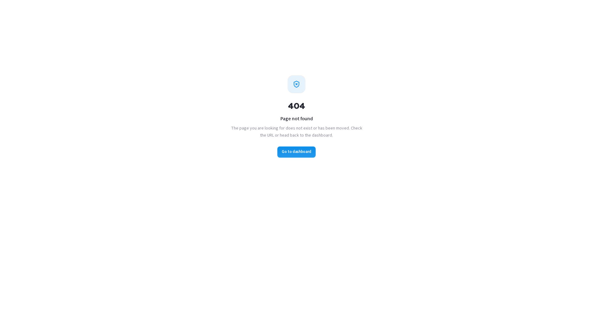

# Threat Intelligence

> **Availability:** Threat Intelligence is a **platform-gated** module. You will only see
> **Threat Intelligence** in the sidebar if your organisation is onboarded for it. If it is
> not there, your org is not subscribed — contact your CSM.

### 1. What Threat Intelligence is and why it matters

**Threat Intelligence** (also referred to as Attack Surface Management, or ASM)
continuously discovers and monitors everything your organisation exposes to the
internet — domains, subdomains, IP addresses, open ports, running technologies,
and cloud resources — and flags weaknesses before an attacker finds them. Where a
**pentest engagement** is a point-in-time deep test of a specific scope, **Threat
Intelligence is always-on breadth**: it watches your perimeter between engagements
so nothing slips through the cracks.

For a client, Threat Intelligence is a **read-only exposure console** scoped to
your own organisation. SecurityBoat runs the scanners and manages the
infrastructure; you consume the results and act on the findings.

The page title you will see is **Attack Surface Dashboard**. The sidebar label
is **Threat Intelligence**.

### 2. What each client role can do

| Action | Client Admin | Client TPM | Client Viewer |
|--------|:---:|:---:|:---:|
| View the dashboard, targets, scans, and subdomains | ✅ | ✅ | ✅ |
| Request a new target to be monitored | ✅ | ❌ | ❌ |
| Adjust a target's monitoring cadence and SLA | ✅ | ❌ | ❌ |
| Create, delete, or trigger scans directly | ❌ | ❌ | ❌ |

> **Why clients cannot run scans directly:** scanning is an active operation with
> real-world impact on the target infrastructure, so SecurityBoat staff own the
> "arm the scanner" step. A **Client Admin** can **request** a target — it is
> created in a `Requested` state, automatically scoped to your organisation —
> and SecurityBoat staff review and approve it before any scan runs.

### Navigation

Click **Threat Intelligence** in the main sidebar menu, under **OPERATIONS**. The
module opens on the **Dashboard** tab. Four tabs are available across the top:
**Dashboard**, **Targets**, **Scans**, and **Subdomains**.

---

### 3. The Dashboard

The **Dashboard** is your exposure posture console — a single-page summary of your
organisation's entire internet-facing attack surface. It answers three questions
at a glance:

- **How much surface do we have exposed?** (discovered assets, monitored targets)
- **What is at risk right now?** (open findings, subdomain takeovers, at-risk targets)
- **What has changed recently?** (threat posture trend, recent vulnerabilities)

**Metrics summary — what each number means:**

| Card / Metric | Meaning | Why it matters |
|---------------|---------|----------------|
| **Coverage** | Percentage of registered targets that are actively being watched on a recurring schedule. | Low coverage means blind spots — targets that are not on a schedule only get scanned on demand. |
| **Open Findings** | Total unresolved exposures discovered across all targets, from the most recent completed scan per target. | Your outstanding perimeter risk that requires remediation. |
| **Subdomain Takeovers** | Dangling DNS records that point to deprovisioned or unclaimed services (e.g. a CNAME to an abandoned cloud bucket or SaaS tenant). | High-severity — an attacker could claim the subdomain and serve malicious content under your domain name. |
| **At-Risk Targets** | Targets whose latest scan returned a threat score above 60, placing them in the "At Risk" bracket. | Where to focus your remediation effort first. |
| **Targets Monitored** | The ratio of targets on a recurring scanning schedule versus total registered targets. | Coverage completeness — a low ratio means many targets are only scanned on demand and may have stale data. |

**Panels below the metrics:**

- **Posture band / Threat posture donut** — your targets classified into risk
  tiers: At Risk, Needs Attention, Secure, and Unrated. The donut gives you an
  instant visual read on your organisation's overall exposure health.
- **Most Exposed Targets** — a ranked list of your targets by finding count.
  Click any target to drill into its scan history and open findings.
- **Recent Vulnerabilities** — the newest Critical, High, and Medium findings
  across your attack surface, ordered by severity (highest first).
- **Asset Coverage map** — geographic distribution of discovered IP assets,
  showing where your infrastructure is physically exposed.
- **Coverage SLA** — how fresh your monitoring data is, measured against the
  freshness SLA configured on your targets. A red indicator means scans are
  overdue.
- **Monitoring Coverage / Surface Composition** — a breakdown of watched versus
  unwatched targets, and a composition view by target type (domain, IP range, ASN).
- **Compliance Posture** (for cloud-scanned targets) — IAM, encryption, attack
  surface, and logging scores with a drift indicator showing changes since the
  previous scan.
- **Exposure Highlights** (for non-cloud targets) — a summary of critical
  exposures: subdomain takeovers, exposed secrets, weak TLS hosts, and
  vulnerability hotspots.
- **Scan Activity** — a 14-day histogram of scans run against your targets,
  showing scan frequency and recency.

> The AI Assistant is aware of this dashboard — you can ask it questions such as
> "what is Coverage SLA?" or "why is my threat score high?" and it will explain
> using your live data.

**Empty state:** if no targets have been scanned yet, the dashboard displays:
_"No attack surface yet — Your attack surface is being set up. Reconnaissance
results will appear here once your first target is scanned."_ This is normal for
newly onboarded organisations.

---

### 4. Targets

A **target** is a domain, an IP address, or an ASN registered for continuous
monitoring. The **Targets** tab lists every target belonging to your organisation,
with the following columns:

| Column | Meaning |
|--------|---------|
| **Name** | The domain, IP, or ASN being monitored. |
| **Type** | Classification: Domain, IP Range, or ASN. |
| **Monitoring Cadence** | How often the target is re-scanned (e.g. daily, weekly, monthly). |
| **Last Scan** | Timestamp of the most recently completed scan. |
| **Status** | Whether the target is actively monitored, paused, or still pending approval. |

Click any target to view its full scan history, open findings, discovered assets,
and compliance checks.

**What a Client Admin can do on Targets:**

- **Request a new target** — submit a domain, IP range, or ASN for monitoring.
  The target is created in a `Requested` state, automatically scoped to your
  organisation. It will not be scanned until a SecurityBoat staff member approves
  it.
- **Adjust monitoring cadence** — change how frequently a target is re-scanned
  (e.g. daily for critical infrastructure, weekly for less sensitive surfaces).
- **Set the freshness SLA** — define the maximum acceptable age of scan data
  before the target is flagged as stale.

> A target you request sits in a `Requested` state, and any monitoring settings
> you configure stay dormant until SecurityBoat staff **approve** the target.
> Approval is the gate that allows scans to run.

**Client TPM and Client Viewer** can browse and inspect targets but cannot
request new ones or modify existing ones.

---

### 5. Scans & Subdomains

**Scans tab:** a chronological history of every automated scan run against your
targets. Each scan entry shows:

| Column | Meaning |
|--------|---------|
| **Target** | Which domain, IP, or ASN was scanned. |
| **State** | Queued, Running, Complete, or Failed. |
| **Started / Completed** | Timestamps for the scan window. |
| **Findings** | Number of new or updated findings from this scan. |

Click any scan to open its detailed results — findings discovered, assets
enumerated, compliance checks, and service fingerprints. A completed scan runs
through a multi-stage pipeline covering DNS enumeration, subdomain discovery,
port scanning, service fingerprinting, vulnerability detection, and (for cloud
targets) compliance posture assessment.

Scans are **initiated by SecurityBoat staff** according to each target's
monitoring cadence. Clients cannot trigger scans manually.

**Subdomains tab:** the complete inventory of subdomains discovered across all
your targets. Each subdomain entry includes:

| Column | Meaning |
|--------|---------|
| **Subdomain** | The discovered subdomain name and resolved IP address. |
| **Discovery Source** | How it was found — DNS brute-force, certificate transparency logs, passive DNS, or search engine results. |
| **First Seen / Last Seen** | When the subdomain was first discovered and when it was last confirmed present. |
| **Takeover Risk** | A flag indicating whether the subdomain points to a deprovisioned or unclaimed service and is vulnerable to subdomain takeover. |

Subdomain takeover flags should be treated as **urgent** — they represent the
highest-priority exposure in the Threat Intelligence module.

---

### 6. How Threat Intelligence connects to the rest of the platform

Threat Intelligence findings flow into the unified **Findings** module with the
source tag `ASM`. This means a perimeter exposure — an open port running a
vulnerable service, an exposed secret, a weak TLS configuration — is triaged and
remediated through exactly the same workflow as a pentest finding. You filter,
comment, transition states, and track resolution in one place.

If an ASM finding warrants deeper investigation, it can inform a new **pentest
engagement request** (via **My Requests**), letting SecurityBoat's testers probe
the exposure with the depth that only a manual pentest provides.

The **AI Assistant** can answer questions about your Threat Intelligence data —
ask it about specific targets, trending exposures, or metric definitions and it
will respond using your organisation's live numbers.

---

### Best practices

- **Aim for high monitoring coverage.** Targets not on a recurring schedule are
  only scanned on demand, so gaps accumulate there. A Client Admin should place
  every critical-facing target on at least a weekly cadence.
- **Treat subdomain takeovers as urgent.** They are cheap for attackers to
  exploit and can damage your brand quickly — escalate them immediately.
- **Watch the posture donut over time.** The goal is fewer "At Risk" and more
  "Secure" segments. A sudden shift often correlates with a recent deployment or
  infrastructure change.
- **Review the drift panels after changes.** New compliance failures or
  regressions in cloud posture tell you if a deploy widened your attack surface.
- **Use the Scan Activity histogram to verify cadence.** If a target is on a
  weekly schedule but the histogram shows a gap longer than a week, contact your
  CSM — the scanner may need attention.
- **Request targets proactively.** Do not wait for a pentest to discover you
  have unmonitored domains — add them to Threat Intelligence as soon as they are
  deployed.

---

### Troubleshooting

| Symptom | Cause / Fix |
|---------|-------------|
| **No "Threat Intelligence" in the sidebar** | Your organisation is not onboarded for Threat Intelligence. Contact your CSM to discuss adding it to your subscription. |
| **Dashboard is empty or shows "No attack surface yet"** | No scans have completed for your targets yet. This is expected for newly onboarded organisations — results appear after the first scan finishes. If scans should have run by now, contact your CSM. |
| **Cannot request a new target or change monitoring settings** | You are signed in as a **Client TPM** or **Client Viewer** — both are read-only for target management. Ask your organisation's Client Admin to submit the request. |
| **My requested target is not being scanned** | The target is in a `Requested` state and awaiting SecurityBoat staff approval. No scans run until a staff member approves the target. |
| **A target shows stale scan data** | The target may not be on a recurring monitoring schedule, or its cadence is longer than expected. A Client Admin can adjust the cadence and SLA on the Targets tab. |
| **Scan shows "Failed"** | The scanner encountered an error — this could be a target-side issue (DNS resolution failure, firewall blocking probes) or a scanner-side problem. SecurityBoat staff are automatically notified of failures and will investigate. |

---

← Previous: [Attack Surface (ASM)](11-asm.md) | Next: [Bug Bounty →](bug-bounty/overview.md)
