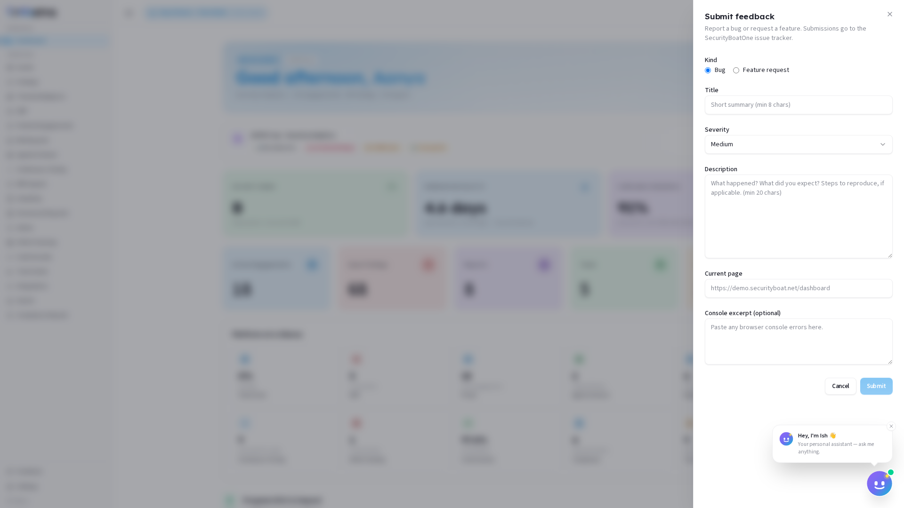

# Feedback

> **Availability:** The Feedback module is available to **all roles** — every user, regardless of role, can submit bug reports and feature requests. It appears as a button at the bottom of the sidebar.

---

## 1. What Feedback is for

The **Feedback** module is a direct line to the SecurityBoat engineering team. Use it to:

- **Report a bug** — broken buttons, incorrect data, UI glitches, performance issues, integration failures, or anything that isn't working as expected.
- **Request a feature** — missing functionality, workflow improvements, new module ideas, or enhancements that would make the platform more useful for your role.

Submissions go to the SecurityBoatOne issue tracker, where the engineering team triages and prioritises them. You won't receive a personal reply to every submission, but every report is reviewed, and patterns across submissions influence the product roadmap.

---

## 2. What each client role can do

| Action | Client Admin | Client TPM | Client Viewer |
|--------|:---:|:---:|:---:|
| Submit a bug report | ✅ | ✅ | ✅ |
| Submit a feature request | ✅ | ✅ | ✅ |

> Feedback is universal — every role has exactly the same access. There are no read-only restrictions.

---

## Navigation

Click the **Feedback** button at the bottom of the left sidebar (below all module links, above **Settings**). It opens as a dialog overlay — you can dismiss it without losing any work on the page behind it.

---

## 3. The Feedback Dialog

The dialog has the following fields:

| Field | Description |
|-------|-------------|
| **Kind** | Radio buttons — choose **Bug** (default) to report an issue, or **Feature request** to suggest an enhancement. |
| **Title** | A short, descriptive summary of your report (e.g., \"Export button fails on Findings page with 500 error\"). |
| **Severity** | Dropdown — **Low**, **Medium** (default), **High**, or **Critical**. Choose based on the impact to your workflow. |
| **Description** | Detailed explanation of the issue or feature request. Include steps to reproduce bugs, expected vs actual behaviour, and any error messages you see on screen. |
| **Current page** | Auto-filled with the URL of the page you were on when you opened the dialog. This is editable — change it if the issue is on a different page. |
| **Console excerpt (optional)** | Paste any browser console errors you encountered (open your browser's developer tools with F12, go to the **Console** tab, and copy relevant red error lines). This helps the engineering team diagnose front-end issues. |

The **Submit** button is disabled until you fill in the required fields (Kind, Title, and Description). Click **Cancel** or the **Close** (✕) button to dismiss without submitting.

---

## 4. When to Use Each Kind

| For... | Kind |
|--------|------|
| Broken buttons, incorrect data, UI glitches | **Bug** |
| Performance issues, slow page loads | **Bug** |
| Integration or API errors | **Bug** |
| Missing functionality, workflow improvements | **Feature request** |
| New module ideas | **Feature request** |
| Dashboard/metric suggestions | **Feature request** |

---

## 5. Writing an Effective Bug Report

A good bug report saves the engineering team hours of investigation. Include:

1. **What you did** — the exact steps you took before the problem occurred.
2. **What you expected** — what should have happened.
3. **What actually happened** — the error, incorrect data, or unexpected behaviour.
4. **Screenshot** (optional but helpful) — if the UI looks wrong, attach a screenshot. You can use your operating system's screenshot tool and paste into the **Description** field or attach via the **Console excerpt** field.
5. **Console errors** — if you see red error messages in the browser console (F12 → Console), paste them in the **Console excerpt** field.

### Example of a good bug report

> **Title:** Export CSV button returns 500 error on Findings page
>
> **Description:**
> 1. Went to Findings → filtered by severity Critical
> 2. Clicked \"Export CSV\" button in the top-right toolbar
> 3. Expected a CSV file download
> 4. Got a red toast: \"Something went wrong — try again\"
> 5. Tried in Chrome and Firefox, same result
> 6. Console shows: `POST /api/findings/export 500 (Internal Server Error)`

---

## 6. How Feedback connects to the rest of the platform

- The **Current page** field is auto-populated from the page you're on — the engineering team can immediately see the context of your report.
- Feedback submissions are independent of your organisation's data — they go to a shared SecurityBoat issue tracker, not your org's database.
- If a bug is blocking your ability to work (e.g., you cannot submit a finding or access an engagement), also notify your **CSM** in parallel — Feedback is for the engineering backlog; the CSM handles immediate blockers.

---

## Best practices

- **Be specific in the title** — \"Export broken\" is less helpful than \"Export CSV returns 500 error on Findings page with Critical filter.\"
- **Include reproduction steps** — the engineering team cannot fix what they cannot reproduce.
- **Use the Console excerpt field** — browser console errors are the fastest way for engineers to trace the problem.
- **Choose severity realistically** — marking every issue as \"Critical\" dilutes the signal. Reserve Critical for issues that block core workflows.
- **Submit separate issues separately** — don't bundle three unrelated bugs into one report; each deserves its own ticket.

---

## Troubleshooting

| Symptom | Cause / Fix |
|---------|-------------|
| **Submit button is greyed out** | Kind, Title, and Description are all required. Fill in all three fields. |
| **Dialog closed and I lost my text** | The dialog dismisses without saving. For long descriptions, draft in a text editor first. |
| **I don't see the Feedback button** | It's at the very bottom of the sidebar, below all module links. Scroll down. |
| **I submitted a bug but nothing changed** | Feedback goes to the engineering backlog — it is not a live support channel. For urgent blockers, contact your CSM directly. |
| **I'm a Client Viewer — am I allowed to submit?** | Yes. Feedback is available to every role without restriction. |

---

← Previous: [AI Assistant](13-ai-assistant.md) | Back to [Full Client Guide](CLIENT_Guide.md)
