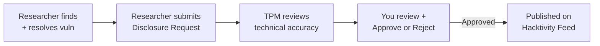

# Hacktivity

**Hacktivity** is the public feed of disclosed vulnerabilities that researchers have published with your approval. It appears under **Bug Bounty** in the sidebar and serves as both a transparency tool and a showcase of your security programme.

---

## Accessing Hacktivity

1. Sign in as a Client Admin
2. In the sidebar, under **OPERATIONS**, click **Hacktivity**

---

## What Appears on Hacktivity

Each published disclosure includes:

| Field | Description |
|---|---|
| Finding Title | Summary of the resolved vulnerability |
| Severity | Critical, High, Medium, Low, or Informational |
| CVSS Score | Standardised severity rating (0–10) |
| Technical Description | Write-up of the finding, impact, and remediation |
| Researcher | Name or handle of the researcher who discovered it |
| Publish Date | When the disclosure was made public |

---

## Browsing the Feed

The Hacktivity page lists all published disclosures in reverse chronological order. Click **View** on any entry to read the full technical write-up.

---

## Your Role in Hacktivity

Before a finding appears on Hacktivity, it must pass through your approval:

---

## Why Hacktivity Matters

- **Brand credibility** — a well-managed Hacktivity feed demonstrates mature security practices to customers, auditors, and regulators
- **Researcher engagement** — public recognition attracts top talent to your bug bounty programme
- **Transparency** — shows you take security seriously and fix issues promptly

---

← Previous: [Edit a Program](bug-bounty/edit-bug-bounty.md) | Next: [Disclosure Requests →](18-disclosure-requests.md)
