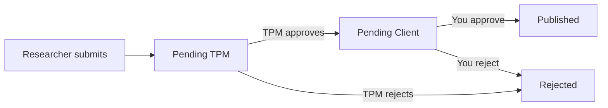

# Disclosure Requests

**Disclosure Requests** let you manage researcher requests to publicly disclose resolved vulnerabilities. You have the final say on whether a finding is published to the Hacktivity feed.

---

## Accessing Disclosure Requests

1. Sign in as a Client Admin
2. In the sidebar, under **OPERATIONS**, click **Disclosure Requests**

---

## The Request Workflow

| State | Description |
|---|---|
| Pending TPM | Researcher has submitted; awaiting TriNetra Program Manager review |
| Pending Client | TPM has approved the technical accuracy; awaiting **your** authorisation |
| Published | You approved the disclosure — it is now live on Hacktivity |
| Rejected | Disclosure was denied |

Use the filter tabs at the top of the page — **All**, **Pending TPM**, **Pending Client**, **Published**, **Rejected** — to focus on requests at each stage.

---

## Reviewing and Deciding on a Request

### When a request is Pending Client:

1. Filter by **Pending Client** to see requests awaiting your decision
2. Click a request to review:
   - **Finding title and severity** — what was found and how critical it is
   - **Technical description** — the proposed public write-up
   - **TPM review notes** — the platform manager's assessment

### To Approve:

Click **Approve**. The disclosure goes live on Hacktivity under the researcher's name.

### To Reject:

Click **Reject** and provide a reason. Common rejection scenarios:

| Scenario | Reason to Reject |
|---|---|
| Same vulnerability class exists in other systems still under remediation | Active risk |
| Disclosure reveals proprietary business logic or architecture | Confidentiality |
| Finding relates to a system under regulatory investigation | Legal/compliance |
| Publication timeframe conflicts with an upcoming audit | Audit readiness |

---

## Best Practices

- **Respond promptly** — researchers rely on timely publication for their professional reputation
- **Provide a clear reason when rejecting** — vague rejections discourage future programme participation
- **Coordinate with your TPM** — they can advise on disclosure strategy and risk
- **Review the Hacktivity feed regularly** — ensure published disclosures still meet your standards

---

← Previous: [Hacktivity](17-hacktivity.md) | Next: [AI Assistant →](13-ai-assistant.md)
