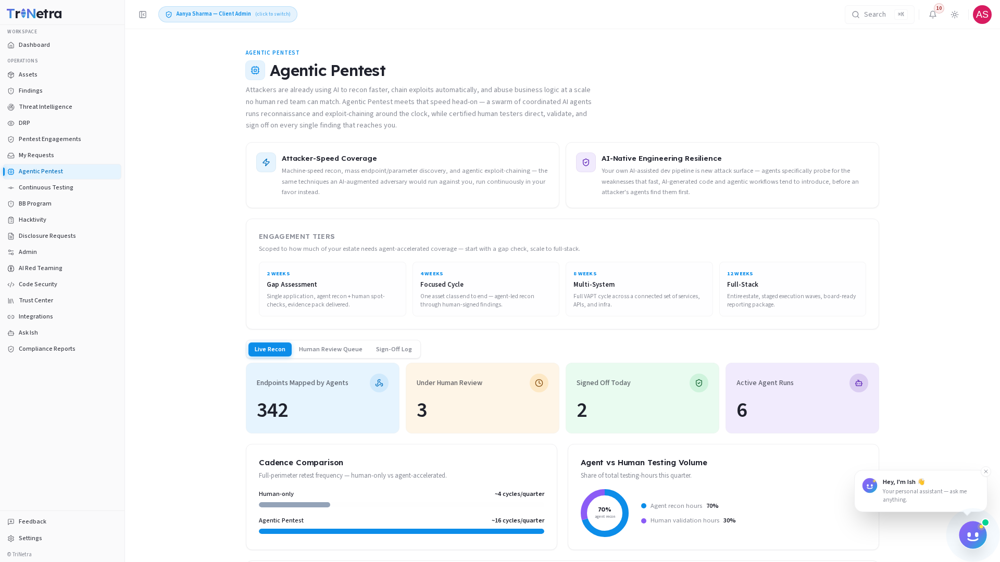

## Agentic Pentest

> **Availability:** Agentic Pentest is a **platform-gated** module. You will only
> see **Agentic Pentest** in the sidebar if your organisation is onboarded for it.
> If it is not there, your org is not subscribed to Agentic Pentest — speak to
> your CSM.

### 1. What Agentic Pentest is and why it matters

**Agentic Pentest** is TriNetra's AI-driven penetration testing module. A swarm of
coordinated AI agents runs reconnaissance and exploit-chaining around the clock,
while certified human testers direct, validate, and sign off on every single
finding before it reaches you.

Attackers are already using AI to recon faster, chain exploits automatically, and
abuse business logic at a scale no human red team can match. Agentic Pentest meets
that speed head-on — machine-speed testing that surfaces real, validated findings
your team can act on, with the assurance that a human expert has reviewed and
signed off every one.

For a client, Agentic Pentest is a **read-only intelligence feed** scoped to your
own organisation. SecurityBoat runs the agentic testing campaigns; you consume the
live recon feed, the human-validated findings, and the full sign-off audit trail.

Two principles govern the module:

- **No finding reaches a client without a human signature.** Every finding
  surfaced by AI agents passes through mandatory human review — a certified tester
  validates it, assigns a severity, and signs off before it appears in your
  Findings list.
- **AI-native resilience.** Your own AI-assisted development pipeline is new attack
  surface. The agents specifically probe for the weaknesses that fast, AI-generated
  code and agentic workflows tend to introduce, before an attacker's agents find
  them first.

### 2. What each client role can do

| Action | Client Admin | Client TPM | Client Viewer |
|--------|:---:|:---:|:---:|
| View the Live Recon dashboard, recon feed, and findings | ✅ | ✅ | ✅ |
| View the Human Review Queue and Sign-Off Log | ✅ | ✅ | ✅ |
| **Request** a new agentic pentest engagement | ✅ | ❌ | ❌ |
| Run agentic campaigns or configure testing parameters | ❌ | ❌ | ❌ |

> **Why clients do not run campaigns directly:** agentic testing is an active,
> AI-orchestrated operation with real-world impact on target systems. SecurityBoat
> staff own the campaign configuration and execution. A **Client Admin** can
> **request** a new engagement; staff scope, configure, and launch the campaign.

### Navigation

Click **Agentic Pentest** in the main sidebar menu. It has three tabs: **Live
Recon**, **Human Review Queue**, and **Sign-Off Log**.

---

### 3. Engagement Tiers

Agentic Pentest engagements are offered in four tiers, each designed for a
different testing depth and duration:

| Tier | Duration | Scope | Best for |
|------|----------|-------|----------|
| **Gap Assessment** | 2 weeks | Quick triage of critical surfaces | Teams needing a rapid risk snapshot between major engagements |
| **Focused Cycle** | 4 weeks | Deep-dive on a single system or application | Newly deployed applications or post-major-release testing |
| **Multi-System** | 8 weeks | Coordinated testing across multiple interconnected services | Service-oriented architectures with inter-service trust boundaries |
| **Full-Stack** | 12 weeks | End-to-end assessment covering all layers | Comprehensive annual testing or pre-audit readiness |

> A **Client Admin** can request any tier through the **My Requests** page. Staff
> will confirm scope, targets, and schedule before the campaign begins.

---

### 4. Live Recon Tab

The **Live Recon** tab is your real-time window into active agentic testing.
Unlike a traditional pentest where you wait weeks for a report, you see
discoveries as they surface.

**Metrics summary — what each number means:**

| Metric | Meaning | Why it matters |
|--------|---------|----------------|
| **Endpoints Mapped by Agents** | Total unique endpoints the agents have discovered and catalogued | Breadth of coverage — how much of your surface the agents have seen |
| **Under Human Review** | Findings currently in the review queue awaiting tester validation | Pipeline health — how many discoveries are pending sign-off |
| **Signed Off Today** | Findings validated and signed off by a human tester in the current day | Throughput — how quickly validated intelligence reaches you |
| **Active Agent Runs** | Number of agent campaigns currently executing | Testing velocity — how many concurrent testing streams are active |

**Cadence Comparison:** A chart compares traditional human-only testing cadence
(~4 cycles per quarter) against Agentic Pentest cadence (~16 cycles per quarter),
showing the velocity uplift that continuous AI-driven testing provides.

**Agent vs Human Testing Volume:** A breakdown showing the split between agent
reconnaissance (approximately 70% of testing volume) and human validation
(approximately 30%). The agents do the heavy lifting of discovery; human testers
focus their expertise on validation and sign-off.

**Agent Discovery Feed:** A live-streaming feed of discoveries the agents are
making in real time. Each entry shows the endpoint, the nature of the finding, and
its current status — surfaced, under review, or signed off. This feed is the
fastest way to understand what your active campaigns are uncovering right now.

---

### 5. Human Review Queue

The **Human Review Queue** is where AI-surfaced findings go through mandatory
human review before reaching you. This is the quality gate that ensures every
finding you receive has been validated by a certified tester.

The review process for each finding follows three required steps:

1. **Review and validate** — a certified tester examines the finding, confirms it
   is not a false positive, and verifies the evidence.
2. **Assign severity** — the tester assigns a severity rating (Critical, High,
   Medium, Low, or Informational) based on impact and exploitability.
3. **Sign off** — the tester signs the finding, which moves it from the queue into
   your Findings list.

Only after all three steps are complete does a finding appear in your **Findings**
module. Until sign-off, findings remain in the review queue and are not visible to
clients.

> **Why this matters:** AI agents are fast but imperfect — they can surface false
> positives or misjudge severity. The human review queue ensures that what reaches
> you is real, validated, and prioritised correctly.

---

### 6. Sign-Off Log

The **Sign-Off Log** provides a complete, immutable audit trail of every finding
that has passed through human review. It answers the question: _who vouched for
this finding, and when?_

Each entry in the Sign-Off Log shows:

- **Finding title** — the validated vulnerability
- **Severity** — the assigned rating after human review
- **Reviewed by** — the certified tester who validated and signed off
- **Signed off on** — date and time of sign-off
- **Status** — whether the finding is open, in remediation, or closed

The Sign-Off Log is read-only for all client roles. It serves as your assurance
that every finding in your queue carries a human signature, and it provides the
audit trail needed for compliance and governance reporting.

---

### 7. How Agentic Pentest connects to the rest of the platform

Agentic Pentest findings flow into the unified **Findings** module (source =
`Agentic Pentest`), so an AI-discovered vulnerability is triaged and remediated
the same way as any other pentest finding:

- **Findings** — signed-off findings appear in your Findings list with full
  evidence and reproduction steps.
- **My Requests** — Client Admins use this page to request new agentic pentest
  engagements.
- **Feedback** — if a finding lacks sufficient evidence or reproduction steps, use
  the Feedback module to flag it.
- **Compliance Reports** — agentic pentest findings are included in your
  compliance reporting alongside findings from other testing sources.

---

### Best practices

- **Monitor the Live Recon feed regularly** — discoveries appear in real time;
  early awareness of a critical finding can shorten your time to remediation.
- **Act on critical findings promptly** — SLAs are measured from sign-off, not
  from discovery. Once a finding is validated and signed off, your remediation
  clock starts.
- **Request retests through My Requests** — when remediation is complete, submit a
  retest request so the agents can verify the fix.
- **Use the Feedback module for quality issues** — if a signed-off finding appears
  to be a false positive or lacks sufficient evidence, report it through Feedback
  rather than ignoring it.
- **Layer agentic pentesting with ASM** — ASM provides always-on breadth between
  engagements; Agentic Pentest provides AI-speed depth during active campaigns.
  Together they give continuous coverage of both surface and depth.

### Troubleshooting

| Symptom | Cause / Fix |
|---------|-------------|
| **No "Agentic Pentest" in the sidebar** | Your org is not subscribed to Agentic Pentest. Contact your CSM. |
| **Cannot request a new engagement** | You are **Client TPM** or **Client Viewer** (read-only). Ask a Client Admin to submit the request. |
| **Live Recon tab shows no activity** | No active agentic campaign is running for your organisation. A Client Admin can request one through My Requests. |
| **Findings appear slowly** | All findings go through mandatory human review before reaching you — this is by design. Check the Human Review Queue for pipeline status. |
| **A finding in the Sign-Off Log seems incorrect** | Use the **Feedback** module to flag it with details — do not ignore it. |

---

← Previous: [Disclosure Requests](18-disclosure-requests.md) | Next: [Continuous Testing →](20-continuous-testing.md)
