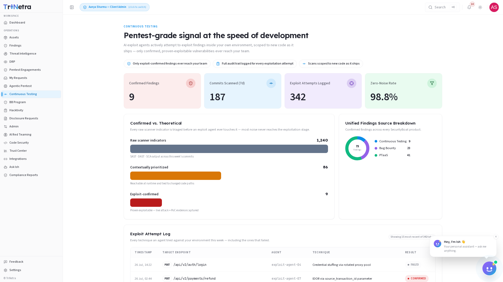

# Continuous Testing

> **Availability:** Continuous Testing is a **platform-gated** module. You will only
> see **Continuous Testing** in the sidebar if your organisation is onboarded for it.
> If it is not there, your organisation is not subscribed to Continuous Testing —
> speak to your CSM.

### 1. What Continuous Testing is and why it matters

**Continuous Testing** delivers pentest-grade signal at the speed of development.
AI exploit agents actively attempt to exploit findings inside your own environment,
scoped to new code as it ships — only confirmed, proven-exploitable vulnerabilities
ever reach your team.

Traditional application security testing produces hundreds or thousands of scanner
indicators per week. The overwhelming majority are theoretical — a static-analysis
rule fired, a dynamic scan flagged a potential injection point, a dependency
checker found a CVE in a library that your code never calls. Triaging that noise
consumes engineering hours that could be spent building and fixing. Continuous
Testing solves this by inserting an AI-powered exploitation gate between detection
and delivery: every finding must survive a real exploitation attempt in your actual
environment before it reaches a human.

For a client, Continuous Testing is a **read-only dashboard** scoped to your own
organisation. SecurityBoat runs the exploit agents and manages the CI/CD
integration; you consume the confirmed findings, the exploit audit trail, and the
pipeline metrics that show how much noise was filtered out.

Three principles govern the module:

- **Only exploit-confirmed findings ever reach your team.** A finding that cannot
  be exploited in practice is noise, not a vulnerability. The platform filters it
  out before it reaches your queue.
- **Full audit trail logged for every exploitation attempt.** Every technique an
  agent tried — successful or not — is recorded with a timestamp, target, and
  outcome. You know exactly what was tested and what held up.
- **Scans scoped to new code as it ships.** Continuous Testing integrates with your
  CI/CD pipeline so that scanning and exploitation are triggered by commits and
  pull requests, keeping the signal focused on what changed.

### 2. What each client role can do

| Action | Client Admin | Client TPM | Client Viewer |
|--------|:---:|:---:|:---:|
| View the Continuous Testing dashboard and all metrics | ✅ | ✅ | ✅ |
| View Confirmed Findings with full attack narratives and PoC evidence | ✅ | ✅ | ✅ |
| View the Exploit Attempt Log (including failed attempts) | ✅ | ✅ | ✅ |
| Configure CI/CD integration (via the Integrations module) | ✅ | ❌ | ❌ |
| Run exploit agents or modify testing parameters | ❌ | ❌ | ❌ |

> **Why clients do not run exploit agents directly:** exploitation is an active
> operation that executes real attack techniques against your infrastructure.
> SecurityBoat staff own agent configuration and execution. A **Client Admin** can
> configure the CI/CD integration so that scans trigger automatically on new
> commits and pull requests, but the agents themselves are managed by SecurityBoat.

### Navigation

Click **Continuous Testing** in the main sidebar menu. The module opens on a
single-page dashboard — there are no sub-tabs. All metrics, the exploit pipeline
visualisation, the Confirmed vs. Theoretical breakdown, and the Exploit Attempt
Log are presented on one scrollable page.

The dashboard is organised into five sections, top to bottom:

1. **Key Metrics** — four summary cards showing the pipeline's current state
2. **Confirmed vs. Theoretical** — the noise-filtering funnel from raw scanner
   output to confirmed findings
3. **Unified Findings Source Breakdown** — confirmed findings across all
   SecurityBoat testing products
4. **Exploit Attempt Log** — every technique tried, including failures
5. **Confirmed Findings** — exploit-proven vulnerabilities with attack narratives
   and reproduction steps

---

### 3. Key Metrics

Four metric cards sit at the top of the dashboard, giving you an at-a-glance
summary of your Continuous Testing pipeline:

| Metric | Meaning | Why it matters |
|--------|---------|----------------|
| **Confirmed Findings** | Exploit-proven vulnerabilities that have been surfaced to your team after surviving the full exploit pipeline. | Your actionable workload — these are the findings that require remediation. |
| **Commits Scanned (7d)** | Number of code changes analysed by the pipeline in the past seven days. | Testing velocity — confirms that the pipeline is keeping pace with your development cadence. |
| **Exploit Attempts Logged** | Total exploitation techniques attempted by AI agents — including both confirmed exploitations and failed attempts. | Transparency into testing depth. A high number of logged attempts means the agents are working hard; zero confirmed findings in that context is a strong signal of resilience. |
| **Zero-Noise Rate** | The percentage of raw scanner output that was filtered out before reaching a human reviewer. | Efficiency gain — this is the portion of your triage workload that Continuous Testing eliminated. |

> **Reading the metrics together:** a high Commits Scanned count, a high Exploit
> Attempts count, and a high Zero-Noise Rate with a low Confirmed Findings count
> is the ideal state — your code is shipping fast, the agents are testing
> thoroughly, very little noise reaches your team, and what does is real.

---

### 4. The Validation Pipeline

Every commit and pull request flows through a four-stage pipeline before any
finding reaches your team. The pipeline is designed to filter aggressively at
each stage so that only exploit-proven results survive:

| Stage | What happens | Output |
|-------|-------------|--------|
| **1. Scan** | SAST, DAST, and SCA tools run against the changed code on every commit and PR. | Raw scanner indicators — a high-volume stream of potential issues. Most of this is theoretical. |
| **2. Prioritise** | Raw scanner output is triaged against your actual code logic, data flow, and runtime context to eliminate findings that are unreachable or inapplicable. | Contextually prioritised findings — a much smaller set of findings that are genuinely reachable at runtime and tied to changed code paths. |
| **3. Exploit** | AI agents attempt real exploitation against the prioritised findings in your own environment. Agents try multiple techniques per target and log every attempt — successful or not. | Exploit outcomes — each finding is marked CONFIRMED (exploitable) or FAILED (blocked/not exploitable). |
| **4. Deliver** | Only exploit-confirmed findings are surfaced to your team, with full attack narratives, reproduction steps, and PoC evidence. | Actionable findings — every one is proven real and comes with everything your team needs to remediate. |

> A finding that fails at Stage 3 is **not** delivered to your team. You never see
> it, triage it, or spend time on it. The Exploit Attempt Log preserves the record
> of what was tested and why it failed, but your Findings queue stays clean.

---

### 5. Confirmed vs. Theoretical

The **Confirmed vs. Theoretical** section visualises the noise-filtering funnel
described in the validation pipeline. It shows the volume reduction at each
stage, making the pipeline's efficiency measurable:

| Stage | Count (example) | Description |
|-------|----------------|-------------|
| **Raw scanner indicators** | 1,240 | Combined SAST, DAST, and SCA output across all commits scanned in the current period. This is the unfiltered noise floor. |
| **Contextually prioritised** | 86 | Findings that survived triage — reachable at runtime, tied to changed code paths, and not ruled out by data-flow analysis. Approximately 93% of raw indicators were eliminated at this stage. |
| **Exploit-confirmed** | 9 | Findings that a real AI agent successfully exploited in your environment, with captured PoC evidence. Only these reach your team. |

> **The numbers above are illustrative.** Your actual counts depend on your
> codebase, commit volume, and the attack surface exposed in changed code. The
> pattern — a steep drop at each stage — is consistent across organisations and
> is the intended behaviour of the pipeline.

---

### 6. Exploit Attempt Log

The **Exploit Attempt Log** provides full transparency into every exploitation
technique an AI agent attempted against your environment — including the ones that
failed. It is your assurance that testing was thorough and your record of what
your defences withstood.

Each entry in the log contains:

| Column | Description |
|--------|-------------|
| **Timestamp** | When the exploitation attempt was made (UTC). |
| **Target Endpoint** | The API endpoint, service, or code path under test. |
| **Agent** | Which AI exploit agent executed the attempt. |
| **Technique** | The specific attack technique used (e.g., SQL injection via parameter tampering, command injection via header manipulation, path traversal with encoded sequences). |
| **Result** | `CONFIRMED` — the technique successfully exploited the finding. `FAILED` — the technique was attempted but the target was not exploitable via that vector. |

**Why FAILED entries matter:** a log full of `FAILED` results is not a sign of
weak testing — it is evidence that your defences are holding. Every `FAILED` entry
represents an attack that was attempted and blocked. The log gives you the
confidence to say, with evidence, that a particular vulnerability class was tested
and found not exploitable in your environment.

The Exploit Attempt Log is read-only for all client roles. It serves as your
audit trail for every exploitation test the platform performed.

---

### 7. Confirmed Findings

The **Confirmed Findings** section lists every finding that survived all four
stages of the validation pipeline — scanned, prioritised, exploited, and
confirmed. These are the only findings that reach your team.

Each confirmed finding includes:

| Element | Description |
|---------|-------------|
| **Finding title** | A concise summary of the vulnerability (e.g., "Authenticated SQL Injection in `/api/orders` via `sort` parameter"). |
| **Severity** | Critical, High, Medium, or Low — assigned after exploitation confirms real-world impact. |
| **Attack narrative** | A step-by-step account of how the AI agent discovered, probed, and exploited the vulnerability. |
| **Reproduction steps** | Precise instructions your team can follow to reproduce the finding in a test environment. |
| **PoC evidence** | Captured proof — request/response pairs, payloads, screenshots, or session tokens — that demonstrates the exploitation was real. |
| **Affected commit / PR** | The code change that introduced the vulnerability, linked back to your repository. |
| **Discovery timestamp** | When the finding was first surfaced by the scanner stage. |
| **Confirmation timestamp** | When the exploit agent confirmed the finding as exploitable. |

Confirmed findings flow into the unified **Findings** module (source =
`Continuous Testing`) so they are triaged, tracked, and remediated through the
same workflow as every other finding in the platform.

**Unified Findings Source Breakdown:** the dashboard also includes a breakdown
of confirmed findings across all SecurityBoat testing products — Continuous
Testing, Bug Bounty, and PTaaS — in one view. This helps you understand where
vulnerabilities are being discovered across your programme and how each source
contributes to your overall security posture.

---

### 8. How Continuous Testing connects to the rest of the platform

Continuous Testing is integrated into the broader TriNetra security ecosystem:

- **Findings module** — confirmed findings appear in your unified Findings list
  with the source tag `Continuous Testing`. They follow the same triage,
  remediation, and closure workflow as findings from pentests, bug bounty, and
  ASM.
- **Integrations** — a Client Admin can configure the CI/CD integration (GitHub,
  GitLab, Bitbucket, and others) through the **Integrations** module. Once
  connected, Continuous Testing triggers scans and exploitation automatically on
  every commit and pull request to monitored repositories. See the
  [Integrations](10-integrations.md) guide for setup instructions.
- **My Requests** — if you need to add a repository to Continuous Testing
  coverage or adjust the scanning scope, submit a request through **My Requests**.
- **Compliance Reports** — Continuous Testing findings are included in your
  compliance reporting alongside findings from other testing sources, with the
  added weight that every included finding is exploit-proven.
- **AI Assistant** — you can ask the AI Assistant questions such as "how many
  confirmed findings do we have this week?" or "show me the exploit attempt log
  for the last 7 days" and it will query your live Continuous Testing data.

---

### Best practices

- **Integrate early.** Connect your CI/CD pipeline through the Integrations module
  as soon as your organisation is onboarded. The value of Continuous Testing is
  proportional to how many commits it sees — every commit not scanned is a commit
  that could contain an uncaught vulnerability.
- **Review the Exploit Attempt Log, not just the confirmed findings.** A finding
  marked `FAILED` confirms your existing controls worked. Use the log to validate
  your defensive investments and identify patterns in what the agents attempted.
- **Act on confirmed findings immediately.** These are proven exploitable — the
  attack narrative and PoC are not hypothetical. Remediation SLAs should reflect
  the confirmed nature of the risk.
- **Monitor the Zero-Noise Rate trend.** A declining zero-noise rate (more scanner
  output reaching human review) may indicate that your codebase is growing in
  complexity faster than the prioritisation engine can adapt. Escalate to your CSM
  if the trend persists.
- **Use the Unified Findings Source Breakdown to balance your programme.** If
  Continuous Testing is finding a disproportionate share of confirmed
  vulnerabilities, consider whether your other testing sources are covering the
  right surface. If Continuous Testing is finding very little, your CI/CD-scoped
  code may be well-hardened — shift attention to your broader perimeter.
- **Request repos proactively.** Do not assume a repository is covered. A Client
  Admin should verify through **My Requests** that every critical repository is
  registered for Continuous Testing.

---

### Troubleshooting

| Symptom | Cause / Fix |
|---------|-------------|
| **No "Continuous Testing" in the sidebar** | Your organisation is not onboarded for Continuous Testing. Contact your CSM. |
| **Dashboard shows zero commits scanned** | The CI/CD integration may not be configured, or no commits have been pushed to monitored repositories since setup. A Client Admin should verify the integration is active in the **Integrations** module. |
| **Confirmed Findings count is zero but Exploit Attempts are high** | The agents are testing actively but not finding anything exploitable. This is a strong signal — your code is resilient against the techniques being attempted. Review the Exploit Attempt Log to see which techniques were tried. |
| **Cannot configure the CI/CD integration** | You are **Client TPM** or **Client Viewer**. Only **Client Admin** can manage integrations. |
| **A finding I expected to see is missing** | It likely failed at Stage 2 (Prioritise) or Stage 3 (Exploit). Check the Exploit Attempt Log — if the finding was attempted and marked `FAILED`, it was not exploitable and was correctly filtered out. |
| **Zero-Noise Rate is lower than expected** | This may indicate that your codebase has introduced patterns the prioritisation engine cannot yet recognise as noise. Contact your CSM to review the pipeline configuration. |
| **Exploit Attempt Log shows no recent activity** | The pipeline may be paused or no commits have triggered a new scan window. Verify that your CI/CD integration is still connected and that commits are flowing to monitored repositories. |

---

← Previous: [Agentic Pentest](19-agentic-pentest.md) | Next: [AI Red Teaming →](23-ai-red-teaming.md)
