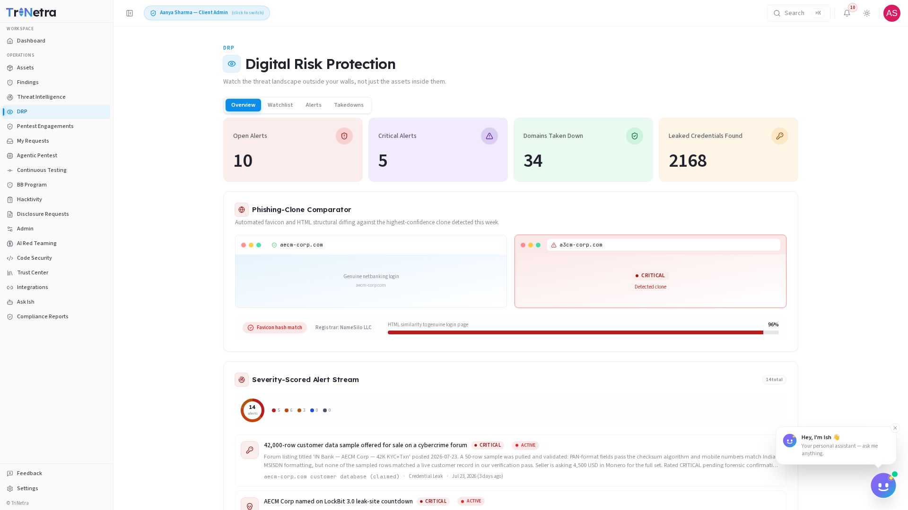
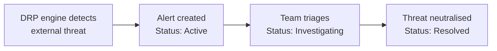
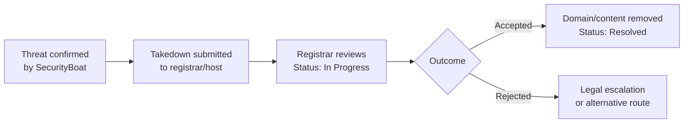

# Digital Risk Protection (DRP)

> **Availability:** DRP is a **platform-gated** module. You will only see **Digital
> Risk Protection** in the sidebar if your organisation is onboarded for DRP. If
> it is not there, your organisation is not subscribed to DRP — speak to your CSM.

### 1. What DRP is and why it matters

**Digital Risk Protection (DRP)** watches the threat landscape outside your walls,
not just the assets inside them. It continuously monitors the external internet —
domain registrations, social media, code repositories, paste sites, dark web
forums — to detect threats that traditional perimeter defences cannot see:
phishing clones, typosquatted domains, leaked credentials, brand impersonations,
and more.

Unlike a penetration test, which assesses your own infrastructure, **DRP scans the
open internet for threats that wear your brand but live beyond your control**. When
a threat is detected, the platform packages it as a severity-scored alert with
verifiable forensic evidence, and — crucially — provides an integrated takedown
workflow to get impersonating domains and fraudulent content removed.

For a client, DRP is a **read-only monitoring and alerting console** scoped to your
own organisation. SecurityBoat runs the watchlist-driven scans and manages
takedowns; you consume the alerts, evidence, and takedown status.

### 2. What each client role can do

| Action | Client Admin | Client TPM | Client Viewer |
|--------|:---:|:---:|:---:|
| View DRP dashboard, alerts, and takedowns | ✅ | ✅ | ✅ |
| Manage watchlist entries (add, edit, remove) | ✅ | ❌ | ❌ |
| Update alert status | ✅ | ✅ | ❌ |
| View forensic evidence on any alert | ✅ | ✅ | ✅ |
| Initiate or manage takedown requests | ❌ | ❌ | ❌ |

> **Why clients do not initiate takedowns directly:** domain takedowns and content
> removal involve legal notices, registrar liaison, and compliance verification.
> SecurityBoat staff own this step and update the takedown tracker so you always
> see live status.

### Navigation

Click **Digital Risk Protection** in the main sidebar menu. It has four tabs:
**Overview**, **Watchlist**, **Alerts**, **Takedowns**.

---

### 3. The Overview Dashboard

The Overview tab gives you an at-a-glance summary of your external risk posture.
Four metric cards sit at the top:

| Metric | Description | Why it matters |
|--------|-------------|----------------|
| **Open Alerts** | Active threats requiring investigation or action. | Your total outstanding external risk. |
| **Critical Alerts** | Highest-severity threats (phishing clones, active credential leaks). | Where to focus first — these carry the greatest operational and reputational risk. |
| **Domains Taken Down** | Impersonating domains successfully removed through the takedown process. | Proof of protection — shows the platform is actively neutralising threats. |
| **Leaked Credentials Found** | Employee or service credentials discovered in breach databases, public repos, or dark web dumps. | Indicates how much of your workforce identity has surfaced outside your control. |

Below the metrics, the **Severity-Scored Alert Stream** lists every alert ranked by
impact, with the most critical at the top. A counter shows your total alert volume.

**Key capabilities highlighted on the dashboard:**

- **Every alert ships with verifiable evidence** — favicon hashes, HTML similarity
  scores, DNS/WHOIS trails, and screenshots so you can validate each detection
  before taking action.
- **Deduplicated, org-scoped alerts** — the same phishing clone is not reported
  twice; alerts are correlated across watchlist terms and scoped strictly to your
  organisation.
- **Full audit trail from detection through confirmed takedown** — every status
  change, evidence update, and takedown milestone is logged.
- **Always-on monitoring, correlated with every attack-surface scan** — DRP
  continuously watches the external landscape and cross-references findings with
  your ASM data when both modules are active.

---

### 4. Watchlist

The **Watchlist** tab is where you define what the system monitors. Each entry
is a keyword, domain, or brand term that the DRP engine uses as a search anchor.

**What you can add to your watchlist:**

| Watchlist Entry Type | Examples | What it catches |
|----------------------|----------|-----------------|
| **Brand terms** | Company name, product names, trademarks | Impersonations in social media, forums, and dark web marketplaces |
| **Domains** | `example.com`, `example.co.uk` | Typosquatted domains, lookalike registrations, homograph attacks |
| **Executive names** | CEO, CTO, CFO full names | Fraudulent social media profiles, impersonation accounts |
| **Product keywords** | "ExamplePay", "ExampleCloud" | Fake mobile apps, phishing pages targeting specific services |

**How it works:** once a watchlist entry is saved, the DRP engine continuously
scans across multiple channels:

- **Domain registrations** — new gTLD/ccTLD registrations, WHOIS records, and
  certificate transparency logs for typosquatting and homograph attacks.
- **Social media and forums** — public posts, profiles, and pages referencing your
  brand terms.
- **Code repositories and paste sites** — GitHub, GitLab, Pastebin, and similar
  platforms for leaked secrets, credentials, and configuration files.
- **Dark web marketplaces and forums** — monitored for credential dumps, data
  sales, and threat actor discussions mentioning your organisation.

> **Only Client Admin** can add, edit, or remove watchlist entries. Client TPM and
> Client Viewer see the watchlist read-only.

---

### 5. Alerts

The **Alerts** tab is your investigation workspace. Every detection the DRP engine
produces appears here as a **severity-scored alert**.

**Each alert includes:**

| Field | Description |
|-------|-------------|
| **Title** | Summary of the detected threat (e.g., "Phishing clone of login page on typosquatted domain") |
| **Description** | Detailed write-up of what was found and why it is a risk |
| **Severity** | Critical, High, Medium, Low — reflects the potential operational and reputational impact |
| **Discovery timestamp** | When the DRP engine first detected the threat |
| **Status** | Active, Investigating, or Resolved |
| **Recommended action** | Guidance on what to do next — e.g., escalate to IR, notify affected users, await takedown |

**Alert lifecycle:**

Click any alert to expand its full detail view, which includes the **forensic
evidence package** (see [Alert Categories](#7-alert-categories) for what evidence
each alert type carries).

> **Client Admin and Client TPM** can update an alert's status. **Client Viewer**
> sees alerts read-only.

---

### 6. Takedowns

The **Takedowns** tab tracks the removal of impersonating domains and fraudulent
content. Every takedown request initiated by SecurityBoat on your behalf appears
here, organised in a **kanban-style board** that mirrors the takedown lifecycle.

**Each takedown card shows:**

| Field | Description |
|-------|-------------|
| **Domain** | The impersonating domain being targeted for takedown |
| **Registrar / Host** | The registrar or hosting provider from whom removal is being requested |
| **Request status** | Submitted, In Progress, Suspended, Resolved, or Rejected |
| **Resolution timeline** | Key dates — submitted, acknowledged by registrar, resolved |

**The takedown lifecycle:**

**Takedown retesting:** after a domain is marked as Resolved, the DRP engine
continues monitoring it for **30 days** to confirm the takedown holds. If the
domain reactivates or the content reappears, the alert reopens automatically.

> Takedown initiation and registrar liaison are handled by **SecurityBoat staff**.
> All client roles can view takedown status and track progress.

---

### 7. Alert Categories

The DRP engine classifies every detection into one of seven alert categories.
Each category carries its own forensic evidence package.

| # | Alert Category | What it detects | Forensic evidence |
|---|---------------|-----------------|-------------------|
| 1 | **Phishing Clone** | Identical replicas of your login interfaces on unauthorised domains. | Favicon hash comparison, HTML similarity score (0–100%), side-by-side screenshot of genuine vs. clone page. |
| 2 | **Typosquat / New Domain** | Lookalike domain names registered to deceive your users (e.g., `examp1e.com` vs `example.com`). | WHOIS registration data, DNS resolution trail, domain age, visual similarity score. |
| 3 | **Financial Fraud** | Fake promotions, job advertisements, or product listings using your brand to defraud victims. | Screenshot of fraudulent content, URL, platform details, first-seen timestamp. |
| 4 | **Ransomware Leak Site** | Mentions of your organisation on dark web ransomware leak sites and extortion portals. | Leak site URL, captured page content, publication date, threat actor name (if known). |
| 5 | **Credential Leak** | Employee or service credentials found in public repositories, paste sites, or breach dumps. | Redacted credential sample, source URL, leak timestamp, number of exposed records. |
| 6 | **Fake Mobile App** | Unauthorised apps using your brand assets on third-party or mirror app stores. | App store URL, package name, developer details, app icon comparison. |
| 7 | **Executive Impersonation** | Fraudulent social media profiles impersonating your executives. | Profile URL, profile screenshot, account creation date, follower count, platform. |

---

### 8. How DRP connects to the rest of the platform

DRP is not an island — it feeds into the broader TriNetra security ecosystem:

- **Findings module** — confirmed DRP alerts that represent a tangible
  vulnerability (e.g., an exposed credential unlocking an internal system) can be
  promoted into the unified **Findings** module for formal remediation tracking.
- **Attack Surface (ASM)** — when both modules are active, DRP cross-references
  typosquatted domains and phishing hosts against your known ASM inventory,
  flagging cases where an external threat overlaps with an owned-but-forgotten
  asset.
- **AI Assistant (Ish)** — you can ask Ish questions like "show me all
  Critical DRP alerts from the last 7 days" or "what is the status of the
  takedown for phishing-clone-example.com?" and it will query your live DRP data.
- **Pentest engagements** — a pattern of DRP alerts (e.g., repeated credential
  leaks) can inform the scope of your next penetration test or security awareness
  programme.

---

### Best practices

- **Keep your watchlist current** — add new product names as they launch, remove
  retired brands, and update executive names after leadership changes. An outdated
  watchlist creates blind spots. (Client Admin responsibility.)
- **Triage Critical alerts first** — phishing clones and active credential leaks
  can cause immediate harm. Establish a process for acknowledging these within
  hours, not days.
- **Use the forensic evidence before escalating** — the favicon hash and HTML
  similarity score let you confirm a phishing clone is genuine before notifying
  users or engaging your incident response team.
- **Monitor the Takedowns tab weekly** — even though SecurityBoat manages the
  takedown process, stalled requests (e.g., an unresponsive registrar) need your
  awareness so you can decide whether to escalate through legal channels.
- **Review credential leaks for trends** — a single leaked credential is a
  reminder to rotate passwords; a pattern of repeated leaks from the same team
  suggests a broader awareness gap worth addressing.

---

### Troubleshooting

| Symptom | Cause / Fix |
|---------|-------------|
| **No "Digital Risk Protection" in the sidebar** | Your organisation is not onboarded for DRP. Contact your CSM. |
| **Cannot add or edit watchlist entries** | You are **Client TPM** or **Client Viewer**. Only **Client Admin** can manage the watchlist. |
| **Alerts seem stale or no new alerts appearing** | Verify the watchlist has active entries with broad enough coverage. If the watchlist is empty or too narrow, the DRP engine has nothing to scan against. |
| **Cannot change an alert's status** | You are **Client Viewer** (read-only). Ask a Client Admin or Client TPM to update it. |
| **A takedown has been "In Progress" for a long time** | Some registrars and hosting providers are slow to respond. SecurityBoat is pursuing it; check the resolution timeline for the last action date. Escalate to your CSM if it has stalled beyond your tolerance threshold. |
| **A resolved takedown reappeared as an alert** | The DRP engine detected the domain or content reactivating during the 30-day retesting window. This is expected behaviour — SecurityBoat will re-initiate the takedown. |
| **An alert looks like a false positive** | Review the forensic evidence. If it genuinely does not relate to your organisation, update the status to Resolved with a note. Persistent false positives may indicate watchlist terms that are too generic. |

---

← Previous: [AI Red Teaming](23-ai-red-teaming.md) | Next: [Trust Center →](22-trust-center.md)
