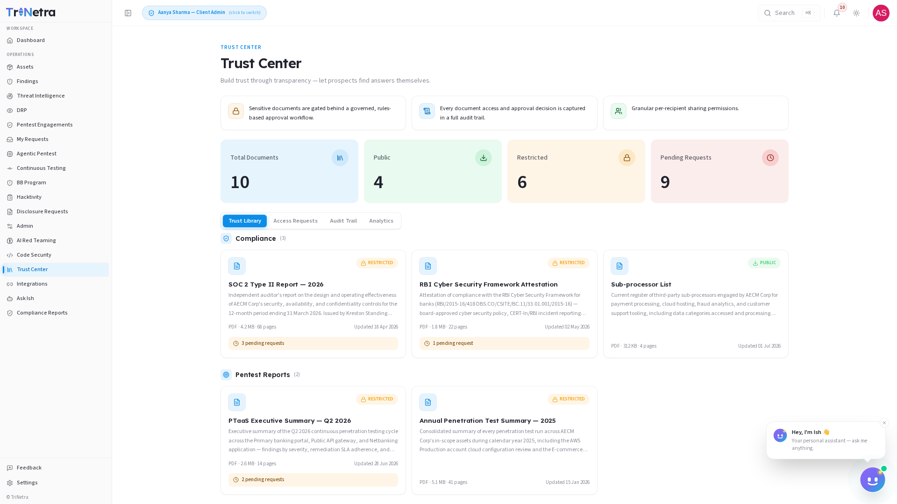

# Trust Center

> **Availability:** Trust Center is a **platform-gated** module. You will only see
> **Trust Center** in the sidebar if your organisation is onboarded for it. If it
> is not there, your organisation is not subscribed to Trust Center — speak to your CSM.

### 1. What Trust Center is and why it matters

**Trust Center** is your organisation's governed security portal and document
library — a single, controlled place where customers, prospects, and auditors can
request and access your pentest attestations, compliance certifications, security
policies, and other due-diligence artefacts. It lets you **build trust through
transparency** by letting prospects find answers themselves, without slowing down
your sales or security teams with repeated manual document exchanges.

Every document lives behind a governed, rules-based approval workflow. Before a
requester can view a restricted document, they must submit a request explaining
**who they are, which documents they need, and why**. You review and either approve
(with a configurable access window) or deny (with a reason). Every access decision
and document view is captured in a full, immutable audit trail.

For a client, Trust Center is your **document governance console**. SecurityBoat
hosts the portal and the document store; you manage which documents are published,
who gets access, and for how long.

> **Page title:** Trust Center
> **Page description:** Build trust through transparency — let prospects find answers themselves.

### 2. What each client role can do

| Action | Client Admin | Client TPM | Client Viewer |
|--------|:---:|:---:|:---:|
| View the Trust Library (public documents) | ✅ | ✅ | ✅ |
| View restricted document metadata (title, description, badges) | ✅ | ✅ | ✅ |
| Submit an access request for a restricted document | ✅ | ✅ | ✅ |
| Review, approve, or deny access requests | ✅ | ❌ | ❌ |
| Configure access windows on approvals | ✅ | ❌ | ❌ |
| Upload, publish, or unpublish documents | ✅ | ❌ | ❌ |
| View the Audit Trail | ✅ | ✅ | ❌ |
| View the Analytics tab | ✅ | ✅ | ❌ |
| View Access Requests tab (pending and resolved) | ✅ | ✅ | ❌ |

> **Why only Client Admin can approve requests and manage documents:** granting
> access to sensitive compliance and security documentation is a governance
> decision with regulatory implications. Client Admin owns the approval gate;
> Client TPM and Client Viewer can browse the library and submit their own
> requests but cannot approve or modify published documents.

### Navigation

Click **Trust Center** in the main sidebar menu. It has four tabs: **Trust
Library**, **Access Requests**, **Audit Trail**, and **Analytics**. Four metric
cards sit across the top, visible on every tab:

| Metric | Description |
|--------|-------------|
| **Total Documents** | The complete count of documents published in your Trust Library across all categories. |
| **Public** | Documents available to any visitor without an access request — typically marketing-friendly summaries and non-sensitive overviews. |
| **Restricted** | Documents gated behind the approval workflow — full reports, certifications, and policies that require a verified request. |
| **Pending Requests** | Access requests awaiting your review. This number turns amber when above zero — it is your action queue. |

---

### 3. Trust Library

The **Trust Library** tab is your document catalogue — what prospects, customers,
and auditors see when they visit your Trust Center. Documents are organised into
four categories:

| Category | What it contains | Typical examples |
|----------|------------------|------------------|
| **Compliance** | Regulatory attestations and framework-aligned reports. | SOC 2 Type II Report, RBI Cyber Security Framework Attestation, Sub-processor List |
| **Pentest Reports** | Penetration test summaries and executive overviews. | PTaaS Executive Summary, Annual Penetration Test Summary |
| **Policies** | Internal security policies and governance documents. | Information Security Policy, Access Control Policy, Data Classification Policy, Incident Response Policy, Business Continuity Plan |
| **Certifications** | Third-party certifications and independent audit letters. | ISO 27001 Certificate, PCI DSS Attestation of Compliance, CSA STAR Certification |

**Each document card displays:**

| Field | Description |
|-------|-------------|
| **Badge** | **RESTRICTED** (gated behind approval workflow) or **PUBLIC** (available to any visitor). Shown as a coloured chip at the top of the card. |
| **Title** | The document name as it appears to requesters. |
| **Description** | A short summary of what the document covers and who it is relevant to. |
| **Format / Size / Pages** | File type (PDF, DOCX), file size, and page count — helps requesters understand what they are asking for. |
| **Updated date** | When the document was last revised or re-uploaded. Outdated documents erode trust — keep this current. |
| **Pending requests** | A counter showing how many people have requested this specific document and are awaiting a decision. |

**What each role can do in the Trust Library:**

- **All roles** can browse the catalogue, read public documents, and see metadata
  for restricted documents.
- **All roles** can submit an access request for any restricted document by
  clicking the document card and filling in the request form (name, company,
  documents needed, business justification).
- **Client Admin** can upload new documents, edit document metadata (title,
  description, category, public/restricted flag), and unpublish documents that are
  no longer current.

> **Granular per-recipient sharing:** when you approve a request, you grant access
> to the specific documents the requester asked for — not the entire library. Each
> approval is scoped to the exact documents listed in the request.

---

### 4. Access Requests

The **Access Requests** tab is your approval workflow console. Every access request
submitted through the Trust Library lands here, waiting for a Client Admin to
review and act.

**Each request displays:**

| Field | Description |
|-------|-------------|
| **Requester name** | The person or organisation making the request. |
| **Company** | Their organisation affiliation — helps you verify legitimacy. |
| **Documents requested** | Which specific documents they need access to. |
| **Reason** | Business justification provided by the requester (e.g., "vendor security assessment", "regulatory audit preparation", "customer due diligence"). |
| **Status** | **Pending** (awaiting review), **Approved** (access granted), **Denied** (request rejected), or **Expired** (access window closed). |
| **Requested date** | When the request was submitted. |

**Approving a request:**

1. Click **Approve** on the request.
2. Set the **access window** — the period during which the requester can view the
   documents. Typical windows are 7–30 days. After the window closes, access
   expires automatically.
3. The requester receives a secure link with time-limited access to the approved
   documents.

**Denying a request:**

1. Click **Deny** on the request.
2. Provide a **reason** for the denial (e.g., "request outside scope", "requester
   identity could not be verified", "document not appropriate for this audience").
3. The requester is notified of the decision with your explanation. Clear reasons
   help requesters understand and potentially re-apply with corrected information.

> **Only Client Admin** can approve or deny requests. Client TPM and Client Viewer
> can see the Access Requests tab and monitor pending/approved/denied statuses, but
> cannot make decisions.

---

### 5. Audit Trail

The **Audit Trail** tab provides a complete, immutable log of every interaction
with your Trust Center. It answers the questions: _who asked for what, who approved
it, and when was it viewed?_

**Each audit entry records:**

| Field | Description |
|-------|-------------|
| **Requester** | The individual or organisation who submitted the access request. |
| **Document** | Which document was requested or accessed. |
| **Action** | The event type — Requested, Approved, Denied, Viewed, or Expired. |
| **Performed by** | Who performed the action (the requester for views, the Client Admin for approvals/denials). |
| **Timestamp** | Date and time of the event (UTC). |
| **IP address** | The IP address from which the action originated — useful for security investigations and verifying legitimate access. |
| **Details** | Additional context — the access window granted, the denial reason, or the document version viewed. |

The Audit Trail is **read-only** for all roles. It cannot be edited, deleted, or
purged — every access decision and document view is permanently recorded for
compliance and governance purposes.

> **Client Admin and Client TPM** can view the Audit Trail. **Client Viewer**
> cannot access this tab.

---

### 6. Analytics

The **Analytics** tab provides engagement intelligence — helping you understand
how prospects, customers, and auditors are interacting with your Trust Center.

**Key analytics panels:**

| Panel | What it shows | Why it matters |
|-------|---------------|----------------|
| **Most-Requested Documents** | A ranked list of documents by request volume. | Reveals what prospects and auditors ask for most — use this to decide which documents to keep updated and potentially make public. |
| **Prospect Activity** | A timeline of request submissions, showing which organisations are engaging with your Trust Center and when. | Identifies active sales conversations and due-diligence cycles — a spike in requests often correlates with procurement activity. |
| **Approval Velocity** | Average time from request submission to approval decision. | Measures the responsiveness of your approval process — long delays can stall sales cycles. |
| **Access Window Utilisation** | How often approved requesters actually view documents within their access window. | Indicates whether your access windows are appropriately sized — if most views happen in the first 48 hours, a 30-day window may be unnecessary. |
| **Category Distribution** | Breakdown of requests by document category (Compliance, Pentest Reports, Policies, Certifications). | Shows which types of documents drive the most demand — useful for prioritising document updates and publication. |

> **Client Admin and Client TPM** can view the Analytics tab. **Client Viewer**
> cannot access this tab.

---

### 7. How Trust Center connects to the rest of the platform

Trust Center is a governed document portal, but it feeds into the broader TriNetra
security ecosystem:

- **Findings module** — pentest report summaries and attestations published in the
  Trust Center are sourced from the findings and engagement data in your platform.
  When a new pentest engagement completes and its report is finalised, a Client
  Admin can publish the summary to the Trust Library.
- **Engagements** — the PTaaS Executive Summary and Annual Penetration Test
  Summary documents are derived from completed engagements. Keeping the Trust
  Library current means publishing reports as engagements close.
- **Compliance Reports** — regulatory attestations (SOC 2, RBI CSF, ISO 27001)
  that appear in your Compliance Reports module can be selectively published to the
  Trust Center for external consumption.
- **AI Assistant** — you can ask the AI Assistant questions like "how many pending
  access requests do we have?" or "which document was requested most this quarter?"
  and it will query your live Trust Center data.
- **Settings** — notification preferences in Settings control whether you receive
  alerts for new access requests. Ensure these are enabled if you are a Client
  Admin responsible for approvals.

---

### Best practices

- **Keep documents current.** An expired certification or outdated pentest report
  in your Trust Library erodes trust and can stall a sales cycle. Set a recurring
  calendar reminder to review and refresh published documents quarterly. (Client
  Admin responsibility.)
- **Set reasonable access windows.** 7–14 days is typical for most requests —
  enough time for the requester to review the document without leaving sensitive
  material accessible indefinitely. For audit preparation, 30 days may be
  appropriate.
- **Review pending requests promptly.** A slow approval process can delay
  procurement decisions and frustrate prospects. Aim to review requests within one
  business day.
- **Use the denial reason field thoughtfully.** A clear, specific explanation helps
  the requester understand the decision and — if appropriate — re-apply with
  corrected information. Vague denials create friction and erode trust.
- **Monitor the Analytics tab for trends.** A sudden spike in requests for a
  specific document often signals an active sales pipeline or an industry-wide
  compliance shift. Use this intelligence to prepare your team.
- **Publish summaries rather than full reports where appropriate.** An executive
  summary of a pentest report often satisfies a prospect's due diligence without
  exposing detailed vulnerability information. Reserve full reports for verified
  auditors and enterprise procurement teams.
- **Audit the Audit Trail periodically.** A monthly review of access patterns
  confirms that only legitimate requesters are viewing your documents and that
  approval decisions are being made consistently.

---

### Troubleshooting

| Symptom | Cause / Fix |
|---------|-------------|
| **No "Trust Center" in the sidebar** | Your organisation is not onboarded for Trust Center. Contact your CSM to discuss adding it to your subscription. |
| **Cannot approve or deny access requests** | You are signed in as **Client TPM** or **Client Viewer**. Only **Client Admin** can approve or deny requests. Ask your organisation's Client Admin to handle pending requests. |
| **Cannot upload or edit documents** | You are signed in as **Client TPM** or **Client Viewer**. Document management is restricted to **Client Admin**. |
| **Cannot see the Audit Trail or Analytics tabs** | You are signed in as **Client Viewer**. These tabs are restricted to **Client Admin** and **Client TPM**. |
| **A requester says their access link does not work** | Their access window may have expired. Check the Access Requests tab — if the status is **Expired**, the requester will need to submit a new request. |
| **A document is showing stale or outdated information** | A Client Admin needs to update or unpublish the document. If you are a Client TPM or Viewer, notify your Client Admin. |
| **Pending Requests counter shows a number but the Access Requests tab is empty** | This may indicate a filtering issue — ensure no filters are applied in the Access Requests tab. If the issue persists, contact your CSM. |
| **Too many pending requests accumulating** | This is a process issue, not a platform bug. Consider whether your approval process needs additional Client Admins to share the review workload, or whether some frequently requested documents could be made public. |

---

← Previous: [Digital Risk Protection (DRP)](21-drp.md) | Next: [AI Assistant (Ish) →](13-ai-assistant.md)
