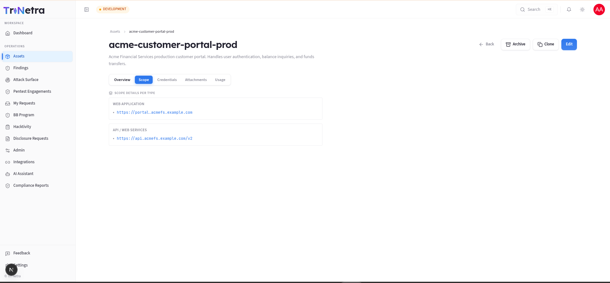
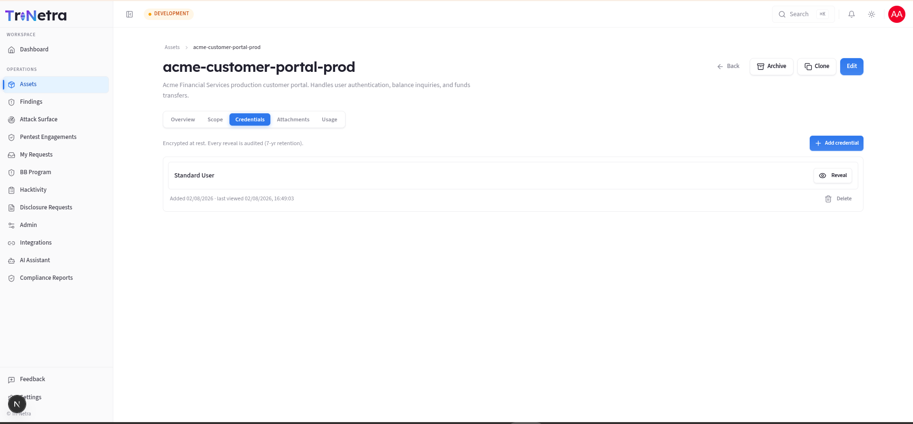
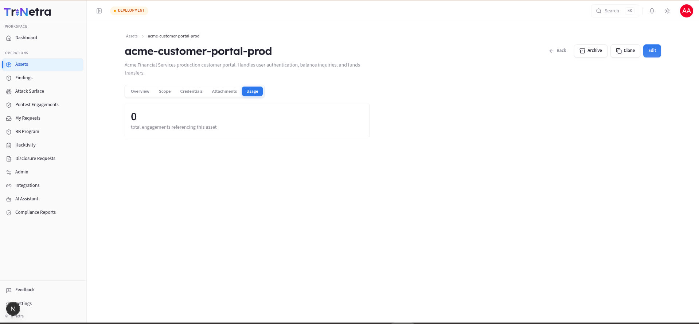

## Asset Detail

The Asset Details page provides a centralized, read-only view of a single asset's configuration, credentials, attachments, and testing history. 

---

### 1. Header Actions

For users with **Client Admin** or **Client TPM** privileges, the header displays several management tools:

| Action | Control Behaviour | Typical Use Case |
|---|---|---|
| **Edit** | Opens the asset editing interface. | Modify the description, change the owner, alter target types, or update the scope. |
| **Archive** | Triggers an archive confirmation dialog. Transitions the asset state to `Archived`. | Remove retired or decommissioned assets from default view lists without destroying their history. |
| **Restore** | Appears in place of "Archive" for archived assets. Returns state to `Active`. | Re-enable an asset that has been put back into testing rotation. |
| **Clone** | Opens a dialog requesting a new name. Duplicates metadata and scope contract. | Quickly spin up a similar environment (e.g., creating a `-staging` counterpart to a `-prod` asset). |
| **Back** | Returns you directly to the main Assets list page. | Navigation shortcut. |

#### Why Archiving is Preferred Over Deletion

Tri-Netra does not support hard-deleting assets. This is a deliberate design choice:

- **Audit Trails**: Security reports, historical pentests, and active findings are linked to the asset record. Deleting an asset would orphan these records and break compliance audit trails.
- **Safety Valve**: Archiving hides the asset from active dropdowns and dashboards but preserves its entire history.
- **Active Engagement Lock**: The platform actively blocks archiving if the asset is currently referenced in a live, active pentest engagement. You must complete or cancel the engagement before you can archive the asset.

---

### 2. Tabbed Submodules In-Depth

The body of the details page is split into five tabs:

#### a. Overview Tab

Provides a high-level summary of the asset's metadata and description.

- **Description**: Displays the formatted rich-text description. If diagrams or images were pasted into the description editor, they render inline here.
- **Metadata Cards**:
  - **Types**: Lists the selected categories (Web App, API, Mobile, etc.).
  - **Criticality**: Displays the color-coded criticality pill (Critical → Informational).
  - **State**: Displays the active state badge.
  - **Owner**: Identifies the assigned technical or business owner.
  - **Created**: Shows the creation date and the name of the user who registered it.
  - **Updated**: Shows the timestamp of the last modification.

#### b. Scope Tab

Displays the type-specific targets set in the scope contract:

- **Web Applications / APIs**: Shows lists of verified URLs or base endpoints. If documentation (like Postman collections, OpenAPI/Swagger specifications, or architecture diagrams) is attached, clicking the link downloads the file.
- **Mobile Apps**: Lists Store links, uploaded APK/IPA binaries, and special instructions.
- **Network & Infrastructure**: Shows a paginated list of IP addresses or CIDR ranges (10 rows per page) alongside VPN configuration notes.

#### c. Credentials Tab

Manages test credentials for the asset. Client Viewers can see that credentials exist but cannot view secrets.

- **Auditable Reveals**: Clicking the reveal icon on a password or API key decrypts it on the fly. To prevent credential abuse, **every reveal is tracked**. The system records the name of the user, the timestamp, and the credential label, and retains this audit trail for **7 years**.
- **In-Place Additions**: Client Admins and TPMs can click **Add credential** to supply new login sets directly from this tab.
- **Deletion**: Obsolete credential sets can be removed using the trash icon (requires confirmation).

#### d. Attachments Tab

Hosts files uploaded via the **Scope Details** section (architecture diagrams, Postman collections, OpenAPI specs, APK/IPA binaries, etc.).

> **How files arrive here:** Files are not uploaded directly on this tab. When you upload a document inside a Scope detail input (e.g., an architecture diagram for a Web Application or an OpenAPI spec for an API), it is automatically surfaced in the Attachments tab once the virus scan completes.

- **Virus Scanning Lifecycle**: Every file uploaded undergoes an automated security scan:
  - `Scanning...`: The file is undergoing verification. Downloads are disabled.
  - `Clean`: The scan passed. The file is accessible to authorized testers and download icons are enabled.
  - `Infected - Quarantined`: The file failed the scan. The system locks down the file, blocks downloads, and flags it as quarantined.
- **Unlinking**: Users can remove files by clicking the trash icon next to the attachment.

#### e. Usage Tab

Provides a rollup of the asset's security testing history within your organization:

- Displays the **total count** of pentest engagements referencing the asset.
- Lists **recent engagements** showing their title, project ID, state (e.g., Draft, In Progress, Completed), and creation date.
- Provides a quick link (`View →`) to jump directly to the specific PTaaS engagement.

---

← Previous: [Create Asset](create-asset.md) | Next: [Edit Asset](edit-asset.md)
