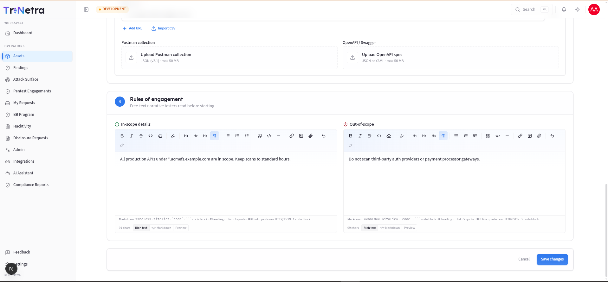

## Edit Asset

Only users with **Client Admin** or **Client TPM** privileges can edit assets. This guide explains how to update existing asset configurations and define boundaries for security testing.

---

### 1. Accessing the Edit Interface

To edit an asset:

1. Navigate to the **Assets** module in the sidebar.
2. Click on the name of the asset you want to update to open its **Asset Details** page.
3. In the top-right header, click the **Edit** button.

---

### 2. Editable Fields & Structure

The edit form is structured similarly to the asset creation form, allowing you to update:

- **Basic Information**: Change the asset name (must remain unique) or adjust the criticality level.
- **Description**: Expand on the rich-text context or paste updated diagrams.
- **Asset Types**: Add or remove types (up to 3 total). Doing so will dynamically show or hide scope configuration modules.
- **Scope Details**: Update URL lists, upload new OpenAPI specifications, replace Postman collections, or modify the network target IP/CIDR table.

---

### 3. Key Differences from the Create Flow

There are two major differences between the creation form and the edit form:

#### a. Credentials Management
The **Credentials** section is **not present** on the Edit Asset page. Because credentials contain sensitive secrets that are encrypted at rest, they cannot be modified in a bulk form. Instead:

- All additions, views (reveals), and deletions of test accounts are managed directly under the **Credentials tab** on the **Asset Details** page.

#### b. Rules of Engagement (Section 4)

The Edit Asset form replaces the Credentials section with **Section 4: Rules of Engagement**. This section contains two critical rich-text fields that define how testers are allowed to interact with the asset:

| Field | Purpose | Industry Best Practice / Examples |
|---|---|---|
| **In-scope details** | Provides operational guidelines, constraints, and instructions for the testing team. | * "Please run aggressive scans only between 10:00 PM and 4:00 AM UTC." * "Focus heavily on the user profile update API endpoints." * "Rate limit scanning to a maximum of 5 requests per second to avoid triggering WAF blocks." |
| **Out-of-scope** | Sets absolute boundaries, restricted areas, or actions that testers must not perform. | * "Do not perform testing on the payment gateway sandbox (`/api/v1/payments`)." * "Do not attempt denial-of-service (DoS) testing." * "Do not access or modify accounts other than those explicitly provided in the credentials tab." |

> **Testers' Playbook:** SecurityBoat testers treat these rules as contractually binding. Clear rules of engagement prevent accidental downtime on fragile staging environments and ensure testing is focused exactly where you need it.

---

### 4. Saving Changes

Once updates are complete, click **Save changes** in the sticky footer. If any file uploads fail during the save process, you will receive a notification prompting you to retry uploading that specific file.

---

← Previous: [Asset Detail](asset-detail.md) | Next: [Findings](../05-findings.md)
