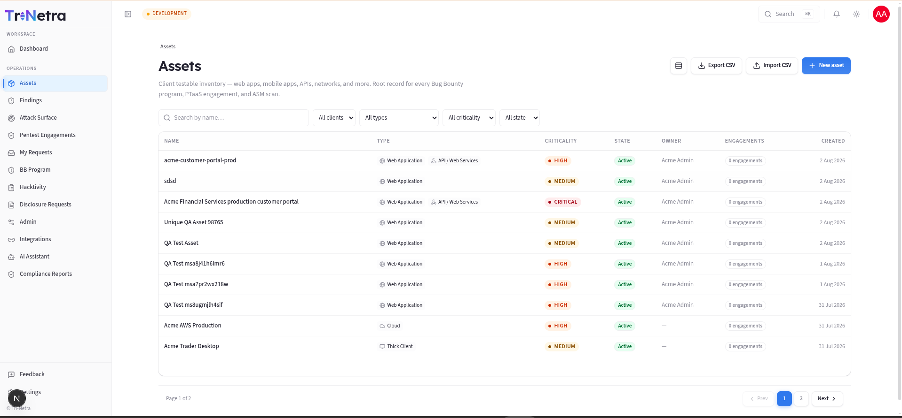

## Assets Overview

### 1. What an "asset" is and why it matters

In Tri-Netra, an **asset** is a single testable target that belongs to your organisation — a web application, an API, a mobile app, a network range, a cloud environment, and so on. It is the **root record** that every security activity hangs off:

- A **PTaaS engagement** (a scheduled penetration test) is always scoped to one or more assets.
- A **Bug Bounty program** advertises an asset (or set of assets) for researchers to test.
- An **ASM scan** (attack-surface monitoring) discovers and watches an asset's exposed surface.

Think of your asset inventory as the foundation of all your security testing. By defining your assets clearly (with the exact web links, IP ranges, or applications to test), our security team can work efficiently without guessing what is in scope. Setting the correct business importance (criticality) for each asset also ensures that any discovered vulnerabilities are prioritized and fixed correctly. Investing a small amount of time up front to set up your assets accurately makes all your future testing faster and more effective.

**Mental model:** Think of an asset as a "product record" for security. It has identity (name, type), risk classification (criticality), a precise definition of what's in bounds (scope contract), optional secrets testers need (credentials), and a lifecycle (active → archived).

---

### 2. What each client role can do (and why)

Asset permissions are enforced centrally by the platform's authorization service. That means the rules below hold no matter how you reach a page.

| Action | Client Admin | Client TPM | Client Viewer | Why |
|---|:---:|:---:|:---:|---|
| View / search list | ✅ | ✅ | ✅ | Everyone in your org needs situational awareness. |
| Open detail (metadata) | ✅ | ✅ | ✅ | Reviewing scope/criticality is read-only. |
| Export list to CSV | ✅ | ✅ | ✅ | Export is a client-side dump of what you can already see. |
| Create / Edit / Import | ✅ | ✅ | ❌ | These change the inventory — a write surface. |
| Clone | ✅ | ✅ | ❌ | Clone creates a new record (same surface as create). |
| Archive / Restore | ✅ | ✅ | ❌ | Lifecycle changes are writes. |
| View asset **credentials** | ❌ | ❌ | ❌ | Secrets are gated by a *separate* policy; clients don't read them back. |

---

### Navigation

Click **Assets** in the left sidebar menu.

---

### 3. The Assets list — every control explained

The list is your inventory dashboard: what exists, how risky it is, and whether it's actively being tested.

#### Toolbar (top-right)

| Control | Type | What it does | Expected result |
|---|---|---|---|
| **Density toggle** | Toggle | Switches row height between comfortable and compact. | Table redraws denser/looser; purely visual, nothing is saved. |
| **Export CSV** | Button | Serialises the **currently loaded rows** to a file. | Browser downloads `assets-export-<YYYY-MM-DD>.csv` with columns for name, target type, target URL, criticality, owner email, and description. Disabled when the list is empty. |
| **Import CSV** | Button → page | Opens the bulk-import workflow. | Opens the bulk import page. *(Client Admin / Client TPM only.)* |
| **New asset** | Button → page | Opens the create form. | Opens the create asset form. *(Client Admin / Client TPM only.)* |

> **Why Export is available to everyone but Import isn't:** Exporting only reveals data you already have permission to see, so it's safe for **Client Viewer**. Importing *writes* new records, so it's restricted to admins/TPMs.

#### Filter bar

All filters combine (AND logic) and narrow the table in place:

| Filter | Type | Values | Use case |
|---|---|---|---|
| **Search** | Text | Matches asset **name** | Jump to a known asset quickly. |
| **Type** | Dropdown | Web App, API, Mobile (Android/iOS), Network, Cloud, Hardware, Thick Client, IoT/Embedded, Telecom, Physical, Other | "Show me only our APIs." |
| **Criticality** | Dropdown | Critical / High / Medium / Low / Informational | "Which crown-jewel assets do we have?" |
| **State** | Dropdown | Active / Inactive / Archived | Find retired assets, or hide them. |
| **Clear** | Button | — | Appears once any filter is set; resets all filters at once. |

> Filters are held **in memory** and reset when you navigate away — they are not written to the URL. This is intentional so a shared link never leaks your filtering intent.

#### Table columns

| Column | Meaning |
|---|---|
| **Name** | The asset's unique name in your org. Click to open its detail page. |
| **Type** | One or more coloured badges. An asset can carry **up to 3 types** (e.g. a product that is both a Web App and an API). |
| **Criticality** | Colour-coded pill from Critical (red) → Informational (blue). Drives triage priority. |
| **State** | Active / Inactive / Archived. |
| **Owner** | The person accountable for the asset, or `—` if unassigned. |
| **Engagements** | How many engagements (active or historical) reference this asset — a quick signal of how heavily tested it is. |
| **Created** | When the asset record was created. |

**Empty state:** With no assets (or none matching your filters) you'll see a prompt with **Add asset** and **Import CSV** buttons instead of a table.

---

### Best practices & Tips

- **Prioritize Critical Assets**: Make sure your highest criticality assets are clearly named and fully documented first.
- **Consistent Naming**: Use a naming convention that matches your internal systems (e.g., `brand-app-prod`, `payments-api-staging`) so team members instantly recognize the target.

---

← Previous: [Dashboard](../03-dashboard.md) | Next: [Create Asset](create-asset.md)
