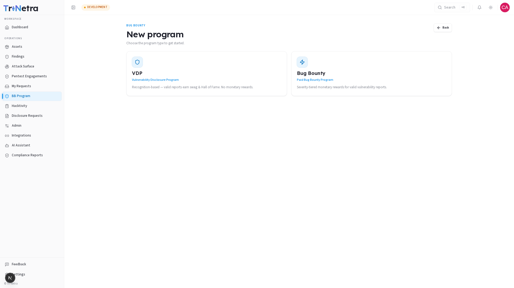
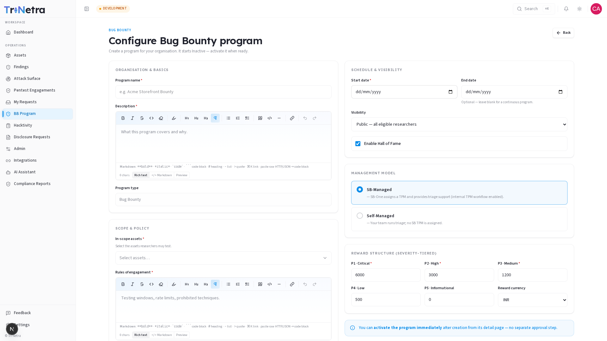
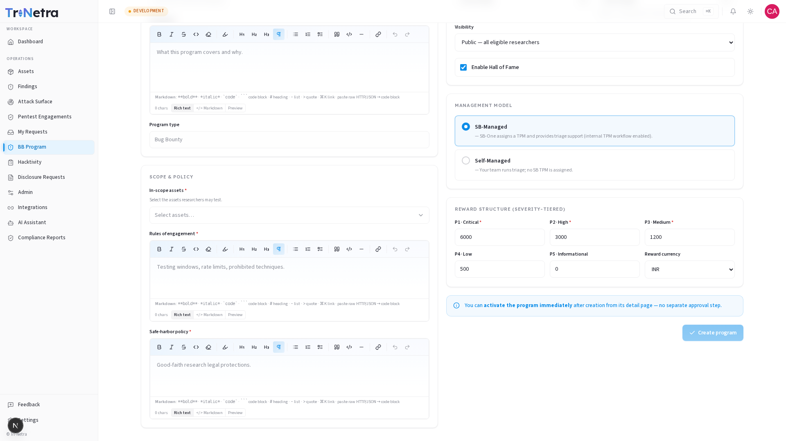

# Create a Bug Bounty Program

> **Who can do this:** Client Admin only. Client TPM and Client Viewer do not see the **New program** button.

Creating a program is a two-step process: first choose the program type, then configure all the details. New programs are created in **Inactive** state — they are not visible to researchers until activated, giving you time to review every setting.

---

## Step 1 — Choose Program Type

Navigate to **BB Program** in the left sidebar. If your organisation has no programs yet, you will see an empty state with a **Create program** button. If programs already exist, click **New program** in the top-right corner.

You will be shown two cards to choose from:

| Card | Choose when… |
|------|-------------|
| **VDP — Vulnerability Disclosure Program** | You want a responsible-disclosure channel. Researchers earn recognition (swag + Hall of Fame), not money. Best for getting started. |
| **Bug Bounty — Paid Bug Bounty Program** | You want severity-tiered cash rewards to incentivise deeper research. |

Click either card to proceed to Step 2. You cannot change the program type after creation, so choose carefully.

---

## Step 2 — Configure the Program

The configuration form is organised into five sections. All fields marked with a red asterisk (`*`) are required before you can submit.

> **Tip:** The form validates as you type. A validation counter in the sticky footer at the bottom of the page shows how many required fields are still empty. The **Create program** button becomes active only when all required fields are filled.

---

### Organisation & Basics

| Field | Required | What to enter |
|-------|:--------:|--------------|
| **Program name** | ✅ | A clear, descriptive name (e.g., *Acme Storefront Bounty*). Must be unique within your organisation and at least 3 characters. |
| **Description** | ✅ | Explain what this program covers and why — researchers will read this. Use the rich-text editor with bold, italic, lists, headings, blockquotes, and code blocks. |
| **Program type** | — | Pre-filled from Step 1 and cannot be changed here. |

> **About the rich-text editor:** The Description field includes a full formatting toolbar (Bold, Italic, Strikethrough, Inline code, Headings 1–3, Bullet/Ordered/Task lists, Blockquote, Code blocks, Horizontal rules, and Links). You can also toggle to **Markdown** mode or use the **Preview** tab to see how your description will appear to researchers. Keyboard shortcuts like `⌘B` (bold) and `⌘K` (insert link) are supported.

---

### Scope & Policy

This section defines what researchers are permitted to test and the ground rules they must follow.

| Field | Required | What to enter |
|-------|:--------:|--------------|
| **In-scope assets** | ✅ | Select one or more assets from the dropdown. Only assets registered in the **Assets** module are available. If the list is empty, add assets there first. |
| **Rules of engagement** | ✅ | The testing boundaries: permitted hours, rate limits, prohibited techniques, tools that are banned. Be explicit — ambiguity leads to researcher disputes. Uses the same rich-text editor as the Description field. |
| **Safe-harbor policy** | ✅ | Your organisation's legal commitment that researchers acting in good faith within scope will not face legal action. Use plain language. Uses the same rich-text editor. |

> **Why scope matters:** Researchers can only be held to rules you have written down. A well-defined scope minimises out-of-scope noise and protects both parties.

---

### Schedule & Visibility

| Field | Required | What to enter |
|-------|:--------:|--------------|
| **Start date** | ✅ | When the program officially opens. Can be today or a future date. |
| **End date** | ❌ | Leave blank for a continuous (rolling) program. Enter a date only if you want the program to close automatically on a specific day. |
| **Visibility** | ✅ | **Public** — open to all eligible researchers on the platform. **Private** — invite-only; only researchers you add via the Team can participate. |
| **Hall of Fame** | ✅ | Toggle to enable a public leaderboard celebrating top researchers by accepted findings. Recommended — it motivates researchers without extra cost. |

---

### Management Model

Choose how triage support is provided:

| Option | What it means |
|--------|--------------|
| **SB-Managed** | SecurityBoat assigns a Technical Project Manager who assists with triage, escalations, and workflow management. The internal TPM workflow is enabled. Recommended for most clients. |
| **Self-Managed** | Your team handles triage directly. No SB TPM is assigned. Choose this only if you have internal security staff dedicated to managing incoming reports. |

---

### Reward Structure *(Bug Bounty programs only)*

If you chose **Bug Bounty**, a reward table appears. Set a payout amount for each severity level:

| Severity | Label | Suggested guidance |
|----------|-------|--------------------|
| P1 | Critical | Highest payout — your most serious findings (e.g., RCE, SQL injection) |
| P2 | High | Significant impact, harder to exploit (e.g., access control bypass, stored XSS) |
| P3 | Medium | Moderate impact (e.g., CSRF, sensitive info disclosure) |
| P4 | Low | Minor impact (e.g., configuration flaws) |
| P5 | Informational | Awareness only — usually set to $0 |

Choose your **reward currency** from the dropdown: INR, USD, EUR, or GBP.

> **VDP programs** skip this section — researchers earn recognition points and Hall of Fame placement, not monetary rewards.

---

## Submitting the Form

Once all required fields are filled, the **Create program** button in the sticky footer becomes active. Click it to create the program.

The program is created in **Inactive** state and you are taken directly to its detail page.

> The program is **not live yet**. Researchers cannot see or access it until it is activated. You can activate it immediately from the program detail page — no separate approval step is needed. This gives you time to review all settings before going public.

---

## What happens next

1. Review the program on the [Program Detail page](program-detail.md) — check every tab to make sure everything looks right.
2. When satisfied, activate the program from the detail page.
3. If the program is **Public**, researchers can discover and start testing immediately. If **Private**, your CSM will help invite specific researchers.
4. Monitor the [Findings tab](detail/findings.md) as submissions come in, and use the [Payouts tab](detail/payouts.md) to approve bounties for accepted findings.

---

← Previous: [Overview](overview.md) | Next: [Program Detail →](program-detail.md)
