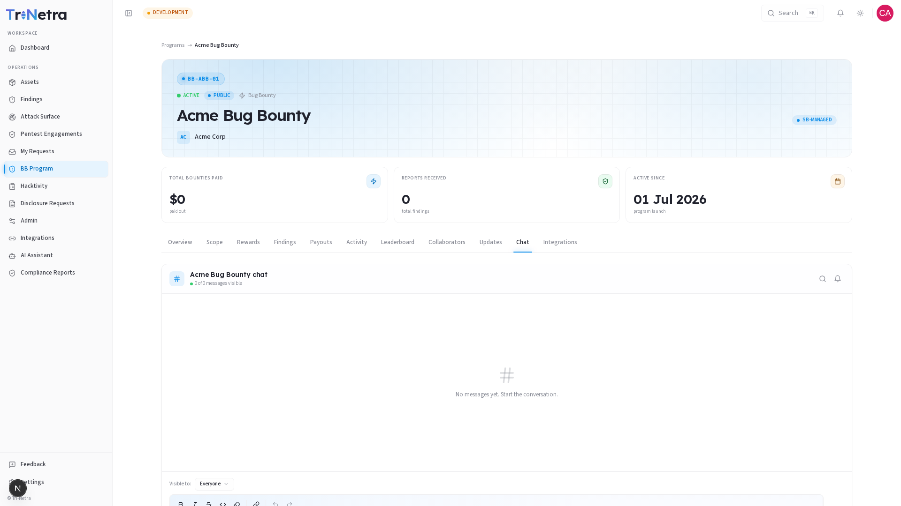

# Program Chat

> **Who can view and send messages:** Client Admin, Client TPM, Client Viewer. Messages are visible based on the visibility level selected when sending.

The **Chat** tab is a real-time messaging channel for this specific program. It allows all program participants — your team, SecurityBoat staff, and researchers — to communicate in one place, eliminating scattered email threads.

---

## Message visibility levels

Every message is tagged with a visibility level that controls who can see it:

| Visibility | Who can see it | When to use |
|------------|---------------|-------------|
| **Everyone** | All program participants — clients, SecurityBoat staff, and researchers | General announcements, scope clarifications, public discussions |
| **Internal** | SecurityBoat staff only (TPM / CSM) | Internal triage discussions (not visible to you) |
| **Client only** | Client roles — Admin, TPM, Viewer | Discussions visible only to your team |
| **Researchers** | Researchers only | Researcher-to-researcher coordination (not visible to you) |
| **Restricted** | Admin only | Confidential admin communications |

As a client, you can send messages with **Client only** or **Everyone** visibility. Messages from other visibility levels that are not relevant to your role are hidden from your view.

---

## How to use the Chat

1. Open the **Chat** tab on the program detail page.
2. Select the visibility level from the dropdown (Client only or Everyone).
3. Type your message in the text field at the bottom.
4. Press Enter or click Send.

Messages appear in chronological order with the sender's name, role badge, and timestamp. The chat updates in real time — you do not need to refresh the page.

---

## Best practices

- **Use "Everyone" for program-wide updates** — if you are clarifying scope or announcing a change, make it visible to researchers so they are informed.
- **Use "Client only" for internal discussions** — if you are discussing a finding or payout with your own team, keep it private to avoid confusion.
- **Keep conversations in context** — the Chat is per-program. If you need to discuss something across programs, use email or your CSM.
- **Avoid sharing sensitive details in "Everyone" messages** — remember that researchers can see those messages. If you need to discuss confidential information, switch to Client only visibility or use a direct channel with your CSM.

---

## Troubleshooting

| Symptom | Cause / Fix |
|---------|-------------|
| **I cannot see messages from my team** | Messages may have been sent with a different visibility level. Check that they were sent as "Client only" or "Everyone". |
| **A researcher cannot see my message** | You may have sent it with "Client only" visibility. Resend with "Everyone" visibility if the message is for researchers. |
| **The chat is not updating** | If the real-time connection drops, refresh the page. The chat reconnects automatically in most cases. |

---

← Previous: [Collaborators](collaborators.md) | Next: [Edit a Program →](../edit-bug-bounty.md)
