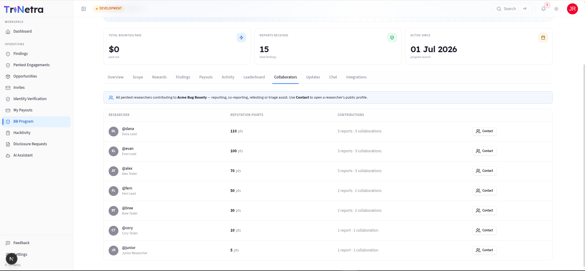

# Program Collaborators

> **Who can view:** Client Admin, Client TPM, Client Viewer.

The **Collaborators** tab lists every researcher who has contributed to this program in any capacity — submitting a finding, co-reporting, retesting, or assisting with triage.

---

## What you will see

Each collaborator row displays:

| Column | Description |
|--------|-------------|
| **Researcher** | Display name and username |
| **Reputation Points** | Total points accumulated on this program |
| **Contribution breakdown** | Number of reports versus collaborations |
| **Contact** | Link to view the researcher's public profile |

---

## Collaborators vs. Team

Do not confuse this with the **Team** tab:

| Tab | Shows |
|-----|-------|
| **Team** | Researchers **invited** to a Private program (may not have submitted yet) |
| **Collaborators** | Researchers who have **contributed** — submitted, co-reported, or retested (all programs) |

On a Public program, you will only see the Collaborators tab. On a Private program, you will see both tabs — Team for invited researchers and Collaborators for those who have actually submitted.

---

## Researcher profiles

Clicking **Contact** opens a researcher's public profile, which typically shows:

- Researcher's display name and avatar
- Overall platform reputation
- Areas of expertise (e.g., web, mobile, API, cloud)
- Number of findings submitted across all programs

> This is useful for identifying researchers you may want to invite to future private programs or engage for deeper testing.

---

## When the tab is empty

If no researchers have contributed yet, the tab shows: *"No collaborators yet. Researchers appear here once they submit findings to this program."* This is expected for newly created programs.

---

← Previous: [Leaderboard](leaderboard.md) | Next: [Chat →](chat.md)
