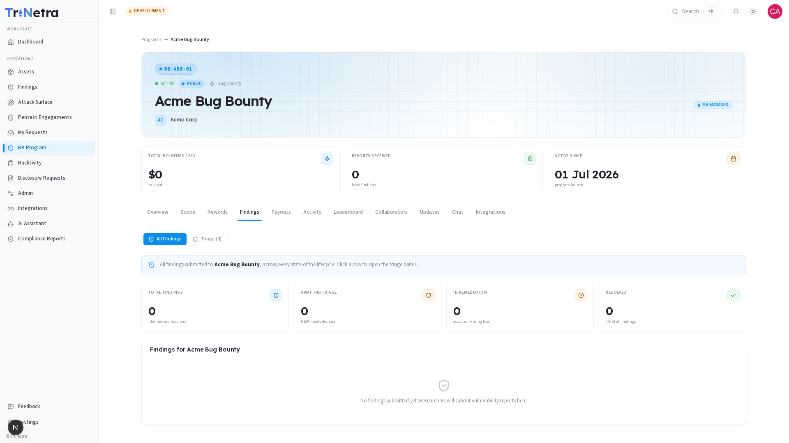

# Program Findings

> **Who can view:** Client Admin, Client TPM, Client Viewer.

The **Findings** tab lists every verified finding that has been submitted to this specific program. It is the primary place to monitor what researchers are discovering on your assets.

> You can also see all Bug Bounty findings across all your programs from the main **Findings** module in the sidebar. The program Findings tab is scoped specifically to this one program.

---

## KPI overview



At the top of the Findings tab, four KPI tiles give you a quick pulse:

| Tile | What it counts |
|------|---------------|
| **Total findings** | All findings ever submitted to this program |
| **Awaiting triage** | New findings that have been submitted but not yet reviewed |
| **In remediation** | Accepted findings that are currently being fixed |
| **Resolved** | Findings that have been fixed, with a percentage of total |

---

## Finding states (lifecycle)

Every finding in this program moves through a defined lifecycle:

```
NEW (awaiting triage)
  → ACCEPTED (valid, needs fixing)
    → FIX IN PROGRESS → RESOLVED
  → DISCARDED (invalid, duplicate, or not applicable)
```

| State | What it means |
|-------|--------------|
| **New** | Researcher submitted; awaiting SecurityBoat triage |
| **Accepted** | Verified as valid by the SecurityBoat triage team; remediation needed |
| **Fix in Progress** | Your team is actively working on the fix |
| **Resolved** | The vulnerability has been fixed and verified |
| **Discarded** | Rejected during triage — invalid, duplicate, out of scope, or not applicable |

---

## Findings table

Each row in the table represents one finding and shows:

| Column | Description |
|--------|-------------|
| **Title** | Finding title as submitted by the researcher |
| **Researcher** | The researcher who submitted it |
| **Severity** | P1 Critical through P5 Informational, assigned during triage |
| **State** | Current lifecycle state (New, Accepted, etc.) |
| **Submitted** | Date the finding was submitted |

Click any row to open the full finding detail, which includes the vulnerability description, CVSS score, reproduction steps, and communication history.

---

## Verified-only visibility

> You only see findings that SecurityBoat has reviewed and verified. Raw, unreviewed submissions from researchers are not visible to clients until they pass triage. This ensures you are not overwhelmed with false positives or low-quality reports.

---

## Findings from other sources

Findings from all sources (Bug Bounty, PTaaS, ASM) are unified in the main **Findings** module. Each finding carries a **source** tag so you can identify where it came from. The program Findings tab filters to only show findings with source `Bug Bounty` from this specific program.

---

## Troubleshooting

| Symptom | Cause / Fix |
|---------|-------------|
| **A researcher told me they submitted a finding but I cannot see it** | The finding has not passed triage yet. Only verified findings are visible to clients. |
| **Finding is stuck in "New" state** | It is in the triage queue. SecurityBoat's team reviews findings — typical turnaround depends on volume. |
| **I want to see findings across all programs** | Use the main **Findings** module in the sidebar, not the program-specific Findings tab. |

---

← Previous: [Rewards](rewards.md) | Next: [Team →](team.md)
