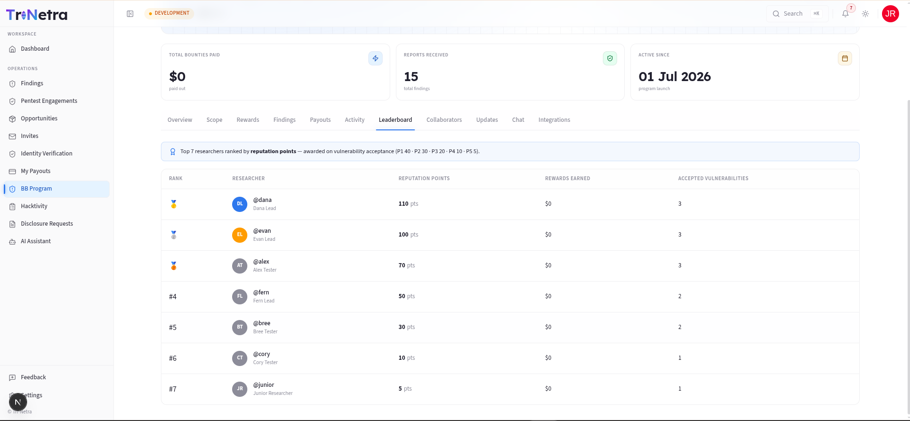

# Program Leaderboard

> **Who can view:** Client Admin, Client TPM, Client Viewer.

The **Leaderboard** tab ranks researchers who have had findings accepted on this program by their **reputation points**. It is a competitive, gamified view that celebrates top contributors.

---

## How points are earned

Points are awarded per accepted vulnerability based on severity:

| Severity | Points |
|----------|--------|
| P1 — Critical | 40 |
| P2 — High | 30 |
| P3 — Medium | 20 |
| P4 — Low | 10 |
| P5 — Informational | 5 |

A researcher who submits and has accepted one P1 finding (40 points) and two P3 findings (2 × 20 = 40 points) would have 80 reputation points on this program.

---

## What the leaderboard shows

Each researcher row displays:

| Column | Description |
|--------|-------------|
| **Rank** | Medal icon (🥇🥈🥉) for the top three; numeric rank for everyone else |
| **Researcher** | Display name and username |
| **Reputation Points** | Total points accumulated from accepted findings |
| **Rewards Earned** | Total bounty value earned (Bug Bounty programs only) |
| **Accepted Vulnerabilities** | Total count of accepted findings |

### Time filters

You can filter the leaderboard view by time period:

| Filter | Shows |
|--------|-------|
| **Today** | Rankings based on findings accepted today |
| **This Week** | Rankings based on findings accepted this week |
| **All Time** | Cumulative rankings since the program launched |

---

## Hall of Fame

When the **Hall of Fame** setting is enabled on the program (set during [creation](../create-bug-bounty.md)), the top three researchers also appear as podium cards on the [Overview tab](../program-detail.md) of the program detail page.

---

## When the leaderboard is empty

If no researchers have had findings accepted yet, the tab shows: *"No researchers on the leaderboard yet. Researchers appear here once their findings are accepted."* This is normal for new programs — the leaderboard fills up as researchers submit and your findings are triaged.

---

## Best practices

- **Enable Hall of Fame** — it is a zero-cost way to motivate researchers through public recognition.
- **Use the leaderboard to spot trends** — a researcher consistently finding P1/P2 issues may be worth inviting to private programs.
- **Do not use leaderboard rank alone to judge researcher quality** — some excellent researchers may submit fewer but higher-quality findings.

---

← Previous: [Payouts](payouts.md) | Next: [Collaborators →](collaborators.md)
