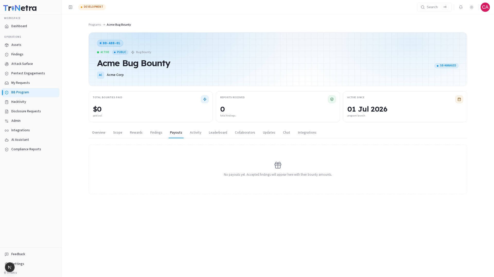

# Program Payouts

> **Who can view:** Client Admin, Client TPM, Client Viewer. **Who can approve:** Client Admin only.

The **Payouts** tab tracks the financial status of every accepted finding. For Bug Bounty programs, this is where you approve and manage bounty payouts. For VDP programs, it tracks reputation points instead.

---

## Bug Bounty Programs



### Payout lifecycle

Each accepted finding follows a payout lifecycle:

```
PENDING → APPROVED → DISBURSED
```

| Status | What it means |
|--------|--------------|
| **Pending** | The finding has been accepted but the payout has not yet been approved by a Client Admin. |
| **Approved** | A Client Admin has approved the payout. An invoice is generated. |
| **Disbursed** | The funds have been transferred to the researcher. |

### Payouts table

Each row represents one accepted finding:

| Column | Description |
|--------|-------------|
| **Finding** | Finding title and reference ID |
| **Researcher** | The researcher who submitted it |
| **Severity** | P1–P5 badge |
| **Amount** | Bounty amount based on the severity tier configured for this program |
| **Status** | Pending / Approved / Disbursed |
| **Invoice** | Download link once the payout is approved |

### Approving a payout (Client Admin)

When you approve a pending payout:

1. The payout amount is locked based on the severity tier.
2. An invoice record is generated with a unique invoice number.
3. The disbursement process is triggered automatically.

### Reverting an approved payout

If a correction is needed before disbursement, you can **revert** an approved payout back to Pending. This is only available while the payout is in Approved status — once it reaches Disbursed, it cannot be undone through the UI.

---

## VDP Programs

VDP programs do not involve monetary payouts. Instead, the Payouts tab shows **reputation points** awarded per accepted finding:

| Severity | Points awarded |
|----------|---------------|
| P1 — Critical | 40 |
| P2 — High | 30 |
| P3 — Medium | 20 |
| P4 — Low | 10 |
| P5 — Informational | 5 |

These points accumulate on the researcher's profile and contribute to their leaderboard ranking.

---

## Best practices

- **Review payouts regularly** — pending payouts that sit unapproved for too long can frustrate researchers and harm your program's reputation.
- **Verify the severity** before approving — the payout amount is tied to the severity assigned during triage. If you believe a severity was mis-assigned, raise it with your CSM before approving.
- **Keep invoice records** — download invoices for your own financial records and compliance.

---

## Troubleshooting

| Symptom | Cause / Fix |
|---------|-------------|
| **I cannot see the "Approve" button** | You are **Client TPM** or **Client Viewer**. Only Client Admins can approve payouts. |
| **The payout amount seems wrong** | The amount is tied to the severity tier set in [Rewards](rewards.md). Check the Rewards tab first. If the severity itself is wrong, contact your CSM. |
| **I accidentally approved the wrong payout** | If it is still in Approved status, you can revert it back to Pending. If it has been Disbursed, contact your CSM. |

---

← Previous: [Team](team.md) | Next: [Leaderboard →](leaderboard.md)
