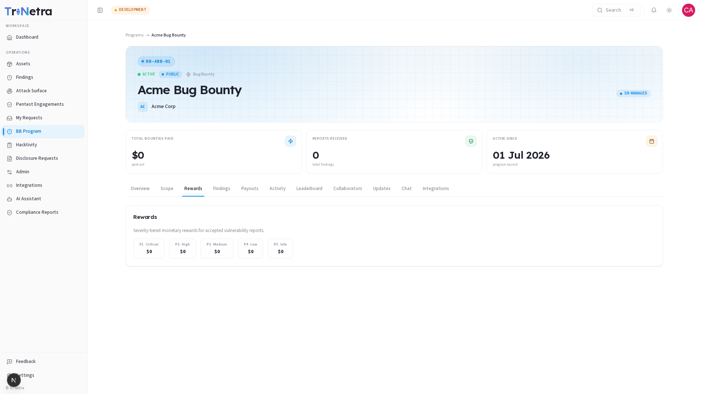

# Program Rewards

> **Who can view:** Client Admin, Client TPM, Client Viewer.

The **Rewards** tab shows the incentive structure for this program — what researchers earn for submitting valid vulnerability reports. The content depends on whether the program is a Bug Bounty or VDP.

---

## Bug Bounty Programs

For Bug Bounty programs, the Rewards tab displays a severity-tiered payout table:

| Severity | Label | What it covers (examples) |
|----------|-------|--------------------------|
| **P1** | Critical | Remote code execution, SQL injection, authentication bypass |
| **P2** | High | Access control bypass, stored XSS on critical endpoints, SSRF |
| **P3** | Medium | CSRF, sensitive information disclosure, reflected XSS |
| **P4** | Low | Minor configuration flaws, missing security headers |
| **P5** | Informational | Best-practice suggestions, low-risk observations |

Each severity level shows its payout amount in the currency configured during program creation (INR, USD, EUR, or GBP).

---

## VDP Programs

VDP (Vulnerability Disclosure Program) programs do not offer monetary rewards. Instead, the Rewards tab shows a recognition note explaining that researchers earn:

- **Swag** — branded merchandise as a token of appreciation
- **Hall of Fame placement** — public recognition on the program leaderboard
- **Reputation points** — platform-level reputation that builds a researcher's standing

---

## How rewards are determined

The reward amounts are set during [program creation](../create-bug-bounty.md) and can only be changed by [editing the program](../edit-bug-bounty.md) while it is Inactive.

Payouts are automatically calculated based on the severity assigned during triage. For example, if a finding is triaged as **P2 — High** and your P2 reward is set to $500, the researcher receives $500 for that finding.

---

## Best practices

- **Set P1-P3 rewards meaningfully** — these severities drive most researcher engagement. Competitive payouts attract higher-quality submissions.
- **P5 can be $0** — informational findings are worth acknowledging but rarely justify a cash reward. Most programs set P5 to zero.
- **Review rewards periodically** — as your program matures and your asset landscape changes, your reward tiers may need adjustment.
- **VDP is not "free"** — while there is no cash payout, you should budget for swag fulfilment and the time to triage incoming reports.

---

← Previous: [Scope](scope.md) | Next: [Findings →](findings.md)
