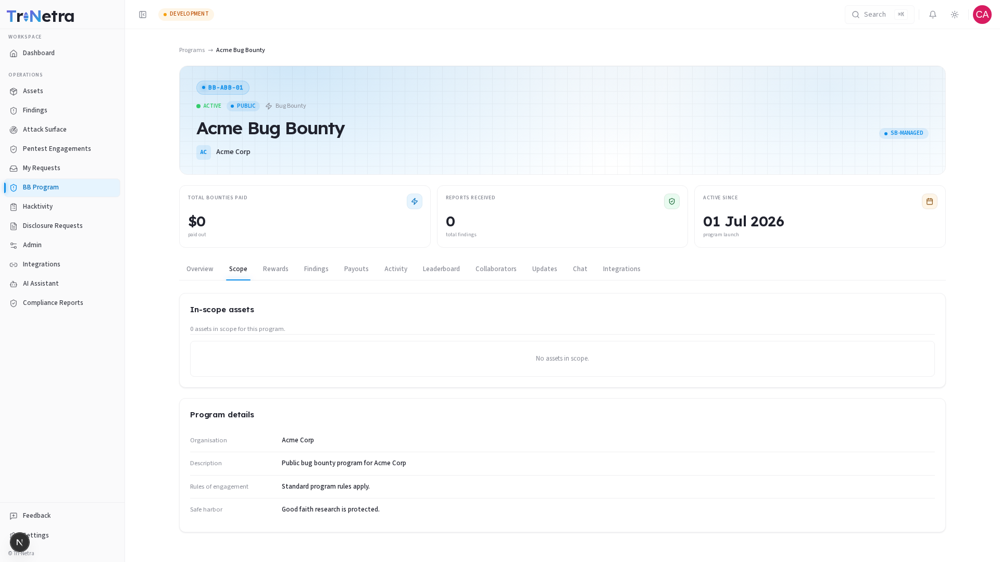
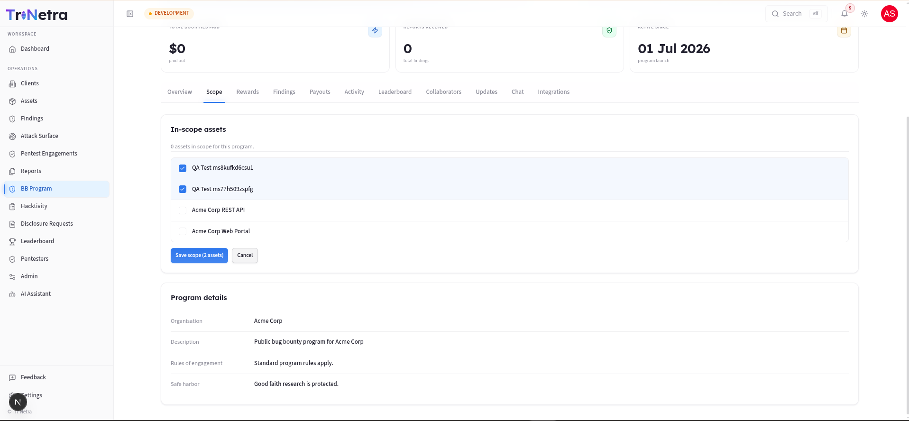

# Program Scope

> **Who can view:** Client Admin, Client TPM, Client Viewer. **Who can edit:** Client Admin only (via Edit Program when Inactive).

The **Scope** tab defines exactly what researchers are authorised to test under this program. It is the contract between your organisation and the researcher community — researchers must stay within this boundary.

---

## What you will see

### In-scope assets

The Scope tab displays all assets that were linked to this program during creation. If no assets have been assigned, the tab shows: *"No assets in scope."*

Assets are grouped by **type** (Web Application, API / Web Services, Mobile Application, etc.). Under each type you will see the specific targets — URLs, IP ranges, API endpoints, or other relevant identifiers — that were set when the asset was registered in the **Assets** module.

> This is the definitive in-scope list. Testing anything outside these assets is out of scope and may result in a finding being discarded. Only assets registered in the **Assets** module can be added to a program — you cannot type in arbitrary URLs here.

### Program details

Below the asset list, a details section shows:

| Field | Description |
|-------|-------------|
| **Organisation** | Your organisation name |
| **Description** | The program description explaining what the program covers |
| **Rules of engagement** | Testing boundaries — permitted hours, rate limits, prohibited techniques, banned tools |
| **Safe harbor** | Legal protection statement for researchers acting in good faith |

---

## Why scope matters

- **Minimises noise:** A well-defined scope tells researchers exactly where to focus, reducing out-of-scope submissions.
- **Legal protection:** The safe-harbor policy and rules of engagement provide legal clarity for both parties.
- **Asset alignment:** Only assets you have formally registered and approved can become test targets — preventing accidental exposure of unregistered systems.

---

## Updating the scope

Scope can only be changed by editing the program. See the [Edit Program](../edit-bug-bounty.md) guide for instructions.

> Editing is only available when a program is **Inactive**. If your program is Active and you need to change the scope, contact your CSM to discuss options.

---

## Troubleshooting

| Symptom | Cause / Fix |
|---------|-------------|
| **Asset list is empty** | No assets were added during program creation. Edit the program (when Inactive) or contact your CSM to add assets. |
| **An asset I need is not in the dropdown** | Only assets registered in the **Assets** module appear. Add the asset there first, then edit the program scope. |
| **A researcher tested something out of scope** | Findings on out-of-scope targets are typically discarded during triage. Use the **Rules of engagement** to clearly list what is out of bounds. |

---

← Previous: [Program Detail](../program-detail.md) | Next: [Rewards →](rewards.md)
