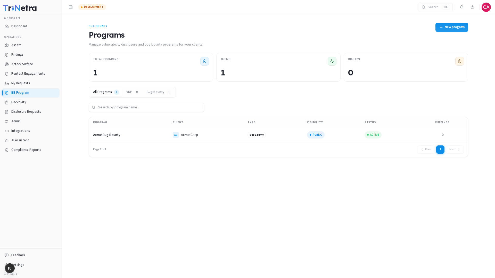

# Bug Bounty — Overview

> **Availability:** The Bug Bounty module is **subscription-gated**. The **BB Program**, **Hacktivity**, and **Disclosure Requests** entries appear in your sidebar only if your organisation has been onboarded for Bug Bounty. If they are missing, contact your Customer Success Manager (CSM).

---

## What is Bug Bounty?

A **Bug Bounty program** invites SecurityBoat's vetted community of security researchers to continuously test your assets and submit discovered vulnerabilities — typically in exchange for a reward.

Unlike a scheduled pentest where a fixed team tests within a defined window, a Bug Bounty program is **ongoing and crowd-sourced**: many researchers, working continuously, are paid or recognised per valid finding. Think of it as having hundreds of specialist security eyes on your applications at the same time, around the clock — rather than a single team that tests for two weeks and stops.

### Program Types

SecurityBoat supports two program types, suited to different stages of your security maturity:

| Type | What it means for you | Researcher incentive |
|------|----------------------|---------------------|
| **VDP** — Vulnerability Disclosure Program | Opens a responsible-disclosure channel so researchers can report issues. Great for organisations starting out with crowd-sourced security. | Recognition only — swag and Hall of Fame listing. No monetary reward. |
| **Bug Bounty** | A paid program with defined scope and severity-tiered monetary rewards. Attracts more active researcher engagement and deeper testing. | Cash payout per accepted finding, scaled to severity (P1–P5). |

### Program Visibility

Each program also has a **visibility** setting that controls who can participate:

| Visibility | Who can find and join |
|------------|----------------------|
| **Public** | Any eligible researcher on the platform can see and participate. Maximum coverage. |
| **Private** | Only researchers you explicitly invite can see and participate. Better for sensitive assets or early-stage programs. |

---

## How it differs from a Pentest

|  | PTaaS Pentest | Bug Bounty |
|---|---|---|
| **Duration** | Fixed window (e.g., 2 weeks) | Ongoing — no end date required |
| **Researchers** | Assigned team | Open or invited crowd |
| **Scope** | Defined per engagement | Defined per program |
| **Findings flow** | All verified findings visible to you | Same — verified-only visibility rule applies |
| **Cost model** | Engagement fee | Per valid finding (or recognition-based) |

> Bug Bounty findings appear in your unified **Findings** list with source `Bug Bounty`, subject to the same verified-only visibility rule as pentest findings.

---

## What each client role can do

| Action | **Client Admin** | **Client TPM** | **Client Viewer** |
|--------|:---:|:---:|:---:|
| View programs, Hacktivity, Disclosure Requests | ✅ | ✅ | ✅ |
| View all program detail tabs | ✅ | ✅ | ✅ |
| Create a new program | ✅ | ❌ | ❌ |
| Configure / edit a program | ✅ | ❌ | ❌ |
| Approve bounty payouts | ✅ | ❌ | ❌ |

> **Client TPM** and **Client Viewer** have read-only access to Bug Bounty — they can view all program information but cannot create or modify programs. Only a **Client Admin** has write access.

---

## Bug Bounty Programs list

The programs list page is your central hub for managing all your bug bounty programs. From here, you can view all your programs, filter them by type, and access each program's detail page.



- **BB Program** — your programs list and each program's detail page (all 11 tabs)
- **Hacktivity** — the public activity feed of disclosed, resolved reports
- **Disclosure Requests** — researcher requests to publicly disclose a finding

> The **Leaderboard** is a platform-level view visible only to SecurityBoat staff; it is not shown in the client sidebar. The program-level leaderboard is available within each program's detail page.

---

## How it all fits together

```
You create a program (VDP or Bug Bounty, Public or Private)
        ↓
Researchers discover and test your in-scope assets
        ↓
Researchers submit findings → SecurityBoat verifies them
        ↓
Verified findings appear in your Findings module (source = Bug Bounty)
        ↓
You fix the issue → finding moves to Resolved
        ↓
Researcher requests public disclosure (optional)
        ↓
You review and approve → finding appears in Hacktivity
```

---

## Best practices for getting started

- **Start with a VDP** if you are new to crowd-sourced security. It creates a responsible-disclosure channel without monetary commitments while you learn the workflow.
- **Use Private visibility** for new programs or sensitive assets, so you can invite and vet researchers before opening up.
- **Define scope clearly** — be specific about which URLs, APIs, or systems are in-scope and which are explicitly out of scope to minimise noise.
- **Set realistic reward tiers** that reflect the severity and complexity of your assets. SecurityBoat defaults are a sensible starting point.
- **Review disclosure requests promptly** — timely, sanitised public disclosure builds researcher trust and community goodwill.
- **Monitor the Findings and Payouts tabs regularly** — keeping on top of submissions and approvals maintains a healthy program.

---

## Troubleshooting

| Symptom | Cause / Fix |
|---------|-------------|
| **No Bug Bounty entries in the sidebar** | Your org is not onboarded for Bug Bounty. Contact your CSM. |
| **No "New program" button on the Programs page** | You are **Client TPM** or **Client Viewer**. Only Client Admins can create programs. |
| **A bug-bounty finding I heard about is not in my Findings** | It has not been **verified** yet — the verified-only visibility rule applies. |
| **Edit button is missing on the program detail page** | Editing is only available when the program is **Inactive**. Active programs must be deactivated first (contact your CSM). |

---

## In this section

| Guide | What it covers |
|-------|---------------|
| [Create a Program](create-bug-bounty.md) | Step-by-step guide to creating a VDP or Bug Bounty program |
| [Program Detail](program-detail.md) | Header, KPIs, tab navigation, and the Overview tab |
| [Scope](detail/scope.md) | In-scope assets, rules of engagement, and safe harbor |
| [Rewards](detail/rewards.md) | Severity-tiered payout structure and recognition model |
| [Findings](detail/findings.md) | All findings submitted to this program and their lifecycle |
| [Team](detail/team.md) | Invited researchers on Private programs |
| [Payouts](detail/payouts.md) | Bounty approvals, invoices, and disbursement tracking |
| [Leaderboard](detail/leaderboard.md) | Researcher ranking by reputation and rewards |
| [Collaborators](detail/collaborators.md) | Every researcher who has contributed to this program |
| [Chat](detail/chat.md) | Real-time messaging channel for program communication |
| [Edit a Program](edit-bug-bounty.md) | How to update program settings |

---

← Previous: [Attack Surface (ASM)](../11-asm.md) | Next: [Create a Program →](create-bug-bounty.md)
