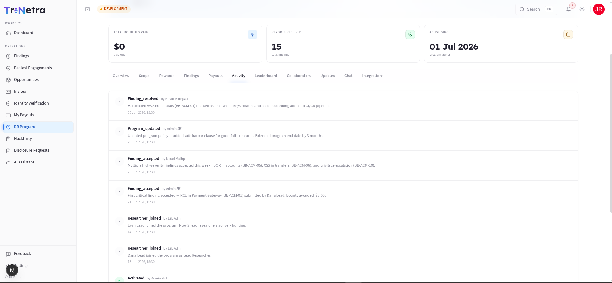
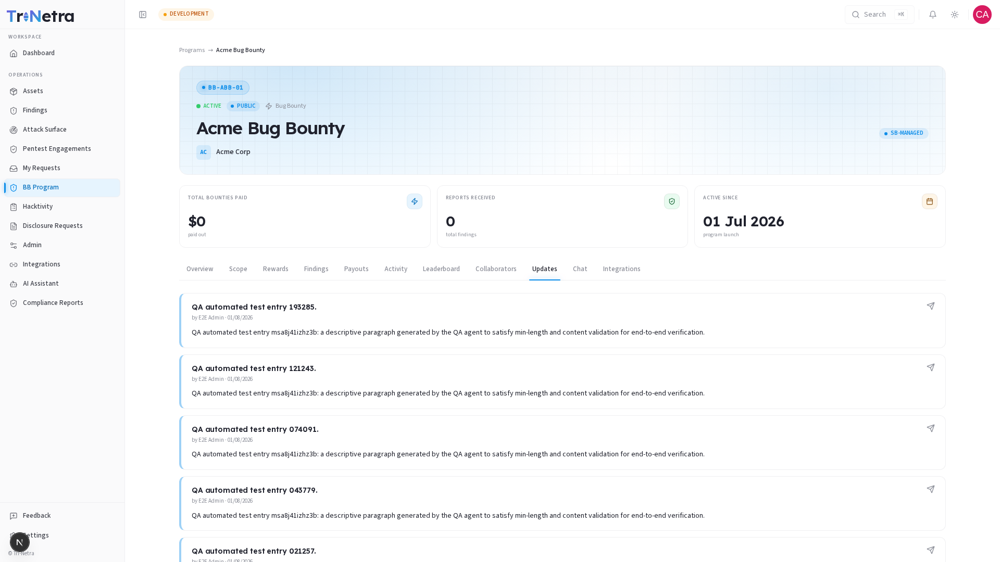
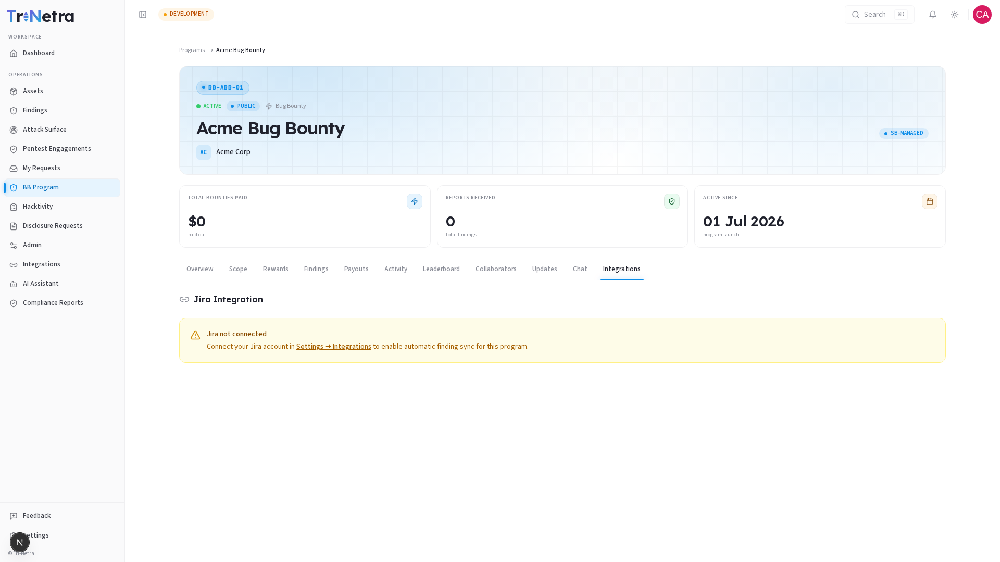

# Program Detail

The program detail page is your command centre for a Bug Bounty program. It gives you a complete picture of the program's health, configuration, findings, financials, and team — all in one place.

To open a program, go to **BB Program** in the sidebar and click any program name in the list.

---

## Page Header

At the top of every program detail page you will find a header bar that identifies the program at a glance:

- **Program code** — a short reference code (e.g., `BB-ACM-01`) displayed in a pill badge on the top-left.
- **Status badge** — **Active**, **Inactive**, or **Closed**.
- **Visibility badge** — **Public** (blue) or **Private** (purple).
- **Type label** — VDP or Bug Bounty.
- **Program name** — the full program name as set during creation.
- **Management badge** — whether the program is **SB-Managed** or **Self-Managed**.
- **Organisation** — the owning organisation name with its initials avatar.
- **Edit button** — visible only when the program is **Inactive**. Takes you to the [Edit Program](edit-bug-bounty.md) page.

### KPI Tiles

Below the header, three tiles give you an at-a-glance summary:

| Tile | Bug Bounty shows | VDP shows |
|------|-----------------|-----------|
| Total bounties paid / Recognition | Cumulative cash paid out | Recognition status — swag + Hall of Fame |
| Reports received | Total findings submitted to this program | Same |
| Active since | Program launch date | Same |

---

## Tab Navigation

The program detail page is organised into eleven tabs. Click any tab to switch views. Your position is preserved in the URL so you can share direct links to specific tabs.

| Tab | Who sees it | Deeper guide |
|-----|------------|-------------|
| **Overview** | All roles | This page (see below) |
| **Scope** | All roles | [Scope guide →](detail/scope.md) |
| **Rewards** | All roles | [Rewards guide →](detail/rewards.md) |
| **Findings** | All roles | [Findings guide →](detail/findings.md) |
| **Team** | Private programs only | [Team guide →](detail/team.md) |
| **Payouts** | All roles | [Payouts guide →](detail/payouts.md) |
| **Activity** | All roles | This page (see below) |
| **Leaderboard** | All roles | [Leaderboard guide →](detail/leaderboard.md) |
| **Collaborators** | All roles | [Collaborators guide →](detail/collaborators.md) |
| **Updates** | All roles | This page (see below) |
| **Chat** | All roles | [Chat guide →](detail/chat.md) |
| **Integrations** | All roles | This page (see below) |

---

## Overview Tab

The Overview tab has a two-column layout that surfaces the most important program information at a glance.

### Left column — Program details

| Field | Description |
|-------|-------------|
| Program ID | Unique short reference code (e.g., `BBP-ACM`) |
| Type | VDP or Bug Bounty |
| Status | Active / Inactive / Closed |
| Visibility | Public or Private |
| Managed by | SB-Managed or Self-Managed |
| Organisation | Your organisation name |
| Start date | When the program opened |
| End date | Close date, or "Continuous" if open-ended |
| Hall of Fame | Enabled or Disabled |

### Right column — Configuration & Reward structure

Shows a summary of:

- The program's **type**, **visibility**, and **management model**
- **Start and end dates** with a visual timeline
- **Hall of Fame** status
- **Reward structure** — the P1 through P5 payout amounts and currency (Bug Bounty), or a recognition note (VDP)

### Scope & Policy review

A section below the two columns displays:

- **Organisation** name
- **Description** — the program description as entered during creation
- **In-scope assets** — count of assets linked to this program

### Program stats

A five-cell grid at the bottom of the Overview tab shows your finding breakdown by state:

| Cell | What it counts |
|------|---------------|
| Total | All findings ever submitted |
| Triage | New findings awaiting review |
| Accepted | Findings confirmed valid and in progress |
| Resolved | Findings that have been fixed |
| Discarded | Findings rejected as invalid, duplicate, or not applicable |

### Hall of Fame *(if enabled)*

When Hall of Fame is enabled, the top three researchers are shown as podium cards directly in the Overview. You can filter the leaderboard by:

- **Today** — today's top contributors
- **This Week** — this week's top contributors
- **All Time** — all-time top contributors

If no researchers have had findings accepted yet, a friendly placeholder message is shown: *"No researchers on the leaderboard yet. Top contributors will appear once findings are accepted."*

---

## Activity Tab

The **Activity** tab is a chronological log of everything that has happened on this program. Each entry is timestamped and attributed to the user who performed the action.

Events recorded include:

- Program state changes (created, activated, deactivated)
- Scope changes (assets added or removed)
- Team invitations and removals
- Finding submissions and state transitions
- Payout approvals and disbursements

This is your audit trail — useful for compliance reviews or understanding the history of a program. When no activity exists yet, the tab shows: *"No activity yet. Events will appear here as the program is managed."*

---

## Updates Tab

The **Updates** tab contains program announcements posted by SecurityBoat staff. Updates are used to inform researchers of:

- Scope changes (new assets added or removed)
- Reward structure changes
- Testing window restrictions
- Policy updates

Each update shows the title, author name, date, and full formatted content.

> As a client, you can **read** updates but cannot post them. Updates are authored by SecurityBoat's CSM team. Contact your CSM if there is an announcement you would like them to post.

---

## Integrations Tab

If your organisation has connected a third-party tool (such as Jira), the **Integrations** tab lets you map this program to a Jira project. When configured, findings from this program can be automatically synced as Jira issues.

If Jira is not yet connected, the tab shows: *"Jira not connected — Connect your Jira account in Settings → Integrations to enable automatic finding sync for this program."*

See the [Integrations guide](../10-integrations.md) for full setup instructions.

---

← Previous: [Create a Program](create-bug-bounty.md) | Next: [Scope →](detail/scope.md)
