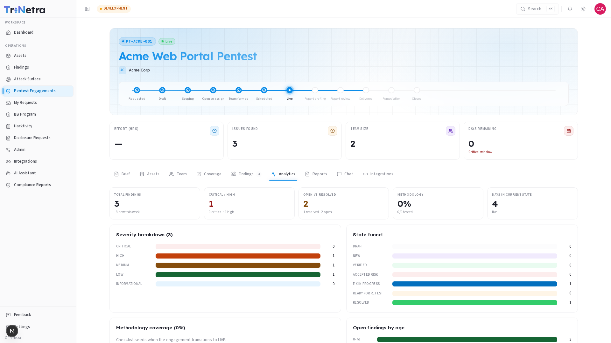

## Analytics

The Analytics tab is a read-only visual dashboard that gives you an at-a-glance view of engagement health — how many findings, how severe, how old, and how much testing is complete.

> **Who can view:** all client roles. This tab is read-only.

---

### 1. KPI strip

Five quick-glance metrics sit across the top of the tab:

| KPI | What it shows | Trend detail |
|-----|---------------|--------------|
| **Total findings** | All verified findings on this engagement. | "+N new this week" when new findings were added recently. |
| **Critical / High** | Count of the two highest-severity tiers. | Breakdown shows "0 critical · N high" so you know the split. |
| **Open vs. Resolved** | How many findings are still open vs. already fixed. | "N resolved · N open" — a rising resolved count means remediation is progressing. |
| **Methodology** | Percentage of the methodology checklist completed. | "N/N tested" — how many checklist items have been exercised. |
| **Days in current state** | How long the engagement has been in its current lifecycle state. | Shows the state name (e.g., "live", "report drafting") for context. |

---

### 2. Severity breakdown

A horizontal bar chart showing the count of findings at each severity tier:

| Tier | Color | What it means |
|------|-------|---------------|
| **Critical** | Red | Immediate risk — could lead to system compromise. |
| **High** | Orange | Significant vulnerability requiring prompt attention. |
| **Medium** | Yellow | Notable issue with moderate impact. |
| **Low** | Blue | Minor issue or hardening opportunity. |
| **Informational** | Grey | Observation without direct risk — useful context. |

---

### 3. State funnel

Shows where all findings sit across the finding lifecycle — from newly submitted through to resolved. Each stage is a bar, and the funnel shape tells you:

- **Wide at the top:** many new findings — testing is productive.
- **Narrow at the bottom:** few resolved — remediation hasn't started yet.
- **Balanced:** healthy flow from discovery through to fix.

---

### 4. Methodology coverage

Stacked progress bars per methodology category showing how much of each area has been tested. Categories are auto-resolved from the engagement's asset types (e.g., Authentication, Session Management, Input Validation for web apps).

If this panel shows 0% with the message "Checklist seeds when the engagement transitions to LIVE," testing hasn't begun yet — see the [Coverage](coverage.md) tab for details.

---

### 5. Open findings by age

Buckets open findings into age ranges to flag aging issues:

| Age range | What to watch for |
|-----------|-------------------|
| **0–7 days** | Fresh findings — normal. |
| **8–30 days** | Starting to age — check if remediation is scheduled. |
| **31–60 days** | Aging — these should have remediation plans. |
| **60+ days** | Stale — escalate if no fix is in progress. |

---

### 6. Highest-severity findings

The top findings ranked by CVSS score, with quick links to open each one. Use this to jump directly to the most impactful issues without scrolling the full findings table.

---

### 7. Findings discovered (last 30 days)

A trend visualization showing how many findings were discovered per day over the last 30 days. This gives you testing velocity at a glance:

- **Rising trend:** testers are finding more — testing may be ramping up or hitting a rich area.
- **Falling trend:** testing may be winding down, or the easy findings have all been found.
- **Flat line:** steady-state testing — consistent productivity.

---

### Best practices

- **Check Analytics before status calls** — the KPI strip and age buckets answer "are we on track?" faster than scrolling individual findings.
- **Watch the Critical/High count** — if it's climbing, escalate to your TPM to discuss whether testing should pause for immediate remediation.
- **Monitor findings by age** — anything over 30 days without a fix plan is a conversation starter with your internal remediation team.

### Troubleshooting

| Symptom | Cause / Fix |
|---------|-------------|
| **Methodology shows 0%** | The engagement hasn't reached Live yet. This is normal. |
| **No data in any chart** | No findings have been verified on this engagement. Charts populate as findings are submitted and verified. |
| **"Findings discovered" chart is empty** | No findings were created in the last 30 days. This is normal for new engagements or engagements in non-Live states. |

---

← Previous: [Findings](findings.md) | Next: [Reports →](reports.md)
