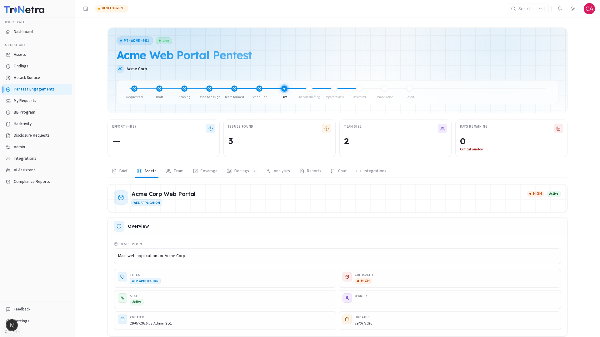

## Assets

The Assets tab shows the asset under test for this engagement — its full scope contract including URLs, IP ranges, credentials, and attachments. This tab is **read-only** for all client roles; asset data is managed by the SecurityBoat team based on the scoping call.

---

### 1. Asset header

At the top of the tab you'll see the asset card with:

| Element | Description |
|---------|-------------|
| **Asset name** | The registered asset name (e.g., "Acme Corp Web Portal"). |
| **Type badge** | The asset type — Web Application, API, Mobile App, Network, etc. |
| **Criticality badge** | Business impact rating: Low, Medium, High, or Critical. |
| **State badge** | Asset lifecycle state — typically "Active" for assets under test. |

---

### 2. Overview section

Basic asset metadata:

| Field | Description |
|-------|-------------|
| **Description** | Business context for the asset. May be empty if not provided during asset registration. |
| **Types** | The asset type(s). Determines which methodology checklists are auto-resolved. |
| **Criticality** | Business impact rating — helps the testing team prioritize effort. |
| **State** | Current asset state (Active, Inactive, Archived). |
| **Owner** | The person accountable for this asset. May show "—" if not assigned. |
| **Created / Updated** | Timestamps for asset record creation and last modification. |

---

### 3. Scope section

Shows scope details grouped by asset type. For a Web Application asset, this typically includes:

- **URLs** — the web application URLs in scope.
- **IP ranges** — any IP ranges to be tested.
- **API endpoints** — specific API paths if applicable.

If this section shows "No type-specific scope set," it means the asset's scope hasn't been configured yet. This is normal during Draft and early preparation stages — the SecurityBoat team finalizes scope during the scoping call.

---

### 4. Credentials section

Displays any test credentials the SecurityBoat team has on file for this asset (e.g., test accounts, VPN access, API keys). These are **masked** for security — you'll see placeholders rather than actual credentials.

If this section is empty, provide credentials to your TPM via the engagement [Chat](chat.md).

---

### 5. Attachments section

Any files attached to the asset — architecture diagrams, data-flow documents, API specifications, or other reference materials the testing team may need.

---

### Best practices

- **Keep your asset record current** — if URLs, IP ranges, or app versions have changed since the asset was registered, update the asset under **Assets** in the sidebar. The engagement references your asset, so keeping it current keeps the engagement scope correct.
- **Provide credentials early** — test accounts, VPN access, and API keys should be shared with your TPM during the Draft stage to avoid delays when testing begins.

### Troubleshooting

| Symptom | Cause / Fix |
|---------|-------------|
| **Scope shows "No type-specific scope set"** | The asset scope hasn't been configured. This is normal before the scoping call. Your TPM will set it up. |
| **Credentials section is empty** | No credentials have been provided for this asset. Share them with your TPM via Chat. |
| **Asset details look wrong** | The asset record may be outdated. Update it under **Assets** in the sidebar, then notify your TPM. |

---

← Previous: [Brief](brief.md) | Next: [Team →](team.md)
