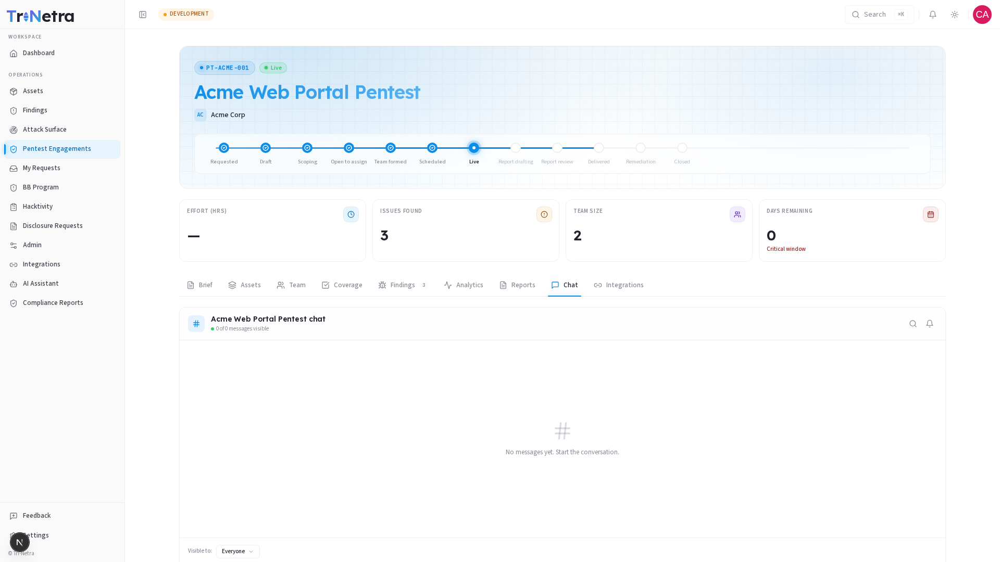

## Chat

The Chat tab is a dedicated message thread scoped to this engagement — the fastest way to ask a question, provide credentials, or clarify scope without leaving the platform. Messages stay permanently attached to the engagement record.



---

### 1. Who can do what

| Action | Client Admin | Client TPM | Client Viewer |
|--------|:---:|:---:|:---:|
| **Read messages** | ✅ | ✅ | ✅ |
| **Send messages** | ✅ | ✅ | ❌ |
| **Choose visibility** (Everyone / Client only) | ✅ | ✅ | — |

> **Client Viewers** can read the full chat history but cannot send messages. If you need to communicate something to the team, ask a Client Admin or TPM in your organization.

---

### 2. Message visibility

When sending a message, use the **Visible to** dropdown to control who sees it:

| Visibility | Who can read it |
|------------|----------------|
| **Everyone** | The full engagement team — SecurityBoat testers, TPM, and your organization's members. Use this for general questions, scope clarifications, and status updates. |
| **Client only** | Only members of your organization on this engagement thread. Use this for internal notes or discussions you don't need the testing team to see. |

---

### 3. Rich text editor

The chat composer supports both **Rich text** and **Markdown** modes — toggle between them with the tabs above the input area.

**Rich text mode** includes a formatting toolbar:
- Bold (⌘B), Italic (⌘I), Strikethrough
- Inline code
- Clear formatting
- Insert link
- Undo / Redo

**Markdown mode** supports standard syntax:
- `**bold**` · `*italic*` · `` `code` ``
- ` ``` code block ``` ` — paste raw HTTP/JSON and it auto-formats as a code block
- `# heading` · `- list` · `> quote`
- `⌘K` to insert a link

A **Preview** tab lets you review your message formatting before sending.

---

### 4. Empty state

If no messages have been sent yet, the tab shows "No messages yet. Start the conversation." and "0 of 0 messages visible." This is normal for newly created engagements — start the conversation whenever you have something to communicate.

---

### Best practices

- **Use Chat instead of email** — messages stay attached to the engagement record and are visible to anyone on the team who needs context later.
- **Provide credentials in Chat** — test accounts, VPN access, or API keys shared here are visible to the testing team immediately.
- **Be specific** — instead of "can you check something?", say "the login page at /auth returns a 500 error with test account user@test.com."
- **Use Client-only visibility for internal notes** — if you're discussing remediation priorities internally, keep it visible only to your organization.

### Troubleshooting

| Symptom | Cause / Fix |
|---------|-------------|
| **Can't send messages** | You're a **Client Viewer** (read-only). Ask a Client Admin or TPM in your organization to send on your behalf. |
| **Message I sent isn't visible to the testing team** | You may have selected "Client only" visibility. Delete and resend with "Everyone" if it should be visible to SecurityBoat. |
| **Chat shows "0 of 0 messages"** | No messages have been sent yet. This is normal for new engagements. |
| **Formatting isn't applying** | Switch to **Preview** tab to check how your message will render, or toggle to Rich text mode for WYSIWYG formatting. |

---

← Previous: [Reports](reports.md) | Next: [Integrations →](integrations.md)
