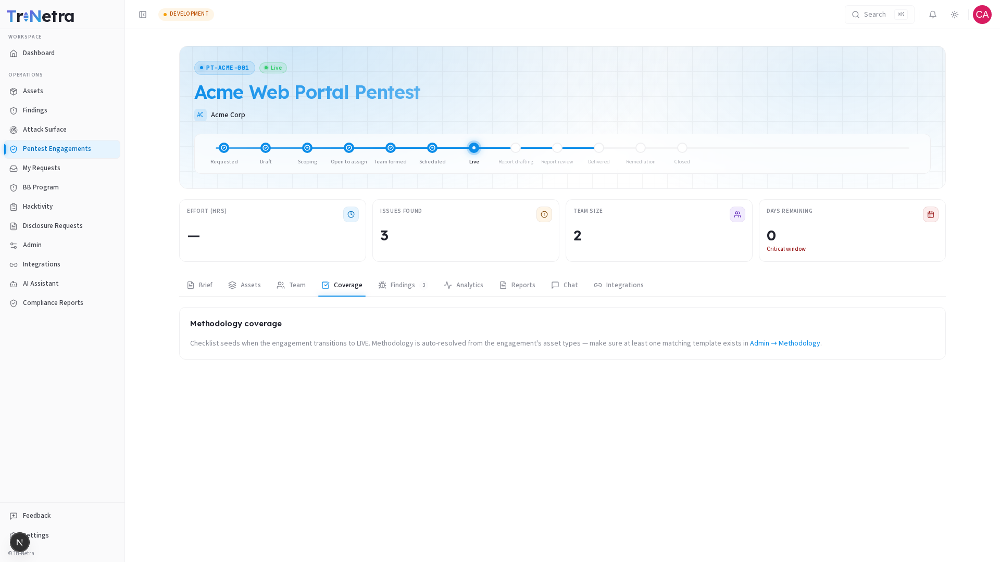

## Coverage

The Coverage tab shows the methodology checklist — the set of test items being exercised on your engagement, grouped by security category. This gives you visibility into testing progress without needing to wait for the final report.

> **Who can view:** all client roles. This tab is **read-only** — status updates are managed by the testing team.

---

### 1. How the checklist works

When an engagement transitions to **Live**, a methodology checklist is automatically seeded based on the engagement's asset types. For example, a Web Application asset triggers web-focused test items (Authentication, Session Management, Input Validation, etc.).

Each checklist item has a status:

| Status | Meaning |
|--------|---------|
| **Not started** | Testing hasn't begun on this item yet. |
| **In progress** | A tester is actively working on this item. |
| **Tested — no finding** | The item was tested and no vulnerability was found. |
| **Tested — finding raised** | Testing uncovered an issue — a finding was submitted. |
| **Not applicable** | The item doesn't apply to this engagement's scope. |

Statuses update in real time as testers work through the checklist.

---

### 2. Empty state

If the Coverage tab shows a message like:

> *"Checklist seeds when the engagement transitions to LIVE. Methodology is auto-resolved from the engagement's asset types — make sure at least one matching template exists in Admin → Methodology."*

This means one of two things:

1. **The engagement hasn't reached Live yet.** The checklist populates when active testing begins. This is normal for Draft, Scheduled, and pre-Live states.
2. **No methodology template matches the asset type.** A SecurityBoat admin needs to create a methodology template for this asset type under **Admin → Methodology**.

In either case, no action is needed from you — the checklist will populate automatically once the conditions are met.

---

### 3. Reading the coverage progress

The methodology completion percentage (also visible on the [Analytics](analytics.md) tab) tells you how much of the planned testing has been executed. Use this alongside the findings count to gauge testing velocity:

- **Low coverage + few findings:** testing is still ramping up — early days.
- **High coverage + few findings:** thorough testing, clean results — good sign.
- **High coverage + many findings:** testing is productive — expect the report to reflect this.

---

### Best practices

- **Don't panic if coverage is 0%** — the checklist seeds when testing goes Live. If the engagement is still in Draft or Scheduled, this is expected.
- **Use coverage alongside Analytics** — the methodology completion % tells you "how much has been tested," while Analytics tells you "what was found."
- **Check coverage before status calls** — it's a fast way to answer "how far along is the testing?"

### Troubleshooting

| Symptom | Cause / Fix |
|---------|-------------|
| **Coverage tab is empty / shows seeding message** | The engagement hasn't reached Live yet, or no methodology template exists for the asset type. The SecurityBoat team handles this — no action needed from you. |
| **Coverage percentage seems stuck** | Testers may be working on complex items that take longer. Check the [Analytics](analytics.md) tab for findings-created-per-day to confirm activity. |
| **All items show "Not applicable"** | The methodology template may not match the engagement's asset types. Flag this to your TPM via Chat. |

---

← Previous: [Team](team.md) | Next: [Findings →](findings.md)
