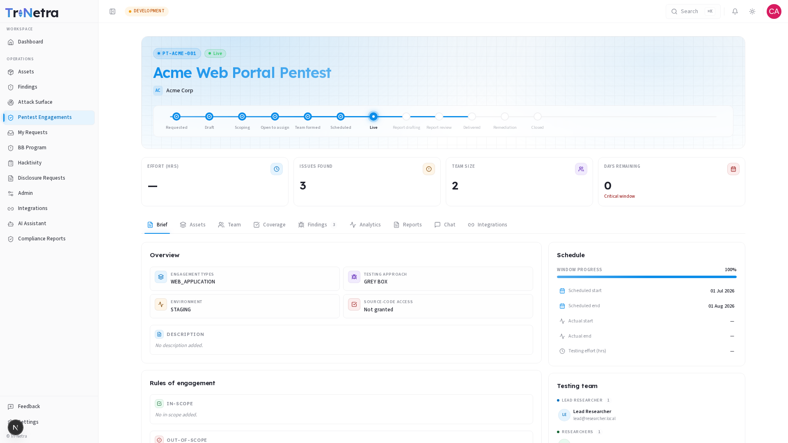

## Engagement Detail

Opening an engagement from the list takes you to its detail page — the central workspace for tracking your pentest from approval through to final report delivery. The page has a header (identity, state, and key metrics) followed by a row of nine tabs.

---

### 1. The header

| Element | What it shows |
|---------|----------------|
| **Project ID** | The engagement's permanent reference code (e.g., `PT-ACME-001`). Quote this when contacting your SecurityBoat team. |
| **State badge** | The current lifecycle state, color-coded. States like "Live" and "Report review" include a subtle pulse animation indicating active progress. |
| **Title** | The engagement name you gave it when submitting the request. |
| **Client badge** | Your organization's avatar and name — confirms which client account the engagement belongs to. |
| **Lifecycle stepper** | A visual 12-step path showing how far the engagement has progressed: Requested → Draft → Scoping → Open to assign → Team formed → Scheduled → Live → Report drafting → Report review → Delivered → Remediation → Closed. Completed steps are checked, the current step glows, future steps are hollow. |
| **KPI tiles** | Four quick-glance metrics: Effort (hours) · Issues found · Team size · Days remaining. The "Days remaining" tile turns amber inside 7 days and red inside 2 — a heads-up that the testing window is closing. |

---

### 2. The tabs

Nine tabs give you different perspectives on the engagement. Click any tab name below for a dedicated guide with screenshots and details:

| Tab | What it shows | Guide |
|-----|---------------|-------|
| **Brief** | Scope overview, testing approach, schedule, rules of engagement, testing team, and state history. | [Brief →](brief.md) |
| **Assets** | The asset under test and its full scope contract (URLs, IP ranges, credentials, attachments). Read-only. | [Assets →](assets.md) |
| **Team** | The SecurityBoat team assigned to your engagement — lead researcher, researchers, and their roles. | [Team →](team.md) |
| **Coverage** | The methodology checklist showing what's been tested, grouped by security category. | [Coverage →](coverage.md) |
| **Findings** | All verified findings for this engagement — severity, state, and links to full details. Filterable by asset type. | [Findings →](findings.md) |
| **Analytics** | Visual dashboards — severity breakdown, state funnel, methodology coverage, findings by age, and discovery trend. | [Analytics →](analytics.md) |
| **Reports** | The engagement report — preview it as it progresses, and download the final PDF once it's approved. | [Reports →](reports.md) |
| **Chat** | Direct messaging with the engagement team via rich-text or Markdown editor with visibility controls. | [Chat →](chat.md) |
| **Integrations** | Jira project mapping to push findings to your issue tracker. Client Admin only. | [Integrations →](integrations.md) |

---

### Best practices

- **Start on the Brief tab** — it's the fastest way to re-orient on scope, schedule, and recent progress before diving into Findings or Reports.
- **Check Analytics before status calls** — the KPI strip and age buckets answer "are we on track?" faster than scrolling individual findings.
- **Use Chat proactively** — if you have questions about a finding or need to provide updated credentials, send it in Chat so the team sees it immediately.
- **Wait for "Final" before circulating the report** — the Download PDF button only activates once the report is officially approved.

### Troubleshooting

| Symptom | Cause / Fix |
|---------|-------------|
| **Coverage tab is empty** | The engagement hasn't reached the Live testing state yet. It will populate once testing begins. |
| **Download PDF is greyed out** | The report hasn't been marked as Final yet. You can preview it in the Reports tab, but the downloadable PDF only becomes available after official sign-off. |
| **Integrations tab is missing** | Only **Client Admin** can manage Jira mappings. Ask your admin if you need this configured. |
| **Can't send messages in Chat** | You're a **Client Viewer** (read-only). Ask a Client Admin or TPM if you need to communicate something to the team. |

---

← Previous: [Create Engagement](../create-engagement.md) | Next: [Brief →](brief.md)
