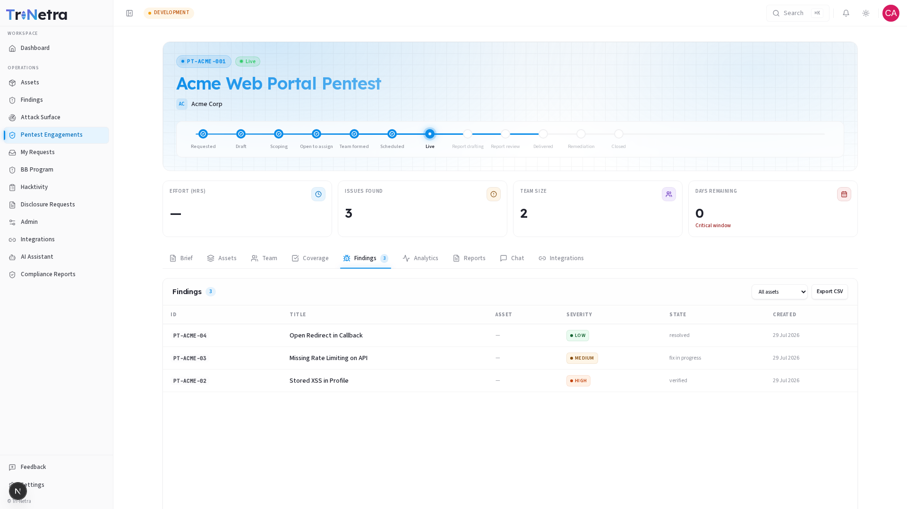

## Findings

The Findings tab lists every verified finding raised on this engagement — the same data you'd see in the platform-wide **Findings** module, pre-filtered to this specific engagement.

> **Who can view:** all client roles. Findings are read-only for clients; only the testing team can create or update them.

---

### 1. Findings table

| Column | Description |
|--------|-------------|
| **ID** | The finding's unique reference code (e.g., `PT-ACME-04`). Quote this when discussing a specific finding with your team. |
| **Title** | A short description of the vulnerability. Click to open the full finding detail (evidence, CVSS score, remediation guidance). |
| **Asset** | The asset the finding was discovered on. May show "—" if the finding isn't asset-scoped. |
| **Severity** | The impact rating: Critical, High, Medium, Low, or Informational. Color-coded for quick scanning. |
| **State** | Where the finding sits in its lifecycle: new, triaged, verified, fix in progress, resolved, etc. |
| **Created** | When the finding was submitted. |

---

### 2. Asset filter

A dropdown at the top of the table lets you filter findings by asset type:

- **All assets** (default) — shows findings across all assets in the engagement.
- **Specific asset types** (e.g., "Web Application") — narrows to findings discovered on that asset type only.

This is useful for multi-asset engagements where you want to see what was found on each system separately.

---

### 3. Export CSV

Click **Export CSV** to download the currently visible findings (respecting any active asset filter) as a spreadsheet. This is useful for:

- Sharing findings with internal teams who don't have platform access.
- Importing into your own issue tracker or GRC tool.
- Preparing for remediation planning meetings.

---

### 4. Finding detail

Click any finding row to open its full detail view, which includes:

- **Description** — technical details of the vulnerability.
- **Evidence** — screenshots, request/response logs, proof-of-concept steps.
- **CVSS score** — the Common Vulnerability Scoring System rating with vector breakdown.
- **Remediation guidance** — step-by-step instructions for fixing the issue.
- **State history** — every lifecycle transition the finding has gone through.

For the full finding lifecycle — severity levels, states, retest flow — see the [Findings guide](../../05-findings.md).

---

### Best practices

- **Filter by severity** — scan Critical and High findings first. These are your priority remediation items.
- **Export before meetings** — a CSV export gives you a portable summary for stakeholders who don't log into the platform.
- **Click into findings** — the table gives you counts and severities, but the detail view gives you actionable remediation steps.

### Troubleshooting

| Symptom | Cause / Fix |
|---------|-------------|
| **Findings tab shows 0 results** | Testing may not have started yet, or no findings have been verified. Check the [Coverage](coverage.md) tab to see if testing is in progress. |
| **Expected finding isn't visible** | Findings are only visible after they've been verified by the testing team. Draft or in-review findings won't appear here. |
| **CSV export doesn't include a finding** | The export respects the active asset filter. Switch to "All assets" if a finding is missing. |

---

← Previous: [Coverage](coverage.md) | Next: [Analytics →](analytics.md)
