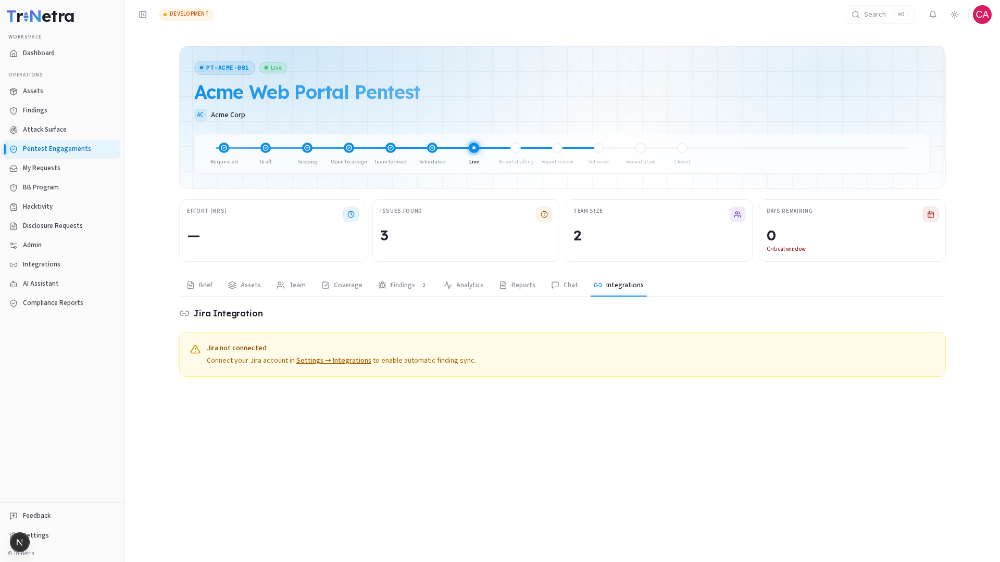

## Integrations

The Integrations tab lets you connect this engagement to a **Jira project** so findings can be automatically pushed into your existing issue tracker.

> **Who can view and configure:** **Client Admin** only. Client TPM and Client Viewer cannot see or manage this tab.

---

### 1. Jira connection status

The tab shows one of two states:

| State | What you see |
|-------|-------------|
| **Not connected** | "Jira not connected" with a prompt to connect your Jira account in **Settings → Integrations**. |
| **Connected** | A dropdown to select a Jira project for this engagement, plus sync status. |

---

### 2. Setting up Jira (first time)

If Jira isn't connected yet:

1. Go to **Settings → Integrations** in the sidebar (or click the link in the prompt).
2. Follow the Jira connection flow to authorize your Jira instance.
3. Return to this engagement's Integrations tab.
4. Select a Jira project from the dropdown.
5. New findings can now be exported as Jira issues directly from the platform.

---

### 3. After connecting

Once a Jira project is mapped to this engagement:

- **Export findings:** each finding gets an "Export to Jira" action that creates a linked Jira issue.
- **Bi-directional sync:** updates to the finding in Tri-Netra (state changes, comments) can be configured to sync to the Jira issue.
- **One project per engagement:** you map a single Jira project per engagement. For multi-project workflows, coordinate with your TPM.

---

### 4. If the tab is missing

Only **Client Admin** can see and manage the Integrations tab. If you're a Client TPM or Viewer and need Jira integration configured, ask your organization's Client Admin to set it up.

---

### Best practices

- **Connect Jira before testing begins** — findings start appearing as soon as testing goes Live. Having the integration ready means you can push them to your team's backlog immediately.
- **Use a dedicated Jira project** — mapping each engagement to its own Jira project keeps remediation tracking clean and prevents cross-engagement confusion.
- **Verify the sync direction** — confirm with your TPM whether you want one-way export (Tri-Netra → Jira) or bi-directional sync.

### Troubleshooting

| Symptom | Cause / Fix |
|---------|-------------|
| **Integrations tab is missing entirely** | Only **Client Admin** can manage Jira mappings. Ask your admin to configure it. |
| **"Jira not connected" message** | Your organization hasn't connected a Jira instance yet. Go to **Settings → Integrations** to set it up. |
| **Jira project dropdown is empty** | Your Jira instance is connected but no projects are visible. Check Jira permissions — your account needs project access. |
| **Exported finding doesn't appear in Jira** | The sync may have a delay, or the finding's state may not trigger an export. Check with your TPM if automatic sync is configured. |

---

← Previous: [Chat](chat.md) | Next: [Reports →](reports.md)
