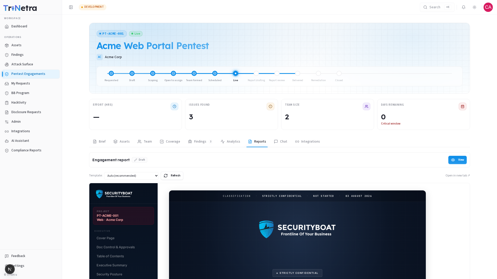

## Reports

---

The Reports tab is where you access the engagement's final deliverable — the penetration test report. You can preview the report as it progresses through internal review, and download the official PDF once it's finalized.

---

### 1. The report approval lifecycle

The report goes through several internal states before reaching you as a final deliverable:

| State | What it means for you |
|-------|------------------------|
| **Draft** | The report is being written by the testing team. You can preview the current version but it's not yet reviewed. |
| **In review** | The report has been submitted for internal quality review. |
| **Pre-Final** | The report has passed initial review and is nearly finalized. |
| **✓ Final** | The report is officially signed off — **you can now download the PDF**. |
| **✓ Post-Retest Final** | The report has been reissued after a retest confirmed your fixes. Also downloadable. |

A colored badge at the top of the Reports tab always shows the current state so you know exactly where things stand.

---

### 2. What you can do

| Action | Client Admin | Client TPM | Client Viewer |
|--------|:---:|:---:|:---:|
| **Preview the report** (read it inline on the platform) | ✅ | ✅ | ✅ |
| **Download the final PDF** | ✅ (once Final) | ✅ (once Final) | ✅ (once Final) |

> **Why the Download button is disabled before Final:** this prevents an unreviewed draft from being circulated as if it were the official deliverable. You can always *preview* the report to read its current content, but the downloadable PDF only becomes available once the SecurityBoat team has formally signed it off.

---

### 3. Previewing the report

Click into the Reports tab at any time to see an inline rendered preview of the engagement report. This lets you:

- Read the executive summary, posture assessment, and recommendations as they're being written.
- See findings data incorporated into the report format.
- Verify that scope information, asset details, and contact names are accurate.

If you spot anything that needs correction (wrong asset URL, outdated contact name, etc.), use the engagement **Chat** to flag it to your TPM before the report is finalized.

---

### 4. Downloading the final PDF

Once the report reaches **✓ Final** or **✓ Post-Retest Final**:

1. Open the **Reports** tab.
2. Click **Download PDF**.
3. The browser downloads the engagement report as a formatted PDF — ready to share with stakeholders, auditors, or compliance teams.

> **Post-Retest Final:** if you remediated findings and requested retests, the SecurityBoat team may reissue the report as a Post-Retest Final. This updated version confirms which findings were successfully resolved and is the authoritative post-remediation record.

---

### Best practices

- **Wait for the "Final" badge** before sharing the report externally — anything before that is still subject to revision.
- **Preview early, flag issues early** — if you notice incorrect information in the draft report (wrong scope URLs, outdated team contacts), flag it in Chat so it's corrected before final sign-off.
- **Keep both versions** if a Post-Retest Final is issued — the original Final shows the "before" state, the Post-Retest Final shows "after remediation."

### Troubleshooting

| Symptom | Cause / Fix |
|---------|-------------|
| **Download PDF button is greyed out** | The report hasn't been marked Final yet. Continue monitoring — you'll be able to download once it's signed off. |
| **Report preview is empty or shows "no narrative"** | The testing team hasn't started writing the report narrative yet. This is normal during Live testing or early Report drafting. |
| **Information in the preview is wrong** | Use the engagement **Chat** tab to flag the issue to your TPM before the report is finalized. |

---

← Previous: [Analytics](analytics.md) | Next: [Chat →](chat.md)
