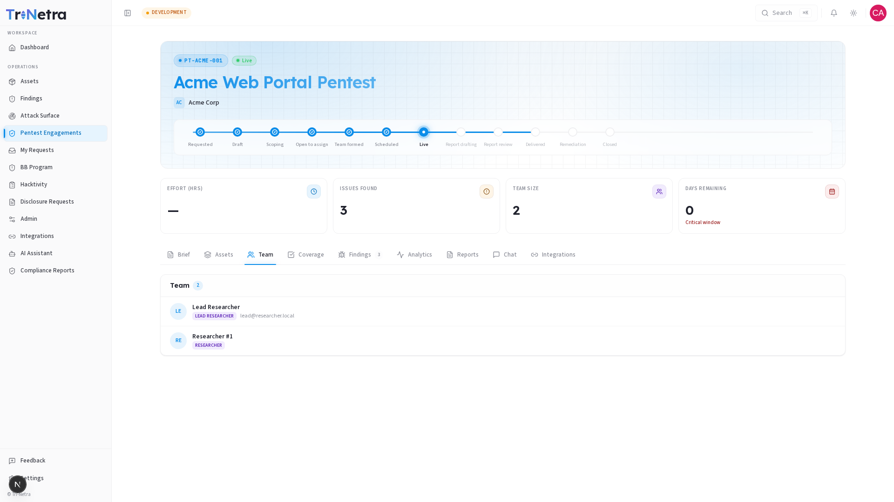

## Team

The Team tab shows you who SecurityBoat has assigned to work on your engagement. As a client user, this tab is **read-only** — you can see the roster but team composition is managed by SecurityBoat.

---

### 1. Understanding the team roles

Every engagement is staffed with a combination of the following roles:

| Role | What they do for you |
|------|----------------------|
| **TPM** (Technical Project Manager) | Your primary point of contact at SecurityBoat. They coordinate the engagement, review the report, and answer your questions. |
| **Lead Researcher** | Runs the hands-on testing effort and authors the engagement report. |
| **Researcher(s)** | Test against the scope and methodology checklist, and submit findings. An engagement may have several researchers working in parallel. |

### 2. What you see

Each team member's entry shows:

- **Avatar and name** — who they are.
- **Role badge** — their function on this engagement (TPM, Lead researcher, or Researcher).
- **Email** — in case you need to reference them outside the platform.

If a team member was removed mid-engagement (e.g. replaced by another researcher), they'll appear with a muted **"removed"** label. Their prior contributions (findings, messages) remain attributed to them.

### 3. When the team is empty

If no team has been assigned yet, you'll see a placeholder message. This is normal for engagements that are still in the **Draft** or internal preparation stages. Once SecurityBoat completes team assembly, the roster populates automatically — no action needed from you.

---

### Best practices

- **Know your TPM by name** — they're the person to reach out to (via Chat or email) for any questions about timeline, scope, or report status.
- **Check the team size** before your engagement goes Live — if you expected a larger team (e.g. for a complex multi-app engagement), raise it with your TPM early during the Draft stage.

### Troubleshooting

| Symptom | Cause / Fix |
|---------|-------------|
| **Team tab shows "No team assigned yet"** | The engagement is still in preparation. The team will appear once SecurityBoat finishes assembling it. |
| **A team member I expected isn't listed** | They may not have been assigned to this specific engagement. Reach out to your TPM in Chat to confirm the roster. |

---

← Previous: [Assets](assets.md) | Next: [Coverage →](coverage.md)
