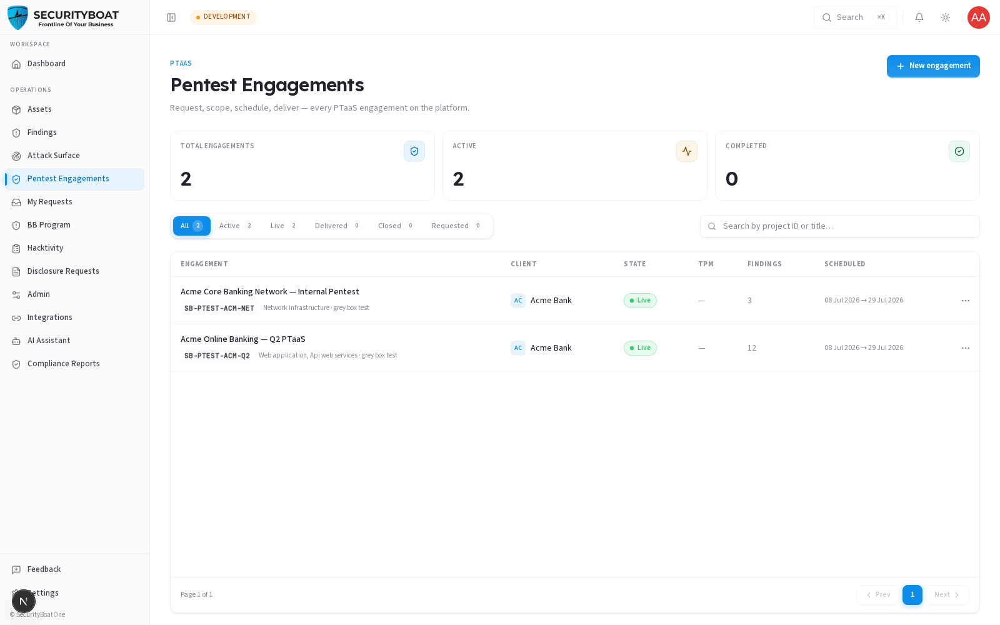

## Engagements — Overview

### 1. What an engagement is and how the PTaaS model works

An **engagement** is a scheduled penetration test of one of your assets, run by SecurityBoat's Security team. "PTaaS" (Penetration Testing as a Service) means the whole lifecycle — requesting, scoping, testing, reporting, and retesting — happens on this platform instead of over email and PDFs.

Every engagement moves through a series of states. You won't see all of them (some are internal to SecurityBoat's team), but understanding the arc helps you know where your test stands:

```
Requested → Draft → (internal preparation) → Live → Report drafting
    → Report review → Delivered → Remediation → Closed
```

| State | What's happening |
|-------|------------------|
| **Requested** | You submitted a pentest request; awaiting SecurityBoat review. |
| **Draft** | Your request was approved; you can still refine scoping details. |
| **Live** | Active testing is underway — findings appear in real time. |
| **Report drafting** | The testing team is writing the engagement report. |
| **Report review** | The report is being reviewed before final delivery. |
| **Delivered** | The final report has been issued to you. |
| **Remediation** | You're fixing issues; retests may follow. |
| **Closed** | The engagement is complete. |

> **Why some states are hidden:** between Draft and Live, SecurityBoat runs internal preparation (confirming testers, locking scope, scheduling). These steps don't require action from you and would add unnecessary noise. Track your request during this window using **My Requests** — it shows a simplified status without exposing the internal machinery.

---

### 2. What each client role can do

| Action | Client Admin | Client TPM | Client Viewer |
|--------|:---:|:---:|:---:|
| View your organization's engagements | ✅ | ✅ | ✅ |
| Open engagement detail (Brief, Findings, Reports…) | ✅ | ✅ | ✅ |
| Submit a new pentest **request** | ✅ | ✅ | ❌ |
| Refine scoping details while in **Draft** | ✅ | ✅ | ❌ |
| Send messages in engagement Chat | ✅ | ✅ | ❌ |
| Download the final report PDF | ✅ | ✅ | ✅ |
| Configure Jira integration on an engagement | ✅ | ❌ | ❌ |

> **Why you "request" rather than "create":** you can't spin up a live engagement directly — scope, testers, and scheduling all need SecurityBoat review. So you file a **request**; once approved, it becomes a tracked engagement that progresses through to delivery.

### Navigation

Click **Pentest Engagements** in the main sidebar menu.

---

### 3. The Engagements list



**Summary metrics bar:** Total engagements · Active · Completed — computed from your organization's visible engagements.

**Filter pills (state buckets):** the lifecycle states are grouped into friendly buckets so you can filter quickly:

| Bucket | What it shows |
|--------|----------|
| **All** | Every engagement visible to your organization. |
| **Active** | Everything currently in flight (Draft through Report review). |
| **Live** | Engagements where testing is actively happening. |
| **Scheduled** | Engagements with confirmed dates, awaiting the Live testing start. |
| **Delivered** | Delivered + Remediation — report issued, fixes in progress. |
| **Closed** | Completed engagements. |
| **Requested** | Pending requests you or your colleagues submitted. |

Each pill shows a live count. There's also a **search** box that matches on Project ID or title.

**Table columns:** Engagement (title + Project ID + testing type) · Client · State · TPM (your SecurityBoat project manager) · Findings (count) · Scheduled (start → end). Click any row to open it. The list paginates at 10 rows per page.

**New engagement button** (Client Admin / Client TPM only): opens the pentest request form — see [Create Engagement](create-engagement.md).

---

### Best practices

- **Use the filter pills** to find "what needs attention right now" — Active and Requested are the fastest way to spot work in flight.
- **Keep your asset inventory current** before requesting a pentest so there's nothing to clarify during scoping.
- **Use the engagement Chat** for questions during testing instead of email — it keeps the full conversation attached to the engagement record.

### Troubleshooting

| Symptom | Cause / Fix |
|---------|-------------|
| **My engagement disappeared from the list** | It moved into internal preparation (between Draft and Live). Track it under **My Requests** until it reaches Live. |
| **No "New engagement" button** | You're a **Client Viewer** (read-only). Ask a Client Admin or Client TPM to submit the request. |
| **Can't find an old engagement** | Check the **Closed** bucket or clear any active search filter. |

---

Next: [Create Engagement →](create-engagement.md)
