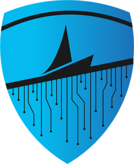

---
hide:
  - navigation
  - toc
---

  
  TriNetra — the agentic security platform by SecurityBoat

<h1 class="sb-hero-title">Security that never stops looking.</h1>

AI agents and vetted researchers on one governed record of your risk from first discovery to verified fix.

<a class="sb-btn-primary" href="trinetra/"><svg xmlns="http://www.w3.org/2000/svg" viewBox="0 0 24 24" width="18" height="18" fill="currentColor" style="vertical-align:text-bottom;margin-right:6px"><path d="M2.5 13.63L9.44 7.67l2.38 2.38L14.86 7l-2.38-2.38L13.63 2.5 2.5 3.11l-1.39 1.39L2.5 13.63M20.5 2.5L24 6l-2.5 2.5L19 6l1.5-3.5M11 21.5l3.5-3.5-2.5-2.5L9.5 18l1.5 3.5M4.88 19.12l.87.87 4.75-4.75-1.62-1.62-4 5.5z"/></svg> Explore the Platform</a>
<a class="sb-btn-ghost" href="https://securityboat.net/lets-connect" target="_blank"><svg xmlns="http://www.w3.org/2000/svg" viewBox="0 0 24 24" width="18" height="18" fill="currentColor" style="vertical-align:text-bottom;margin-right:6px"><path d="M14 3v2h3.59l-9.83 9.83 1.41 1.41L19 6.41V10h2V3m-2 16H5V5h5V3H5c-1.11 0-2 .89-2 2v14c0 1.1.9 2 2 2h14c1.1 0 2-.9 2-2v-5h-2v5z"/></svg> Let's Connect</a>

12

Platform modules

2

Role guides

28+

Documentation pages

---

PLATFORM MODULES

## Every major attack surface

Jump straight into the module you need today.

-   :material-target:

    **Bug Bounty**

    ---

    Vetted researchers, published reward tiers, pay for impact.

    [:octicons-arrow-right-24: Learn more](trinetra/bug-bounty.md)

-   :material-shield-check:

    **PTaaS**

    ---

    Pentests as a live 12-state engagement, not a PDF.

    [:octicons-arrow-right-24: Learn more](trinetra/ptaas.md)

-   :material-radar:

    **Attack Surface Management**

    ---

    11-stage scan pipeline across domains, IPs, 15+ cloud providers.

    [:octicons-arrow-right-24: Learn more](trinetra/attack-surface-management.md)

-   :material-shield-alert:

    **Digital Risk Protection**

    ---

    Phishing clones caught with side-by-side visual proof.

    [:octicons-arrow-right-24: Learn more](trinetra/digital-risk-protection.md)

-   :material-robot-industrial:

    **Agentic Pentest**

    ---

    Agents run recon and exploit-chaining around the clock. Nothing ships
    without a human signature.

    [:octicons-arrow-right-24: Learn more](trinetra/agentic-pentest.md)

-   :material-refresh:

    **Continuous Testing**

    ---

    1,240 raw indicators distilled to 9 exploit-confirmed.

    [:octicons-arrow-right-24: Learn more](trinetra/continuous-testing.md)

-   :material-lightning-bolt:

    **AI Red Teaming**

    ---

    Prompt injection, jailbreaks, cross-tenant isolation — OWASP LLM Top 10
    and MITRE ATLAS.

    [:octicons-arrow-right-24: Learn more](trinetra/ai-red-teaming.md)

-   :material-code-json:

    **Code Security**

    ---

    1,204 scanner alerts filtered to 6 before a human looks.

    [:octicons-arrow-right-24: Learn more](trinetra/code-security.md)

-   :material-check-circle:

    **Continuous Controls Validation**

    ---

    Controls tested on a cadence, evidence always current.

    [:octicons-arrow-right-24: Learn more](trinetra/continuous-controls-validation.md)

-   :material-certificate:

    **Trust Center**

    ---

    SOC 2, RBI, sub-processor docs behind a request gate.

    [:octicons-arrow-right-24: Learn more](trinetra/trust-center.md)

### Managed Services

-   :material-account:

    **vCISO as a Service**

    ---

    Senior security leadership on tap — strategy, board reporting, and
    regulator conversations run by practitioners who have delivered 1,000+
    pentests.

    [:octicons-arrow-right-24: Learn more](trinetra/vciso.md)

-   :material-security:

    **Incident Response**

    ---

    When something breaks through, the same team that knows your attack
    surface runs containment, forensics, and recovery — no cold-start
    onboarding mid-crisis.

    [:octicons-arrow-right-24: Learn more](trinetra/incident-response.md)

ROLE GUIDES

## Browse Guides by Role {#browse-guides-by-role}

-   [:material-domain: **Client Organisation Guide**](client/00-GETTING_STARTED.md)

    ---

    Complete guide for client organization members, security managers, and
    compliance officers — covering assets, findings, engagements, and
    compliance reports.

-   [:material-shield-search: **Security Researcher Guide**](researcher/00-GETTING_STARTED.md)

    ---

    Detailed manual for security researchers, bug hunters, and penetration
    testers — onboarding, findings, payouts, and bug bounty programs.

<footer class="sb-overview-footer">

  

    
    SecurityBoat
  

  

    AI agents and vetted researchers on one governed record of your risk — from first discovery to verified fix.
  

  

    <a href="https://www.youtube.com/@securityboat" target="_blank" title="YouTube" aria-label="YouTube">
      <svg viewBox="0 0 24 24" width="20" height="20" fill="currentColor"><path d="M19.615 3.184c-3.604-.246-11.631-.245-15.23 0-3.897.266-4.356 2.62-4.385 8.816.029 6.185.484 8.549 4.385 8.816 3.6.245 11.626.246 15.23 0 3.897-.266 4.356-2.62 4.385-8.816-.029-6.185-.484-8.549-4.385-8.816zm-10.615 12.816v-8l8 3.993-8 4.007z"/></svg>
    </a>
    <a href="https://www.instagram.com/securityboat/" target="_blank" title="Instagram" aria-label="Instagram">
      <svg viewBox="0 0 24 24" width="20" height="20" fill="currentColor"><path d="M12 2.163c3.204 0 3.584.012 4.85.07 3.252.148 4.771 1.691 4.919 4.919.058 1.265.069 1.645.069 4.849 0 3.205-.012 3.584-.069 4.849-.149 3.225-1.664 4.771-4.919 4.919-1.266.058-1.644.07-4.85.07-3.204 0-3.584-.012-4.849-.07-3.26-.149-4.771-1.699-4.919-4.92-.058-1.265-.07-1.644-.07-4.849 0-3.204.013-3.583.07-4.849.149-3.227 1.664-4.771 4.919-4.919 1.266-.057 1.645-.069 4.849-.069zm0-2.163c-3.259 0-3.667.014-4.947.072-4.358.2-6.78 2.618-6.98 6.98-.059 1.281-.073 1.689-.073 4.948 0 3.259.014 3.668.072 4.948.2 4.358 2.618 6.78 6.98 6.98 1.281.058 1.689.072 4.948.072 3.259 0 3.668-.014 4.948-.072 4.354-.2 6.782-2.618 6.979-6.98.059-1.28.073-1.689.073-4.948 0-3.259-.014-3.667-.072-4.947-.196-4.354-2.617-6.78-6.979-6.98-1.281-.059-1.69-.073-4.949-.073zm0 5.838c-3.403 0-6.162 2.759-6.162 6.162s2.759 6.163 6.162 6.163 6.162-2.759 6.162-6.163c0-3.403-2.759-6.162-6.162-6.162zm0 10.162c-2.209 0-4-1.79-4-4 0-2.209 1.791-4 4-4s4 1.791 4 4c0 2.21-1.791 4-4 4zm6.406-11.845c-.796 0-1.441.645-1.441 1.44s.645 1.44 1.441 1.44c.795 0 1.439-.645 1.439-1.44s-.644-1.44-1.439-1.44z"/></svg>
    </a>
    <a href="https://www.linkedin.com/company/securityboat/" target="_blank" title="LinkedIn" aria-label="LinkedIn">
      <svg viewBox="0 0 24 24" width="20" height="20" fill="currentColor"><path d="M19 0h-14c-2.761 0-5 2.239-5 5v14c0 2.761 2.239 5 5 5h14c2.762 0 5-2.239 5-5v-14c0-2.761-2.238-5-5-5zm-11 19h-3v-11h3v11zm-1.5-12.268c-.966 0-1.75-.79-1.75-1.764s.784-1.764 1.75-1.764 1.75.79 1.75 1.764-.783 1.764-1.75 1.764zm13.5 12.268h-3v-5.604c0-3.368-4-3.113-4 0v5.604h-3v-11h3v1.765c1.396-2.586 7-2.777 7 2.476v6.759z"/></svg>
    </a>
    <a href="https://x.com/Securityb0at" target="_blank" title="X (Twitter)" aria-label="X Twitter">
      <svg viewBox="0 0 24 24" width="20" height="20" fill="currentColor"><path d="M18.244 2.25h3.308l-7.227 8.26 8.502 11.24H16.17l-5.214-6.817L4.99 21.75H1.68l7.73-8.835L1.254 2.25H8.08l4.713 6.231zm-1.161 17.52h1.833L7.084 4.126H5.117z"/></svg>
    </a>
    <a href="https://www.facebook.com/secureb0at/" target="_blank" title="Facebook" aria-label="Facebook">
      <svg viewBox="0 0 24 24" width="20" height="20" fill="currentColor"><path d="M9 8H6v4h3v12h5V12h3.642L18 8h-4V6.333C14 5.374 14.5 5 15.5 5H18V0h-3.808C10.592 0 9 1.583 9 4.615V8z"/></svg>
    </a>
    <a href="https://securityboat.net" target="_blank" title="SecurityBoat" aria-label="SecurityBoat">
      <svg viewBox="0 0 24 24" width="20" height="20" fill="currentColor"><path d="M12 2L4 5v6.09c0 5.05 3.41 9.76 8 10.91 4.59-1.15 8-5.86 8-10.91V5l-8-3zm0 15c-3.87 0-7-3.13-7-7V6.5l7-2.5 7 2.5V10c0 3.87-3.13 7-7 7zm-1-4.17L8.17 10 7 11.17l4 4 6-6-1.17-1.17L11 12.83z"/></svg>
    </a>
  

  <h4 class="sb-footer-col-title">Documentation</h4>
  <ul class="sb-footer-links">
    <li><a href="trinetra/bug-bounty/">TriNetra Platform</a></li>
    <li><a href="client/00-GETTING_STARTED/">Client Guide</a></li>
    <li><a href="researcher/00-GETTING_STARTED/">Researcher Guide</a></li>
  </ul>

  <h4 class="sb-footer-col-title">Platform Modules</h4>
  <ul class="sb-footer-links">
    <li><a href="trinetra/bug-bounty/">Bug Bounty</a></li>
    <li><a href="trinetra/ptaas/">PTaaS</a></li>
    <li><a href="trinetra/attack-surface-management/">Attack Surface (ASM)</a></li>
    <li><a href="trinetra/digital-risk-protection/">Digital Risk Protection</a></li>
    <li><a href="trinetra/agentic-pentest/">Agentic Pentest</a></li>
    <li><a href="trinetra/ai-red-teaming/">AI Red Teaming</a></li>
  </ul>

  <h4 class="sb-footer-col-title">Connect & Legal</h4>
  <ul class="sb-footer-links">
    <li><a href="https://securityboat.net/lets-connect" target="_blank">Let's Connect</a></li>
    <li><a href="trinetra/trust-center/">Trust Center</a></li>
    <li><a href="trinetra/vciso/">vCISO Services</a></li>
  </ul>

  © 2026 SecurityBoat. All rights reserved.
  TriNetra — The Agentic Cybersecurity Platform

</footer>
