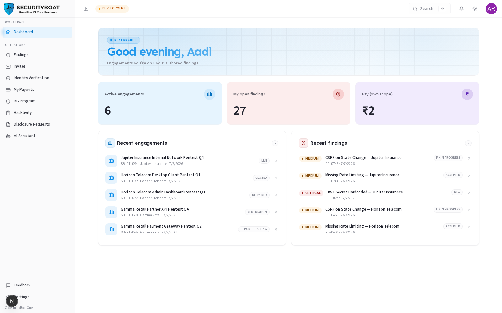

# Introduction

---

### Welcome

**Tri-Netra** is the platform through which SecurityBoat engages
security researchers to test its customers' systems. This guide is for the
**Researcher** (and **Lead Researcher**) — the people who do the actual security
testing: joining engagements, hunting vulnerabilities, and authoring findings.

### Your role in one line

A **Researcher** works on the **engagements they've been added to** and the
**bug-bounty programs** they participate in. You see your opportunities and invites,
the engagements you're seated on, the findings you author, your payouts, and your
identity verification — all scoped to **you**. You never see another org's private
data or another researcher's pay.

A **Lead Researcher** does everything a researcher does, plus coordinates the
testing team on an engagement (a slightly richer dashboard and team view).

### What you can do on Tri-Netra (Researcher modules)

| Module | What it does | Your access |
|--------|--------------|-------------|
| **Dashboard** | Your testing snapshot — active engagements, your open findings, your pay. | View |
| **Opportunities** | Open engagement opportunities you can express interest in. | View / apply |
| **Invites** | Direct invitations to join specific engagements. | Accept / decline |
| **Engagements** | The engagements you're seated on — scope, team, timeline. | View / work |
| **Findings** | Vulnerabilities on your engagements. | View / author |
| **My Findings** | The findings you personally authored, across engagements. | View / manage |
| **Payouts** | Your earnings and payout history (your scope only). | View |
| **Identity Verification** | Complete background/identity verification to unlock work. | Complete |
| **Bug Bounty** | Programs you participate in — submit and track reports. | View / submit |
| **AI Assistant (Ish)** | Ask questions about your engagements and findings powered by Ish. | Use |
| **Notifications** | Your alerts and updates. | View |
| **Settings** | Your account, MFA, and notification preferences. | Manage own |

### How to use this guide

Each chapter covers one module in depth — its purpose, how to reach it, every
control on the page, the end-to-end flow, and exactly what your role can and can't
do. Start with **Login**, then your **Dashboard**.

---

← Previous: [Getting Started](00-GETTING_STARTED.md) | Next: [Login →](02-login.md)

