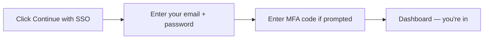

# Signing In

### 1. How you get access

Access to Tri-Netra is **invite-only**. Here's how you get onboarded as a researcher:

1. **Apply.** Click **Apply as a researcher** on the sign-in screen and submit your application.
2. **Get approved.** SecurityBoat reviews your application.
3. **Receive your invitation.** Once approved, you get an invitation email with a setup link.
4. **Set up your account.** Follow the link to create your password and set up MFA.

After setup, you sign in whenever you're ready to work.

---

### 2. The sign-in screen

Open your Tri-Netra URL. You'll see the sign-in screen with:

- **Continue with SSO** — the main sign-in button. Click this every time you sign in.
- **Apply as a researcher** — for new researchers who haven't applied yet.
- **Contact sales** — for prospective customers (not relevant to researchers).

---

### 3. Signing in — what you actually do

1. **Click "Continue with SSO".** Your browser opens the sign-in page.
2. **Enter your email and password.** These are the credentials you set up when you accepted your invitation.
3. **Enter your MFA code** if prompted (from your authenticator app).
4. **You land on your Dashboard.** Everything is scoped to your engagements, findings, and payouts.

---

### 4. First-time setup (from an invitation)

1. Open the **invitation email** and click the link inside.
2. Set your **password** — pick something strong and unique.
3. Set up **MFA** if prompted — scan the QR code with your authenticator app.
4. After setup, sign in anytime by clicking **Continue with SSO** on the sign-in screen.

> Before you can work on paid engagements, you'll usually need to complete **Identity Verification** — see [that chapter](10-verification.md).

---

### 5. Managing MFA

- **Set up or change MFA:** go to **Settings → MFA Setup** once signed in.
- **Lost your authenticator?** Contact SecurityBoat Support to reset your MFA.

---

### 6. Signing out

Click your avatar (top-right) → **Sign out**. Always sign out on shared or public devices.

---

### Best practices

- **Set up MFA** — it's your strongest protection against account takeover.
- **Never share your login** — accounts are per-person and all activity is audited.
- **Complete identity verification early** — you can't be seated on paid engagements without it.

### Troubleshooting

| Symptom | What to do |
|---------|------------|
| **"You're not invited" or access denied** | Your application may still be under review, or you haven't accepted your invitation yet. |
| **Can't sign in with your password** | Use the password reset option on the sign-in page. |
| **Lost MFA device** | Contact SecurityBoat Support to reset your MFA. |
| **Signed out unexpectedly** | Sessions expire after inactivity for security. Sign in again — it takes 30 seconds. |

---

← Previous: [Introduction](01-introduction.md) | Next: [Dashboard →](03-dashboard.md)
