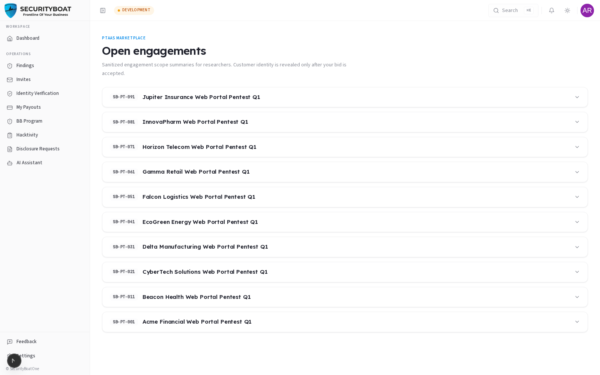

## 4. Opportunities (Marketplace)

### 4.0 What Opportunities is

**Opportunities** is the researcher marketplace: a feed of **open pentest
engagements** you can bid on. SecurityBoat posts sanitised scope summaries here when
an engagement opens for bids. You browse, find work that fits your skills, and
**apply** — as a Researcher or a Lead Researcher.

> **Privacy by design:** the customer's identity is **not** shown in the
> marketplace. You see the scope, type, duration, and payout — the client name is
> revealed only **after your bid is accepted**. This protects the client and keeps
> bidding merit-based.

### Navigation

Click **Opportunities** in the sidebar. (Researcher /
Lead Researcher only.)

---

### 4.1 Browsing open engagements

Each opportunity is a collapsible card showing its **project ID** and **title**.
Click to expand the detail panel:

| Field | Meaning |
|-------|---------|
| **Pentest Type** | The engagement types (Web App, API, Mobile, Network, …). |
| **Testing Type** | Black-box / Grey-box / White-box approach. |
| **Pentest Duration** | Computed from the scheduled window (or testing hours). |
| **Testing Hours** | Budgeted hours. |
| **Fixed Payout** | The researcher payout (amount + currency), or "Contact for details". |
| **Tags** | "Source access" vs "Black-box only", and the scheduled dates. |

### 4.2 Applying (placing a bid)

At the bottom of an expanded card:

| Button | What it does |
|--------|--------------|
| **Apply as Researcher** | Submits a bid to join the engagement as a Researcher. |
| **Apply as Lead Researcher** | Submits a bid to join as the Lead (who also drafts the report). |

After you apply, the card shows **"✓ You have already applied for this
opportunity."** Your bids are tracked, and if accepted the engagement appears under
**Engagements** (with the client revealed) and you're added to its team.

> **Researcher vs Lead:** a Lead Researcher additionally **drafts the report
> narrative** and can submit it for review. Only apply as Lead if you're prepared
> to own the reporting.

### Best practices

- **Bid to your strengths** — match the pentest type and testing approach to your
  skills.
- **Read the scope + payout carefully** before applying; the payout is fixed.
- **Don't double-apply** — one bid per opportunity; the card tells you when you've
  applied.

### Troubleshooting

| Symptom | Cause / Fix |
|---------|-------------|
| **"No open engagements right now"** | Nothing is open for bids currently — check back or ask your CSM. |
| **Can't see a client name** | By design — identity is revealed only after your bid is accepted. |
| **Already applied** | You've bid on this one; watch **Invites**/**Engagements** for the outcome. |

---

← Previous: [Dashboard](03-dashboard.md) | Next: [Invites →](05-invites.md)
