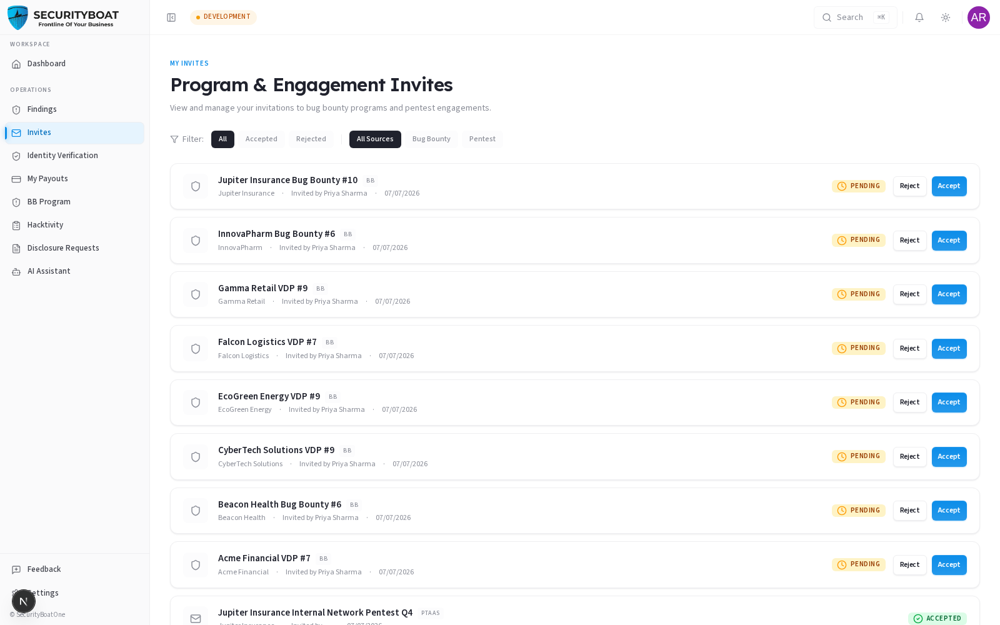
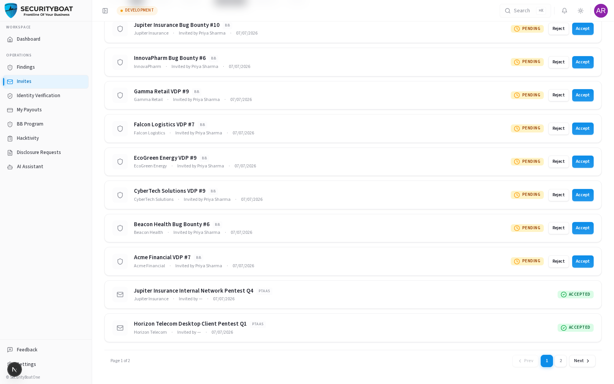

## 5. Invites

### 5.0 What Invites are

**Invites** are direct invitations from program managers to join a **Bug Bounty
program** or a **pentest engagement** — as opposed to the open **Opportunities**
marketplace where you bid. If someone wants *you* specifically, it shows up here.

### Navigation

Click **Invites** in the sidebar. (Researcher / Lead Researcher only.)

---

### 5.1 The Invites list

**Filters:** status (**All / Accepted / Rejected**) and source (**All / Bug Bounty
/ Pentest**).

Each invite shows:

| Field | Meaning |
|-------|---------|
| **Name** | The program or engagement you're invited to. |
| **Source badge** | **BB** (Bug Bounty) or **PTaaS** (pentest). |
| **Organisation** | The inviting org. |
| **Invited by / date** | Who sent it and when. |
| **Status** | **Pending** (awaiting your response), **Accepted**, or **Rejected**. |

### 5.2 Responding

For **pending Bug Bounty invites**, you get **Accept** and **Reject** buttons. Both
open a dialog where you can add an optional note/reason:

- **Accept** — you join the program; add a note for the program manager.
- **Reject** — you decline; a reason (e.g. "schedule conflict") is optional but
  courteous.

> **Pentest invites** are informational here — pentest participation is driven
> through **Opportunities** (bids) and the resulting engagement team, so you won't
> see accept/reject buttons on a PTaaS invite in this list.

### Best practices

- **Respond promptly** — program managers are waiting to build their roster.
- **Add a note when rejecting** so the manager understands why (keeps you top of
  mind for the next one).

### Troubleshooting

| Symptom | Cause / Fix |
|---------|-------------|
| **"No invites found"** | You haven't been invited yet (or the filter hides them — set status to All). |
| **No Accept/Reject on a pentest invite** | Correct — respond to pentest opportunities via **Opportunities** bids. |

---

← Previous: [Opportunities](04-opportunities.md) | Next: [Engagements →](06-engagements.md)
