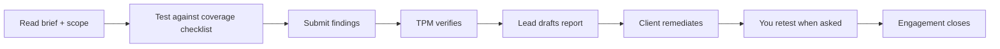

# Engagements

### 1. The researcher's view of an engagement

Once your bid is accepted (or you're invited and assigned), you join an **engagement team**. The engagement is your primary workspace for that pentest: the brief, assets and scope contract, coverage checklist, team chat, and — most importantly — where you **submit findings**.

> **Privacy & Scope:** Once assigned to an engagement team, the customer identity (hidden during marketplace bidding) is revealed. You see target assets, credentials, and testing dates. However, internal financials of other researchers or client pricing stay hidden.

---

### 2. What a researcher can do on an engagement

| Capability | Researcher | Lead Researcher |
|------------|:---:|:---:|
| Read the engagement brief, assets, coverage checklist, & findings | ✅ | ✅ |
| Submit findings (via the Findings tab drawer) | ✅ | ✅ |
| Track & complete testing items on the Coverage checklist | ✅ | ✅ |
| Participate in engagement Team Chat | ✅ | ✅ |
| Draft the report narrative & submit for review | ❌ | ✅ |
| Approve final report bundle | ❌ | ❌ (Staff only) |

---

### Navigation

Click **Pentest Engagements** in the main sidebar menu.

---

### 3. Engagement tabs & controls

When you open an engagement from your assigned list, you interact with six main tabs:

| Tab | Purpose & Researcher Actions |
|-----|------------------------------|
| **Brief** | Review testing scope, approach, scheduled dates, objectives, and customer contact parameters. |
| **Assets** | Inspect the systems under test (URLs, IP ranges, Mobile build links, API specs) and review provided testing credentials or safe rules of engagement. |
| **Coverage** | The methodology checklist pre-seeded for the asset types. Check off tested items so the TPM can verify assessment thoroughness. |
| **Findings** | View all findings filed on this engagement. Click **Submit finding** to open the locked finding submission drawer. |
| **Chat** | Secure multi-party team chat (Researcher, Lead, TPM, CSM) to discuss technical questions or clarify scope. |
| **Reports** | *(Lead Researcher only)* Author executive summary, testing methodology notes, and narrative write-ups before submitting the report draft for TPM review. |

---

### 4. Your workflow on a LIVE engagement

Submitting a well-scoped, well-evidenced finding is your core deliverable — see the [Findings guide](07-findings.md).

---

### Best practices

- **Work the Coverage checklist** — check off items as you complete testing scenarios so the TPM has real-time visibility into assessment progress.
- **Use engagement Chat** — ask scope or credential questions in the engagement chat rather than making assumptions.
- **File findings as you go** — submit findings incrementally during testing rather than batching them at the end.

---

### Troubleshooting

| Symptom | Cause / Fix |
|---------|-------------|
| **Engagement not listed** | Your bid is still under review or pending assignment. |
| **Reports tab missing** | Standard Researchers do not see the Reports tab; narrative drafting is owned by the designated **Lead Researcher**. |
| **Submit finding disabled** | The engagement must be in an active testing state (e.g. Live); check status on the Brief tab. |

---

← Previous: [Invites](05-invites.md) | Next: [Findings →](07-findings.md)

