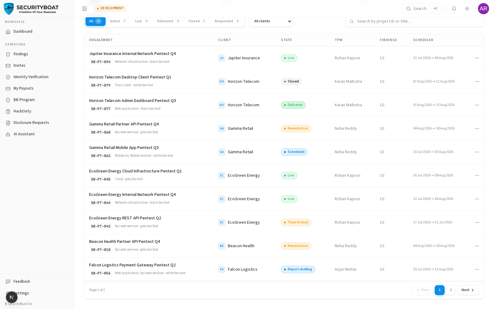
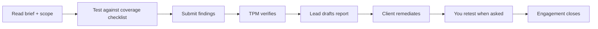

## Engagements

### 1. The researcher's view of an engagement

Once your bid is accepted (or you're invited), you join an **engagement** team. The
engagement is your workspace for that pentest: the brief, the assets and scope, the
coverage checklist, and — most importantly — where you **submit findings**.

> **Scope:** you see the engagements you're on the team for. The customer identity
> (hidden in the marketplace) is visible here once you're on the team. Internal
> financials of *other* people are not shown to you.

### 2. What a researcher can do on an engagement

| Capability | Researcher | Lead Researcher |
|------------|:---:|:---:|
| Read the engagement (brief, assets, coverage, findings) | ✅ | ✅ |
| Submit findings (from the Findings tab) | ✅ | ✅ |
| Draft the report narrative + submit for review | ❌ | ✅ |
| Approve the report | ❌ | ❌ (that's admin) |

### Navigation

Click **Pentest Engagements** in the main sidebar menu.

---

### 3. The list & detail

The list shows your engagements with their state and schedule.
Open one to reach its tabs:

| Tab | What you do |
|-----|-------------|
| **Brief** | Read the scope, testing approach, schedule. |
| **Assets** | The systems under test and their scope contract (URLs, IPs, credentials the client provided). |
| **Coverage** | The methodology checklist — track what you've tested. |
| **Findings** | **Submit** new findings and see the engagement's findings. |
| **Chat** | Coordinate with the TPM and team. |
| **Reports** | *(Lead only)* draft the report narrative and submit it for review. |

> Researchers don't see the Reports tab (only the Lead does, to draft); report
> approval is a TPM/CSM/admin step.

### 4. Your workflow on a LIVE engagement

Submitting a well-scoped, well-evidenced finding is your core deliverable — see the
[Findings guide](07-findings.md).

### Best practices

- **Work the Coverage checklist** so nothing in scope is missed — it's how the TPM
  assures completeness.
- **Use engagement Chat** for scope questions rather than guessing.
- **Submit findings as you go**, not in a last-minute batch — it gives the TPM time
  to verify.

### Troubleshooting

| Symptom | Cause / Fix |
|---------|-------------|
| **An engagement isn't listed** | You're not on its team (bid not accepted, or invite pending). |
| **No Reports tab** | Correct for a Researcher — only the Lead drafts the report. |
| **Can't submit a finding** | The engagement must be in a testing state (e.g. LIVE); check the Findings tab's submit action. |

---

← Previous: [Invites](05-invites.md) | Next: [Findings →](07-findings.md)
